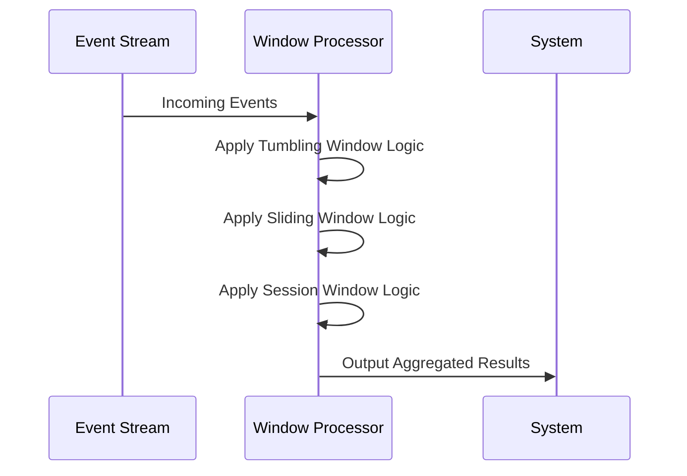

## Streaming Aggregation with Time Windows

### Overview

In the realm of streaming data applications, aggregating data over specific time intervals — known as time-windowed aggregation — is crucial for generating meaningful statistics and insights in real-time. This pattern allows systems to calculate metrics, such as the count, sum, average, and more, over a continuous flow of data segmented into meaningful timeframes.

### Architectural Approaches

1. **Tumbling Windows**: Fixed-size, non-overlapping time windows. Each data point belongs to exactly one window.
   
2. **Sliding Windows**: Fixed-size, overlapping windows, defined by window length and slide interval. Used when calculations must consider overlapping time segments.

3. **Session Windows**: Adaptive to user activity with gaps in data serving as window boundaries. Effective for user-interaction patterns.

### Best Practices

- **Time Synchronization**: Ensure data sources are synchronized based on event time rather than processing time to increase the accuracy of window results.
  
- **Out-of-Order Handling**: Incorporate mechanisms like watermarks in systems to handle late-arriving data gracefully.

- **State Management**: Utilize efficient state-handling techniques to store intermediate results, especially in distributed setups.

### Example Code

Here's an example using Flink's DataStream API with sliding windows in Java:

```java
DataStream<Event> events = ...; // source of events
WindowedStream<Event, String, TimeWindow> windowed =
    events.keyBy(event -> event.getUserId())
          .window(SlidingEventTimeWindows.of(Time.minutes(1), Time.seconds(30)))
          .allowedLateness(Time.seconds(10))
          .sideOutputLateData(lateOutputTag);

DataStream<AggregationResult> aggregated = windowed.apply(new MyWindowFunction());
```

### Diagrams

#### Time Window Types in Streaming



### Related Patterns

- **Event Sourcing**: Ensures that all changes to application state are stored as a sequence of events, useful for recreating state from log streams.
- **CQRS (Command Query Responsibility Segregation)**: Divides the processing aspect of handling request-response cycles and event processing, complementing time windows.
- **Data Sharding**: Distributes a dataset across multiple machines to support large-scale streaming workloads.

### Additional Resources

- *Stream Processing with Apache Flink* by Fabian Hueske: Covers practical implementations of time window patterns.
- [Apache Kafka's Streams Documentation](https://kafka.apache.org/documentation/streams/) for handling streaming data with Spark and Kafka.

### Summary

Streaming Aggregation with Time Windows is foundational for systems where real-time analytics and dashboards are needed. It empowers architects and developers to decide how to slice time effectively and handle data complexities such as lateness and ordering, thus enabling more accurate and timely application insights.
