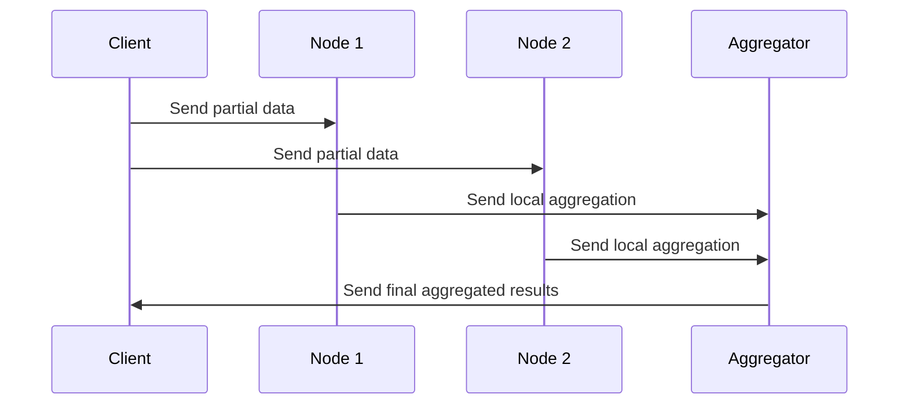

## Distributed Aggregation

### Overview

Distributed Aggregation is a design pattern employed to perform aggregation tasks across distributed systems or clusters. It ensures that data is processed efficiently and results are accurate, even when the data is spread across multiple nodes or data centers. This pattern is crucial in large-scale systems where a single node cannot handle the data alone, such as in big data environments processing massive datasets.

### Architectural Approach

To implement a distributed aggregation pattern, the following architectural components are typically involved:

1. **Data Partitioning**: Data is divided across different nodes to enable parallel processing. This is achieved through partitioning strategies like shard keys or partition keys.

2. **Local Aggregation**: Each node performs a local aggregation on its partition of the data. This reduces data to a summarized format before transmission.

3. **Intermediate Combine Phase**: Optionally, an intermediate node may combine results from several nodes before reaching the final node. This additional layer helps in balancing the load and further reducing the data volume for final aggregation.

4. **Global Aggregation**: The final aggregation combines results from either the local aggregates or intermediates, to produce a comprehensive summary.

### Example Code

Consider a simple scenario where visitor counts from multiple web servers need to be aggregated to compute the total site traffic:

```java
import java.util.List;
import java.util.Map;
import java.util.stream.Collectors;

public class DistributedAggregation {
    
    // Example: Aggregates visitor counts from multiple servers
    public static int aggregateVisitorCounts(List<Map<String, Integer>> serverData) {
        return serverData.stream()
            .flatMap(dataMap -> dataMap.values().stream())
            .mapToInt(Integer::intValue)
            .sum();
    }

    public static void main(String[] args) {
        List<Map<String, Integer>> serverData = List.of(
            Map.of("US", 120, "EU", 100),
            Map.of("US", 130, "EU", 150),
            Map.of("US", 110, "EU", 90)
        );

        int totalVisitors = aggregateVisitorCounts(serverData);
        System.out.println("Total Visitors: " + totalVisitors);
    }
}
```

### Diagrams

#### Distributed Aggregation Sequence Diagram



### Best Practices

- **Data Locality**: Ensure that data processing is as close as possible to its storage location to minimize network usage and latency.
- **Parallelization**: Utilize frameworks that support distributed computing, for example, Apache Spark or Flink, to enhance parallel processing efficiency. 
- **Fault Tolerance**: Implement robust error handling and retry mechanisms to handle node failures and ensure data consistency.
- **Scalability**: Design aggregation processes to seamlessly scale as the dataset grows or as additional nodes are added to the cluster.

### Related Patterns

- **MapReduce**: This pattern is used for processing large amounts of data parallelly across a distributed cluster, and is closely related to distributed aggregation.
- **Eventual Consistency**: Ensuring that eventually, all nodes reflect the same aggregation result, even in the event of network partitions.
- **Bulkhead**: Isolating failures in microservice architectures when conducting distributed operations to increase system resilience.

### Additional Resources

- [Apache Hadoop](https://hadoop.apache.org) – A popular open-source framework for processing large datasets in a distributed computing environment.
- [Apache Spark Documentation](https://spark.apache.org/docs/latest/) – Comprehensive resources regarding one of the leading data processing platforms which support distributed aggregation.
- [Google Cloud's Dataflow](https://cloud.google.com/dataflow) – An extensive framework from Google for streaming and batch processing.

### Summary

Distributed Aggregation is an essential pattern in modern data processing architectures, particularly in environments where data is enormous and scattered across multiple nodes. By leveraging optimized data partitioning, parallel local processing, and defining clear aggregation flow, systems can efficiently produce accurate results while ensuring scalability and fault tolerance. Understanding and implementing this pattern is crucial for developing high-performance data algorithms and architectures in distributed environments.
