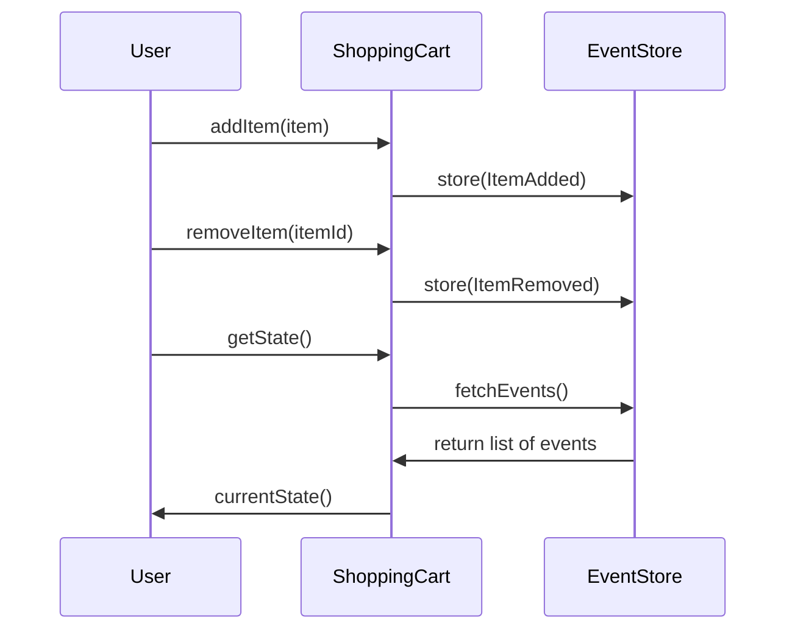

---

linkTitle: "Event Sourcing with Aggregates"
title: "Event Sourcing with Aggregates"
category: "9. Aggregation Patterns"
series: "Data Modeling Design Patterns"
description: "Capturing changes to an aggregate as a sequence of events, which can rebuild the aggregate's state. This pattern facilitates a reliable mechanism for state reconstruction and change auditing."
categories:
- Aggregation Patterns
- Data Modeling
- Event Sourcing
tags:
- Event Sourcing
- Aggregates
- CQRS
- Domain-Driven Design
- Data Integrity
date: 2024-07-07
type: docs

canonical: "https://softwarepatternslexicon.com/102/9/2"
license: "© 2024 Tokenizer Inc. CC BY-NC-SA 4.0"
---

## Introduction

In complex systems, tracking state changes within business entities is crucial for maintaining data integrity and supporting audit logging. The *Event Sourcing with Aggregates* pattern enables capturing changes to an aggregate as a series of immutable events. This historical log of events can rebuild the current state of the aggregate at any moment, providing both a resilient architecture and a transparent operational history.

## Key Concepts and Benefits

- **Aggregate**: A cluster of domain objects that can be treated as a single unit. An aggregate root controls the aggregate's transactions and consistency boundaries.
- **Event Sourcing**: Instead of storing only the current state, all changes (events) are stored, allowing reconstruction of past states.
- **Event Store**: A database optimized for storing events which provides both data persistence and querying capabilities.

### Benefits

1. **Immutability**: Events are immutable, which enhances the integrity and consistency of data.
2. **Audit Log**: Every state change is recorded, providing a complete history for audits.
3. **Reproducibility**: The ability to rehydrate past states of an entity for debugging, analysis, or reconciliation.
4. **Scalability and Consistency**: When combined with **CQRS (Command Query Responsibility Segregation)**, it improves system scalability and transactional consistency.

## Example

Consider managing a shopping cart in an e-commerce application:

1. **Event Types**:
   - `ItemAdded`: Captures item additions to the cart.
   - `ItemRemoved`: Captures item removals from the cart.

2. **Workflow**:
   ```scala
   case class Cart(id: String, items: List[Item])

   sealed trait CartEvent
   case class ItemAdded(item: Item) extends CartEvent
   case class ItemRemoved(itemId: String) extends CartEvent

   class ShoppingCart {
     private var events: List[CartEvent] = List.empty

     def addItem(item: Item): Unit = {
       events = events :+ ItemAdded(item)
     }

     def removeItem(itemId: String): Unit = {
       events = events :+ ItemRemoved(itemId)
     }

     def loadFromHistory(events: List[CartEvent]): Cart = {
       events.foldLeft(Cart("", List.empty)) {
         case (cart, ItemAdded(item)) => cart.copy(items = cart.items :+ item)
         case (cart, ItemRemoved(itemId)) => cart.copy(items = cart.items.filterNot(_.id == itemId))
       }
     }

     def currentState: Cart = loadFromHistory(events)
   }
   ```  

   In this example, the cart's state can be reconstructed by replaying the sequence of events. Every method updates the state by adding a corresponding event to the event history. 

## Diagram



## Related Patterns

- **Command Query Responsibility Segregation (CQRS)**: Complements Event Sourcing by segregating write and read models.
- **Snapshot**: Periodically storing the current state from events to speed up the initialization process.
- **Domain-Driven Design (DDD)**: Aggregates and Event Sourcing are core elements.

## Additional Resources

- [Greg Young on Event Sourcing](https://cqrs.wordpress.com/documents/writing-event-sourced-applications/) — A foundational paper.
- *Event Sourcing* by Martin Fowler - An in-depth view and exploration of Event Sourcing.

## Summary

The *Event Sourcing with Aggregates* pattern supports robust state management and effective data handling across large-scale systems. By persisting events instead of just state, systems gain auditability, flexibility in state reconstruction, and consistency in handling changing requirements. This pattern, especially when used alongside CQRS and DDD, provides a sustainable architecture for modern distributed systems.
