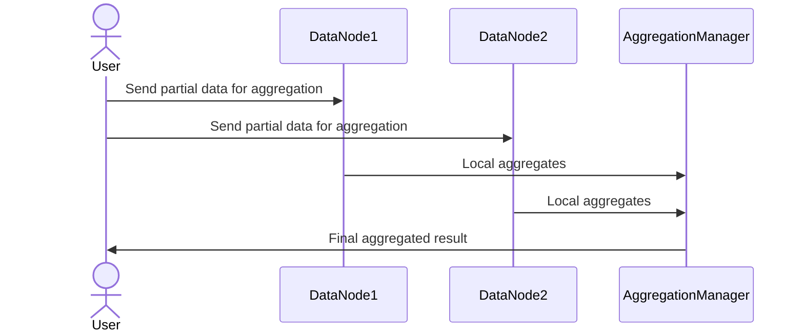

## Partial Aggregation	

### Description
Partial Aggregation is a design pattern used in distributed systems to aggregate data incrementally as it becomes available. This approach optimizes performance and scalability by processing smaller subsets of data in parallel and then combining these partial results to form the complete dataset aggregation. By leveraging intermediate aggregation steps, systems can handle large data volumes more efficiently and with reduced latency.

### Architectural Approach
Partial Aggregation is typically implemented in big data frameworks such as Apache Kafka, Apache Flink, or Apache Spark. These systems often distribute data across multiple nodes, allowing for parallel processing. Each node performs partial aggregation on its local subset of the data, which are then combined using another step to achieve the final results.

The architecture can be broken down into:
1. **Data Sources**: Data is ingested from various sources.
2. **Local Aggregation**: Each node performs aggregation on its portion of the data.
3. **Intermediate Results Storage**: This may include in-memory storage (like Spark RDDs) or durable storage (like Kafka Topics).
4. **Global Aggregation**: Partial results are aggregated to form the final output.
5. **Output Storage/Service**: Final results are pushed to a database or analytics system.

### Best Practices
- **Distribute Load**: Ensure data is evenly distributed among nodes to prevent bottlenecks.
- **Optimize Local Aggregation**: Use algorithms that reduce data size early in processing.
- **Configuration Tuning**: Adjust batch sizes, memory usage, and parallelism according to workload.
- **Fault Tolerance**: Implement checkpoints and retries to handle failures.

### Example Code

Here is a simplified example using Apache Spark's RDD in Scala to perform partial aggregations:

```scala
import org.apache.spark.{SparkConf, SparkContext}

object PartialAggregationExample {
  def main(args: Array[String]): Unit = {
    val conf = new SparkConf().setAppName("PartialAggregationExample").setMaster("local")
    val sc = new SparkContext(conf)

    // Example data: (storeId, salesAmount)
    val salesData = sc.parallelize(List(("store1", 100.0), ("store2", 150.0), ("store1", 200.0), ("store2", 50.0)))

    // Perform partial aggregation by store
    val partialAggregates = salesData.reduceByKey(_ + _)

    // Collect the results
    partialAggregates.collect().foreach {
      case (store, totalSales) => println(s"Store: $store, Total Sales: $totalSales")
    }

    sc.stop()
  }
}
```

### Diagrams

#### Sequence Diagram



### Related Patterns
- **Batch Aggregation**: Similar but processes data in larger batches instead of streams.
- **Incremental Processing**: Closely tied to partial aggregation, focuses on processing new data increments as they arrive.
- **Sharding**: Often used together to divide and conquer the dataset for parallel partial aggregations.

### Additional Resources
- [Apache Spark Documentation](https://spark.apache.org/docs/latest/)
- [Apache Flink Documentation](https://ci.apache.org/projects/flink/flink-docs-stable/)
- [The Data Warehouse Toolkit](https://amzn.to/3Ep6vKC)

### Summary
The Partial Aggregation pattern is crucial in building scalable and efficient distributed data processing systems. By incrementally aggregating data, it lowers latency and improves performance, especially when dealing with large datasets. This pattern is a go-to solution in scenarios requiring real-time analytics, monitoring, and rapid insights derived from continuously streaming data.
