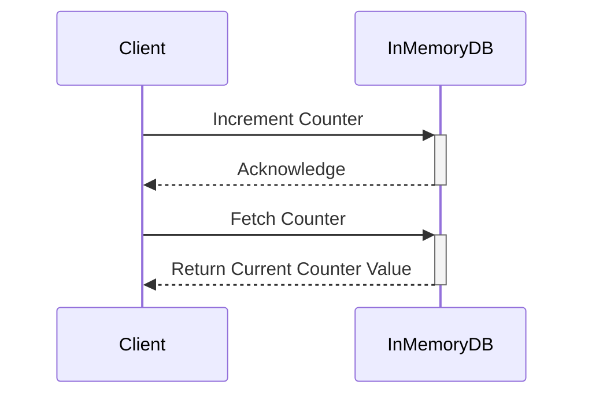

## Overview

The In-Memory Aggregation pattern is a performance optimization technique widely adopted in scenarios requiring real-time data processing. Compared to traditional disk-based aggregations, in-memory processing significantly reduces latency, allowing systems to handle high-throughput, low-latency workloads effectively. This pattern is instrumental in speedy calculations for real-time analytics dashboards, enabling businesses to recognize trends and make informed decisions in a timely fashion.

## Detailed Explanation

### Design Pattern

In-memory aggregation involves loading necessary data into a data store with rapid access times, such as a distributed in-memory data grid or an in-memory key-value store. Aggregations are then performed directly within memory without frequent disk I/O operations, thus achieving impressive speed-ups in processing times. This model suits scenarios where the dataset size can be managed within the available memory.

### Architectural Approaches

1. **In-Memory Data Structures**: Leverage efficient data structures such as hash maps or lists that reside entirely in memory. These structures can be easily updated and allow constant-time access patterns.

2. **Data Partitioning**: Partition data across multiple nodes in a distributed network to balance load and optimize aggregation operations. This enhances horizontal scalability and reliability.

3. **Caching**: Temporarily store frequently accessed data or computation results in memory to reduce redundant processing, resulting in enhanced performance.

### Best Practices

- **Memory Management**: Continuously monitor and manage memory usage to prevent memory leaks and ensure that all operations remain within the available resources.
  
- **Scalability Planning**: Design the system to seamlessly scale horizontally by adding more nodes to accommodate increasing data volumes.
  
- **Concurrency Controls**: Implement concurrency mechanisms to handle simultaneous read and write operations effectively.

### Example Code

Below is an example using Redis, a popular in-memory key-value store, to perform real-time counters aggregation.

```java
import redis.clients.jedis.Jedis;

public class RealTimeAggregator {

    private static final String REDIS_HOST = "localhost";
    private static final int REDIS_PORT = 6379;

    public static void main(String[] args) {
        try (Jedis jedis = new Jedis(REDIS_HOST, REDIS_PORT)) {
            // Increment counter for a specific event
            jedis.incr("event:clicks");

            // Get the current count of clicks
            String clicks = jedis.get("event:clicks");
            System.out.println("Total Clicks: " + clicks);
        }
    }
}
```

### Diagram

#### Mermaid UML Sequence Diagram



## Related Patterns

- **Cache-Aside Pattern**: Improves read performance by caching data fetched from primary data sources.
  
- **CQRS (Command Query Responsibility Segregation)**: Separates read and write operations to optimize data storage and retrieval processes.

- **Event Sourcing**: Captures all changes as a sequence of events, enabling reconstruction of past states and real-time insights.

## Additional Resources

- [Redis Documentation](https://redis.io/documentation)
- [In-Memory Data Grids](https://en.wikipedia.org/wiki/In-memory_data_grid)
- [AWS ElastiCache](https://aws.amazon.com/elasticache/)

## Summary

The In-Memory Aggregation pattern is essential for applications and systems that demand real-time responsiveness and performance. By leveraging powerful in-memory data processing techniques, it helps organizations achieve less latency and higher throughput in data analytics applications. Making use of this pattern allows businesses to remain competitive by deriving insights at the speed of thought.
