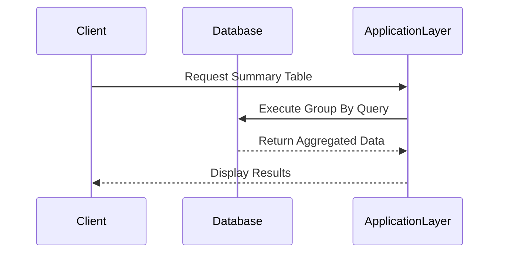

---

linkTitle: "Group By Aggregation"
title: "Group By Aggregation"
category: "9. Aggregation Patterns"
series: "Data Modeling Design Patterns"
description: "Using SQL's GROUP BY clause to aggregate data based on specific columns to optimize data processing in large-scale applications."
categories:
- Data Processing
- Aggregation Patterns
- Data Modeling
tags:
- SQL
- Aggregation
- Data Processing
- Group By
- Big Data
date: 2024-07-07
type: docs
canonical: "https://softwarepatternslexicon.com/102/9/22"
license: "© 2024 Tokenizer Inc. CC BY-NC-SA 4.0"
---

### Overview

The **Group By Aggregation** design pattern leverages the SQL `GROUP BY` clause to facilitate data aggregation based on selected attributes, enabling efficient summarization of large datasets. This pattern is commonly employed in data processing tasks where identifying and summarizing data trends or figures is essential, such as computing total sales per region or average temperature per city.

### Design Pattern Structure

The **Group By Aggregation** pattern involves clustering rows sharing a specified attribute and subsequently applying aggregate functions to these groups. Typical functions include `SUM`, `AVG`, `COUNT`, `MIN`, and `MAX`.

#### Example Query

```sql
SELECT product_category, SUM(revenue) AS total_revenue
FROM sales
GROUP BY product_category;
```

In this example, revenue totals are calculated for each product category, providing insights into the revenue distribution across different categories.

### Architectural Approaches

1. **Vertical Aggregation**:
   - Applied when summarization over a single attribute or a straightforward dataset is required.
   - Simple aggregation operations like total counts or sums are computed efficiently.

2. **Horizontal Aggregation**:
   - Optimized for scenarios requiring aggregation across multiple attributes or more complex operations.
   - Suitable for multi-dimensional analysis and Data Warehousing contexts.

3. **Hybrid Approach**:
   - Combines both vertical and horizontal aggregations for even more complex analytics, often employed in advanced data processing and reporting systems.

### Best Practices

- **Index Utilization**: Ensure that indexed fields are frequently used in the `GROUP BY` clause to accelerate query performance.
- **Aggregation Design**: Align the aggregation logic with business requirements for coherent and actionable results.
- **De-normalization Strategy**: Consider data denormalization in OLAP systems to enhance aggregation efficiency.

### Example Code Implementation in Python with SQLAlchemy

For integration with Python applications using an ORM like SQLAlchemy:

```python
from sqlalchemy import create_engine, Column, Integer, String, Float, func
from sqlalchemy.ext.declarative import declarative_base
from sqlalchemy.orm import sessionmaker

Base = declarative_base()

class Sale(Base):
    __tablename__ = 'sales'
    id = Column(Integer, primary_key=True)
    product_category = Column(String)
    revenue = Column(Float)

engine = create_engine('sqlite:///example.db')
Base.metadata.create_all(engine)

Session = sessionmaker(bind=engine)
session = Session()

result = session.query(
    Sale.product_category,
    func.sum(Sale.revenue).label('total_revenue')
).group_by(Sale.product_category).all()

for category, total in result:
    print(f"{category}: {total}")
```

### Diagrams

#### Mermaid Sequence Diagram: Data Processing with Group By



### Related Patterns

- **MapReduce Pattern**: Parallelizes data aggregation tasks across distributed systems.
- **ETL (Extract, Transform, Load) Pattern**: Prepares data for effective aggregation and analysis.

### Additional Resources

- [SQL GROUP BY Documentation](https://www.w3schools.com/sql/sql_groupby.asp)
- [SQLAlchemy Official Guide](https://docs.sqlalchemy.org/)
- [Understanding OLAP and Data Warehousing](https://www.oracle.com/technetwork/middleware/bi-foundation/olap-vs-analysis-wp-129630.pdf)

### Summary

The **Group By Aggregation** design pattern remains a fundamental tool in data analysis for efficiently summarizing large datasets. By leveraging SQL's ability to group data based on specific columns and applying aggregate functions, organizations can derive valuable insights that drive decisions. This approach is pivotal in transitioning raw data into meaningful, actionable information, especially in big data contexts.
