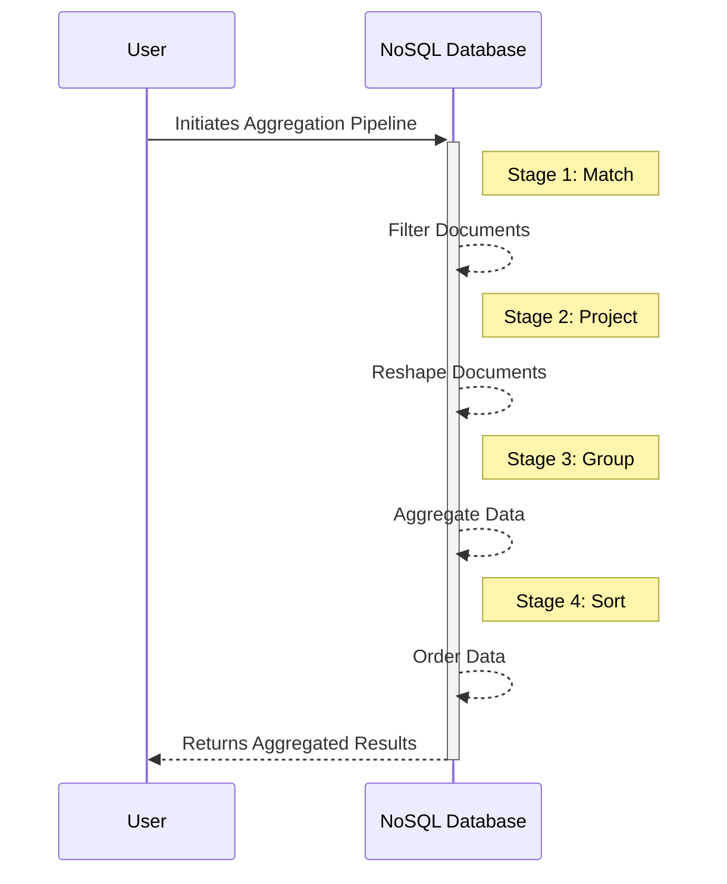

## Aggregation Pipelines

### Description

Aggregation Pipelines are essential patterns in data processing that allow for the efficient transformation of data by composing multiple operations into a sequence. This design pattern is particularly prevalent in NoSQL databases, such as MongoDB, where it provides a powerful way to filter, transform, and aggregate data in a single, streamlined query. 

By leveraging a series of stages, each responsible for a specific operation like filtering documents, projecting specific fields, or combining values, aggregation pipelines enable complex data processing tasks to be run efficiently and effectively.

### Architectural Approaches

Aggregation pipelines are designed to process data in the following staged manner:

1. **Match**: Filter data to pass only the documents that match specified conditions.
2. **Project**: Reshape each document in the stream, for example, by including, excluding, or adding new fields.
3. **Group**: Combine documents into groups based on a specified identifier, and perform computations like sum or average.
4. **Sort**: Order the documents by a specified field or fields.
5. **Limit/Skip**: Control the amount of data by limiting or skipping a set number of documents.

### Example Code

In MongoDB, an aggregation pipeline might look like this:

```javascript
db.sales.aggregate([
  { $match: { status: "A" } },
  { $group: { _id: "$item", total: { $sum: "$amount" } } },
  { $sort: { total: -1 } }
]);
```

This example matches documents in a sales collection with the status "A", groups them by the item field, sums the amounts in each group, and sorts the results by total in descending order.

### Best Practices

- **Minimize Stages**: Limit the number of pipeline stages to keep performance optimal.
- **Use Indexes**: Ensure that the fields used in the initial stages such as `$match` are indexed for better performance.
- **Efficiently Use `$project`**: Only include necessary fields to minimize the document size early in the pipeline.

### Diagrams

Here's a conceptual Mermaid diagram illustrating a typical aggregation pipeline sequence:



### Related Patterns

- **MapReduce**: Another powerful pattern used for processing large datasets over a distributed architecture.
- **CQRS (Command Query Responsibility Segregation)**: Separates the reading of data from its writing, allowing for specialized processing strategies like aggregation pipelines for reading.

### Additional Resources

- [MongoDB Aggregation Pipeline Documentation](https://docs.mongodb.com/manual/core/aggregation-pipeline/)
- [Understanding Aggregations in NoSQL](https://www.example.com)
- [Best Practices for MongoDB Aggregations](https://www.example.com)

### Summary

Aggregation Pipelines are a sophisticated pattern for processing data within NoSQL environments, enabling complex operations over sets of documents. By chaining operations in a staged process, these pipelines allow for efficient data transformation and filtering, aligning with modern data processing needs while ensuring optimal performance through best practices such as minimizing stages and utilizing indexes. As data sizes and complexity grow, leveraging aggregation pipelines properly can result in significant improvements in both query performance and application responsiveness.
