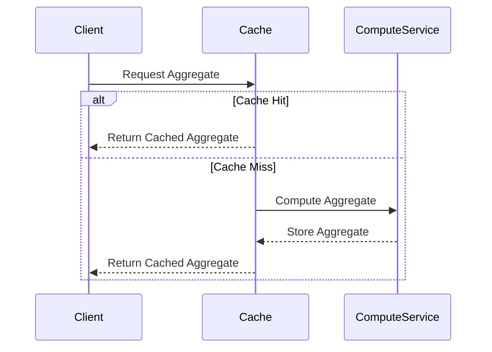

## Description

Cache-Ahead Aggregation is a design pattern primarily used to enhance the performance of read-heavy applications by precomputing and caching aggregate data results before they are requested by users. This approach significantly reduces the load on databases during peak request times and provides faster query responses by delivering precomputed results from a cache instead of executing complex database operations in real-time.

## Architectural Approach

In many enterprise applications, complex data operations can become bottlenecks, especially when aggregates are calculated on-the-fly. This pattern uses a proactive caching strategy to compute potentially expensive aggregations ahead of time. These precomputed aggregates are stored in a cache, making it possible to swiftly serve user requests from the cached values rather than querying and aggregating data at the time of request action.

The key challenge involved is balancing the trade-off between the freshness of the cached data and the performance improvement it provides. This pattern is particularly suitable for scenarios where the aggregation logic is complex, but data freshness is not of utmost importance right away.

## Design Considerations

- **Cache Invalidation**: One of the crucial aspects is managing cache invalidation. Explicit strategies for invalidation must be defined to ensure cached data does not become stale.
  
- **Data Freshness**: The pattern is ideal for scenarios where aggregates change less frequently or where slightly stale data is acceptable.
  
- **Cache Storage**: It is often ideal to use in-memory cache storage like Redis or Memcached for faster access times.
  
- **Scalability**: Cache-Ahead Aggregation allows horizontal scaling for read operations efficiently, reducing direct database load during high traffic periods.

### Example Code

Here's a conceptual example using Python and Redis for caching aggregates:

```python
import redis
from datetime import timedelta, datetime

cache = redis.StrictRedis(host='localhost', port=6379, db=0)

def compute_aggregate():
    # Complex aggregate computation
    # This could involve multiple database queries and processing
    result = {"count": 100}  # Placeholder
    return result

def cache_aggregate(key):
    # Setting cache with an expiry time
    aggregate_result = compute_aggregate()
    cache.setex(key, timedelta(hours=1), str(aggregate_result))
    return aggregate_result

def get_aggregate(key):
    # Try to get from cache
    cached_value = cache.get(key)
    if cached_value:
        return cached_value
    # If not cached, compute and store
    return cache_aggregate(key)

def main():
    key = "daily_user_count"
    print(f"Aggregate_result: {get_aggregate(key)}")
    
if __name__ == "__main__":
    main()
```

## Diagrams

### Sequence Diagram

Here is a Mermaid sequence diagram depicting how Cache-Ahead Aggregation works.



## Related Patterns

- **Read-Through Cache**: Automates cache miss handling by fetching and caching results as a response to a missed request.
  
- **Write-Behind Cache**: Writes data back to the cache asynchronously after processing operations to offload write pressure from the database.
  
- **Lazy Load Caching**: Fetches items and caches them on-demand, introducing latency only on the first request.

## Additional Resources

- [Designing Data-Intensive Applications by Martin Kleppmann](https://martin.kleppmann.com/): A comprehensive guide to modern data systems, performance, and scalability.
- [Redis Official Documentation](https://redis.io/documentation): Offers extensive resources and guides on implementing caching strategies using Redis.

## Summary

Cache-Ahead Aggregation offers a smart solution to improve the perceived performance of applications by precomputing expensive aggregations and serving them from cache. While this approach provides significant performance boosts, it’s important to carefully plan cache invalidation strategies to maintain an accurate reflection of the underlying data system. This pattern excels in scenarios where read operations are frequent, and immediate correctness of the data is not critical, striking a delicate balance between latency and data accuracy.
