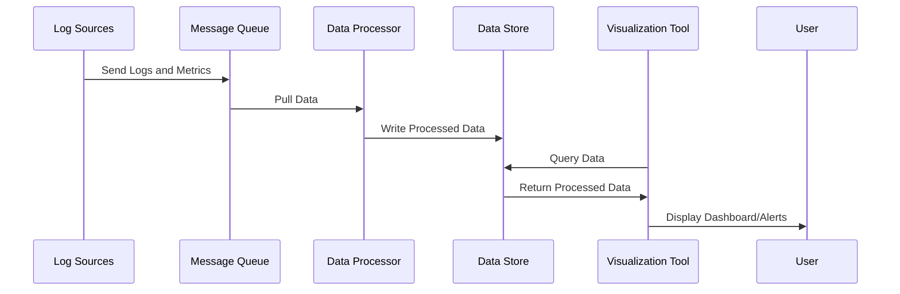

In cloud computing and distributed systems, **Aggregating Logs and Metrics** is a critical pattern that helps in achieving effective monitoring and alerting by collecting, centralizing, processing, and summarizing data from diverse sources. This pattern enables organizations to gain insights into their operations, optimize performance, detect anomalies, and ensure system reliability.

## Design Pattern Structure

The pattern involves the following key components:

1. **Data Collection**: Gathering logs and metrics from various sources such as application servers, database systems, network devices, etc.
2. **Data Ingestion**: Transporting collected data to a central log and metrics processing service or queue.
3. **Data Processing**: Analyzing, filtering, and enriching the data to make it meaningful and actionable.
4. **Data Storage**: Persisting the processed data in a scalable and queryable datastore for historical analysis.
5. **Alerting and Visualization**: Configuring alerts based on predefined thresholds and visualizing the data using dashboards for better interpretation.

## Sequence Diagram

Here's a basic sequence diagram showcasing the interaction between components in a typical log and metrics aggregation system:



## Example Implementation

Consider an example where the aggregation of server CPU usage metrics is fundamental to identify performance bottlenecks:

```java
import java.util.List;

public class MetricsAggregator {

    public static void main(String[] args) {
        // Simulate capturing CPU usage metrics
        List<Double> cpuUsages = captureCpuUsageMetrics();

        // Process and aggregate CPU usage metrics
        double averageUsage = cpuUsages.stream().mapToDouble(Double::doubleValue).average().orElse(0.0);

        // Check against threshold and alert
        alertIfThresholdExceeded(averageUsage, 75.0);
    }

    private static List<Double> captureCpuUsageMetrics() {
        // Dummy data for illustration
        return List.of(60.0, 70.5, 80.0, 90.0, 65.0);
    }

    private static void alertIfThresholdExceeded(double averageUsage, double threshold) {
        if (averageUsage > threshold) {
            System.out.println("Alert: Average CPU Usage Exceeded Threshold!");
        } else {
            System.out.println("CPU Usage is within normal range.");
        }
    }
}

```

## Best Practices

- **Scalability**: Ensure the system can handle high throughput and scale horizontally by leveraging cloud-native services such as AWS Kinesis, Google Cloud Pub/Sub, or Apache Kafka.
- **Fault Tolerance**: Design the architecture to be resilient with data redundancy and recovery mechanisms.
- **Latency Optimization**: Minimize the delay from data collection to alerting by optimizing the processing pipeline.
- **Security Considerations**: Encrypt sensitive data in transit and at rest, and implement access control measures to safeguard data integrity.

## Related Patterns

- **Event Streaming**: Real-time data processing and analytics pattern complementing logs and metrics aggregation.
- **Service Monitoring**: Focused on tracking specific service performance metrics.
- **Centralized Logging**: A pattern specifically dedicated to consolidating logs from multiple services.

## Additional Resources

1. "Monitoring distributed systems" - A comprehensive guide by Brendan Gregg on monitoring distributed architectures.
2. "The Elastic Stack: Getting new value from data logs" - Book by Mikael Bopst and Lava Kumar Enamala focusing on using Elastic stack for data logging.

## Summary

The Aggregating Logs and Metrics pattern is an effective approach in maintaining operational insight and reliability for cloud-based systems. By leveraging this pattern, organizations can ensure a proactive stance in monitoring and resolving issues, facilitating robust, performant, and resilient system designs. With advancements in tools and technologies, implementing this pattern becomes essential for modern infrastructure success.
