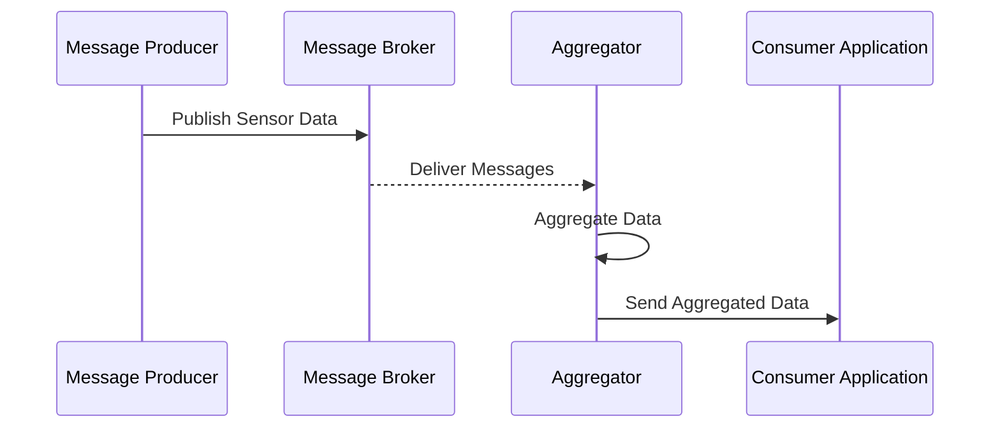

## Introduction

In the realm of distributed systems, efficient data processing and real-time event handling are pivotal for the seamless operation of complex architectures. Aggregation in message queues represents a robust pattern where data streaming through message brokers is aggregated, facilitating efficient downstream processing.

## Detailed Explanation

### Design Pattern Concept

Aggregation in message queues involves collecting and consolidating numerous data messages into a more manageable form as they traverse through a message broker. This pattern is especially useful in scenarios where downstream systems require bulk data processing, reduced network overhead, or optimized computational resources.

### Key Components

1. **Message Producers**: Components or services that generate messages or events, such as sensors, user interfaces, or other distributed applications.
  
2. **Message Broker**: Centralized systems (e.g., Apache Kafka, Amazon SQS, or RabbitMQ) that reliably dispatch and possibly store messages for further processing.

3. **Aggregators**: Specialized processes that extract, transform, and consolidate raw messages into coherent datasets or time windows suitable for consumption.

4. **Consumers**: Applications or services that ingest aggregated messages for data analytics, machine learning pipelines, or long-term storage.

### Architectural Approaches

- **Time-Based Aggregation**: Collects messages based on time intervals (e.g., every 10 seconds), useful for stream processing in low-latency systems.
  
- **Size-Based Aggregation**: Aggregates messages until a certain volume or data size is reached, optimizing for data handling efficiency.

- **Custom Rules**: Uses specific business or validation rules to determine aggregation, applicable in complex workflow environments.

### Best Practices

- **Scalability**: Ensure the message broker supports high-throughput scenarios and is configured for scale.
  
- **Fault Tolerance**: Implement recovery and failover mechanisms within the aggregation processes to prevent data loss.
  
- **Schema Management**: Utilize schema registries to manage and version the structure of messages or events.

### Example Code

Here's a simple example of using Apache Kafka Streams for message aggregation:

```java
StreamsBuilder builder = new StreamsBuilder();
KStream<String, SensorData> sensorStream = builder.stream("sensor-topic");

sensorStream
    .groupByKey()
    .windowedBy(TimeWindows.of(Duration.ofMinutes(1)))
    .aggregate(
        SensorAggregate::new,
        (key, value, aggregate) -> aggregate.add(value),
        Materialized.with(Serdes.String(), new SensorAggregateSerde())
    )
    .toStream()
    .to("aggregated-sensor-data-topic");

KafkaStreams streams = new KafkaStreams(builder.build(), new StreamsConfig(config));
streams.start();
```

### Diagrams

#### Sequence Diagram



### Related Patterns

- **Competing Consumers**: Enhances parallel processing by distributing messages across multiple consumer instances.
  
- **Event Sourcing**: Stores application state as a sequence of events, enabling complex aggregation queries and patterns.
  
- **Batch Messaging**: Group multiple messages into a single batch to optimize processing and reduce overhead.

### Additional Resources

- **Apache Kafka Documentation**: [Kafka Documentation](https://kafka.apache.org/documentation/)
- **Amazon SQS**: [AWS Messaging](https://aws.amazon.com/sqs/)
- **Stream Processing with Apache Flink**: [Flink Documentation](https://flink.apache.org)

## Final Summary

Aggregation in message queues plays a critical role in data processing architectures, enabling efficient collection and transformation of data as it travels through message brokers. This pattern is vital for optimizing resource utilization, improving throughput, and ensuring robust real-time processing in distributed systems. By leveraging the capabilities of modern message brokers like Apache Kafka, organizations can create scalable, fault-tolerant, and responsive data pipelines that support a variety of applications from real-time analytics to complex event processing.
