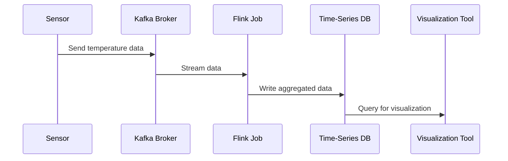

## Time-Series Aggregation

### Description

Time-Series Aggregation is a design pattern focused on summarizing time-series data at specific intervals to transform high-volume, granular data into actionable insights and reduce data complexity. This pattern is commonly used in scenarios where data is collected at a much finer level of granularity than needed for decision-making purposes. By performing operations such as averaging, summing, counting, or even applying more complex statistical functions over specified time windows, this aggregation makes the data manageable and meaningful for analysis.

### Architectural Approach

Time-Series Aggregation often involves a pipeline architecture where data flows through stages of ingestion, transformation, aggregation, and loading (ETAL). Tools and frameworks such as Apache Flink, Apache Kafka Streams, and Apache Spark are frequently employed to handle real-time or batch processing of time-series data.

**Components:**
- **Data Source**: Collects raw time-series data from various origins such as IoT devices, logs, sensors, etc.
- **Ingestion Layer**: Often facilitated by streaming platforms like Apache Kafka or managed solutions like AWS Kinesis.
- **Transformation Logic**: Business rules and logic to compute desired statistics (e.g., average, max, min) over sliding or tumbling time windows.
- **Storage Layer**: Databases optimized for time-series data such as InfluxDB, TimescaleDB, or cloud-based solutions like Google BigQuery.
- **Visualization and Reporting Tools**: Systems like Grafana or Kibana allow stakeholders to visualize aggregated data.

### Example Code

Here's an implementation snippet using Apache Flink and Scala:

```scala
import org.apache.flink.streaming.api.scala._
import org.apache.flink.streaming.api.windowing.time.Time

case class TemperatureReading(sensorId: String, timestamp: Long, temperature: Double)

object TemperatureAggregationExample {
  def main(args: Array[String]): Unit = {
    // Set up the streaming execution environment
    val env = StreamExecutionEnvironment.getExecutionEnvironment

    // Create a DataStream of TemperatureReading
    val readings: DataStream[TemperatureReading] = // source omitted for brevity

    // Aggregate by sensorId over a 1-hour window, calculating the average temperature
    val aggregatedReadings = readings
      .keyBy(_.sensorId)
      .timeWindow(Time.hours(1))
      .reduce((r1, r2) => TemperatureReading(r1.sensorId, r1.timestamp,
                                              (r1.temperature + r2.temperature) / 2))

    // Add your sink/output
    aggregatedReadings.print()

    // Execute the Flink job
    env.execute("Time-Series Aggregation Example")
  }
}
```

### Diagrams

#### Time-Series Aggregation with Flink



### Related Patterns

- **Windowing Pattern**: Define how to split and organize time-series events into time-based processing buckets.
- **Data Transformation Pattern**: Rules and operations applied to modify the time-series data before aggregation.
- **Data Compression Pattern**: Reduces the size of time-series data by storing aggregated results.

### Additional Resources

- *Designing Data-Intensive Applications* by Martin Kleppmann
- Apache Flink Documentation: [https://flink.apache.org/doc/](https://flink.apache.org/doc/)
- InfluxDB Documentation: [https://docs.influxdata.com/](https://docs.influxdata.com/)

### Summary

The Time-Series Aggregation pattern provides a strategy to handle large volumes of time-stamped events, facilitating meaningful comprehension of the data through aggregation on user-defined time windows. It leverages technologies specifically suited for processing and storing time-sensitive data efficiently. This pattern is crucial for real-time monitoring, analytics, and dashboards where data freshness and summarization are needed for decision-making.
