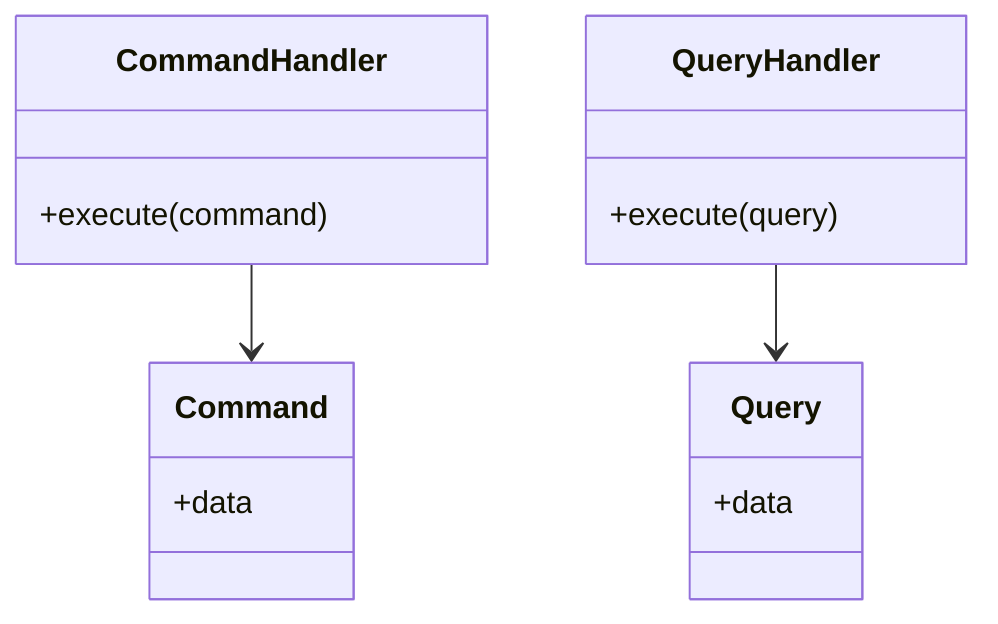

## Command Query Responsibility Segregation (CQRS)

Command Query Responsibility Segregation (CQRS) is a design pattern that segregates the data modification operations (commands) from the data reading operations (queries). This separation often results in different aggregation and optimization strategies for command and query data models.

### Detailed Explanation

CQRS divides the system's architecture into two distinct models: 

- **Command Model**: This is responsible for handling requests that modify the state of data. Commands do not return data except for a success/failure status. The focus here is on operations that result in changes to the data, like creating, updating, or deleting records.

- **Query Model**: This addresses requests that aim to read data without modifying it. Queries should be side-effect-free and emphasize retrieving data in an optimized manner for quick access, often using separate databases for performance tuning.

#### Benefits

- **Scalability**: By separating the read and write concerns, systems can scale the read and write operations independently.
- **Optimized Read/Write Operations**: Different databases or data models can be used to optimize reading queries (e.g., caches, read replicas) and write operations.
- **Flexibility in Data Models**: Tailor data models to the specific needs of reads and writes, which can be independently iterated and improved.

#### Drawbacks

- **Complexity**: The separation introduces additional complexity in maintaining two separate models and eventual consistency concerns.
- **Consistency Challenges**: Since the data models for reading and writing are separate, ensuring all state changes synchronize properly requires careful management, often involving event sourcing.

### Example

Suppose you are building an e-commerce platform. You would deploy the CQRS pattern as follows:

- **Command Model**: Handles requests such as "Add product to inventory" or "Update product pricing". These operations would directly impact the dataset and might trigger events to notify the system of a change.

- **Query Model**: Efficiently retrieves data for product listings and search results. The model can be heavily indexed and cached to provide low-latency access to this often-accessed data.

### Diagram

### Related Patterns

- **Event Sourcing**: Often paired with CQRS to maintain audit logs and track changes across commands, which helps in reconstructing states from an event log.
- **Domain-Driven Design (DDD)**: CQRS fits naturally within DDD, where different models are often required for different contexts.

### Best Practices

1. **Use Event Sourcing**: When implementing CQRS, use event sourcing to ensure all changes are captured as events, simplifying the creation of the query model.
2. **Separate Database/Storage**: Consider physically separating databases or storage engines for commands and queries for improved performance.
3. **Ensure Consistency**: Manage eventual consistency through using message passing or event-driven mechanisms to propagate changes.

### Additional Resources

- **Martin Fowler on CQRS**: [Martin Fowler's website](https://martinfowler.com/bliki/CQRS.html)
- **The CQRS Journey Guide by Microsoft**: A comprehensive guide to implementing CQRS patterns.
- **Event-Driven Microservices by O'Reilly**: Offers insights on combining CQRS with microservices architecture.

### Summary

CQRS leverages the strengths of separate data models for command and query operations, allowing teams to optimize each path independently. While it introduces complexity into system architecture, the pattern provides scalability, flexibility, and improved performance when correctly implemented, often in conjunction with event sourcing and microservices.
