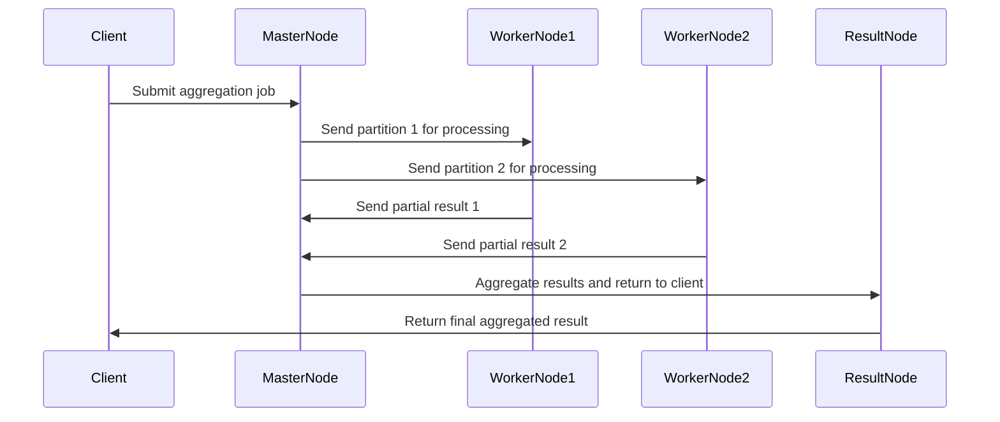

---

linkTitle: "Parallel Aggregation"
title: "Parallel Aggregation"
category: "9. Aggregation Patterns"
series: "Data Modeling Design Patterns"
description: "Executing aggregation operations in parallel to reduce processing time, enhancing performance significantly by leveraging multi-threaded computing to handle large datasets efficiently."
categories:
- aggregation-patterns
- data-modeling
- performance
tags:
- parallel-computing
- performance-optimization
- multi-threading
- data-aggregation
- scalability
date: 2024-07-07
type: docs

canonical: "https://softwarepatternslexicon.com/102/9/30"
license: "© 2024 Tokenizer Inc. CC BY-NC-SA 4.0"
---

## Introduction

Parallel aggregation is a performance optimization design pattern that enables the efficient processing of aggregation operations by executing them in parallel across multiple threads or nodes. This pattern is particularly beneficial when dealing with large datasets, as it utilizes computing resources effectively to reduce processing time and improve scalability.

In distributed systems, aggregation tasks are crucial when summarizing information, generating reports, or performing complex queries that involve multiple computational steps across extensive datasets. Leveraging parallel processing techniques allows for faster computations and responsive data operations.

## Detailed Explanation

### Design Patterns and Architectural Approaches

Parallel Aggregation fits into the Performance Optimization subcategory of Aggregation Patterns, aspiring to tackle the challenges posed by single-threaded processing, which typically becomes inefficient with increased data volume.

A common architectural approach to implement Parallel Aggregation is the MapReduce paradigm, where data is distributed across several servers to be processed in parallel, and results are often consolidated (reduced) into a final output. 

Frameworks such as Apache Spark, Flink, and Hadoop are extensively used for parallel aggregation tasks and facilitate distributed processing by providing built-in functions for map, shuffle, and reduce operations.

**MapReduce Architecture:**
- **Map Phase**: Distribute data for processing across multiple nodes, where each node independently executes a map operation.
- **Shuffle and Sort Phase**: Once map phase completes, data is shuffled and sorted to prepare for aggregation (reduce operation).
- **Reduce Phase**: Aggregate the results of each map operation, consolidating a final output.

### Example Code

Here is a simple example using Apache Spark to demonstrate how parallel aggregation is achieved:

```scala
import org.apache.spark.sql.SparkSession

// Initialize Spark session
val spark = SparkSession.builder
  .appName("ParallelAggregationExample")
  .getOrCreate()

// Sample dataset
val data = Seq(("category1", 10), ("category2", 20), ("category1", 5))
val df = spark.createDataFrame(data).toDF("category", "value")

// Perform aggregation in parallel
val aggregatedDF = df
  .groupBy("category")
  .sum("value")

// Show the result
aggregatedDF.show()

spark.stop()
```

### Diagrams

Below is a Mermaid UML Sequence Diagram demonstrating the flow in a parallel aggregation scenario.



### Related Patterns

Parallel Aggregation often integrates with other design patterns like:

1. **Bulkhead Pattern**: Isolating elements of an application into pools to limit failure impact.
   
2. **CQRS (Command Query Responsibility Segregation)**: Inducing parallelism by applying query and command segregation.
   
3. **Event Sourcing**: Capturing all changes to application state as a sequence of events which can complement data replication and aggregation.

### Additional Resources

For further study on Parallel Aggregation and related concepts, consider exploring materials such as:

1. [Designing Data-Intensive Applications by Martin Kleppmann](https://dataintensive.net/)
2. Apache [Spark Documentation](https://spark.apache.org/docs/latest/)
3. [The MapReduce Programming Model](https://research.google.com/archive/mapreduce.html)

## Summary

Parallel Aggregation is a foundational design pattern optimizing the execution of aggregation tasks across multiple threads or nodes, greatly enhancing performance and resource utilization. Strategic implementation using frameworks like Spark streamlines the data processing lifecycle, ensuring scalability and rapid results even with the large-scale datasets typical in modern enterprise systems. Embracing this pattern facilitates a seamless integration with emerging paradigms in distributed data processing, solidifying its spot in a robust data architecture strategy.
