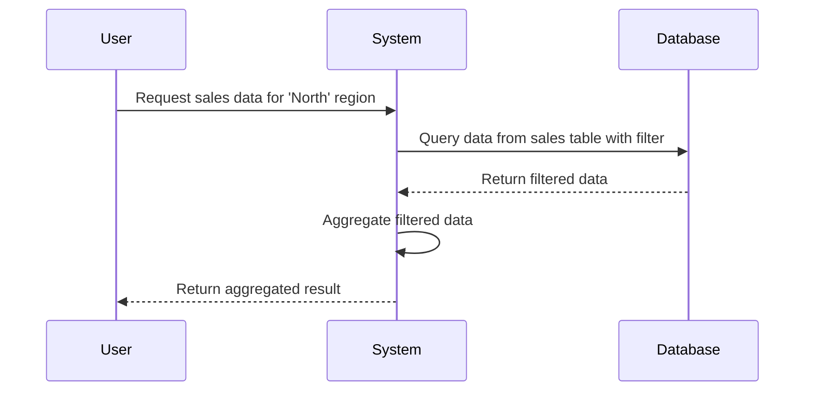

The Filter-Aggregate Pattern is an essential design pattern within the realm of data processing and modeling. This pattern emphasizes the application of filters to data sets before performing aggregations. By doing so, the pattern ensures that only relevant subsets of data are processed for aggregation, which can enhance performance and provide more targeted insights.

## Detailed Explanation

### Overview
The primary purpose of the Filter-Aggregate Pattern is to streamline data processing workflows by allowing only pertinent data to be passed through aggregation functions. This offers a strategic advantage in terms of computing efficiency and precision of analysis.

### Motivations

1. **Performance Optimization**: Filtering data sets before aggregation reduces the volume of data processed, conserving both computational power and time.
2. **Targeted Analytics**: Allows for more meaningful and specific insights by focusing on particular data segments (e.g., region-specific sales).
3. **Scalability**: Efficiently handles large data sets by managing complexity through reduced data scope.

### Architectural Approaches

- **Pre-Processing Step**: Use intermediate data storages or phases where data can be filtered before forwarding for aggregation.
- **Chained Functions**: Employ functional programming paradigms where filtering and aggregation logic form a chain of operations.
- **Distributed Computing**: Utilize distributed systems where filters can be applied at the node level to minimize data transfer across the network prior to aggregation.

### Example Code

#### JavaScript Example

In this example, we demonstrate a simple filter and aggregation using JavaScript.

```javascript
const salesData = [
  { region: "North", amount: 200 },
  { region: "South", amount: 150 },
  { region: "North", amount: 300 },
  { region: "East", amount: 250 },
  { region: "South", amount: 100 },
];

// Filter sales data for the 'North' region
const filteredSales = salesData.filter(sale => sale.region === "North");

// Aggregate the total sales for the filtered region
const totalSales = filteredSales.reduce((total, sale) => total + sale.amount, 0);

console.log(`Total sales for the North region: $${totalSales}`);
```

### Diagrams

#### Sequence Diagram



### Related Patterns

- **MapReduce**: Splits tasks into map and reduce phases that can leverage filtering during the map stage.
- **Lambda Architecture**: Supports batch and real-time processing, where filtering is crucial to reduce data volume for batch computations.
- **CQRS (Command Query Responsibility Segregation)**: Separates read and write operations, potentially including filtering on the read side to optimize data retrieval and processing.

## Additional Resources

- *Design Patterns: Elements of Reusable Object-Oriented Software* by Erich Gamma et al. – for foundational understanding of design patterns.
- Online tutorials specific to your stack (e.g., Apache Beam for distributed processing).

## Summary

The Filter-Aggregate Pattern is invaluable for efficiently processing and analyzing large volumes of data by focusing on relevant data subsets before aggregation. This pattern not only boosts performance but also facilitates more precise data-driven insights. By employing architectural practices and leveraging related patterns, organizations can harness the full potential of this approach in their data modeling and processing workflows.
