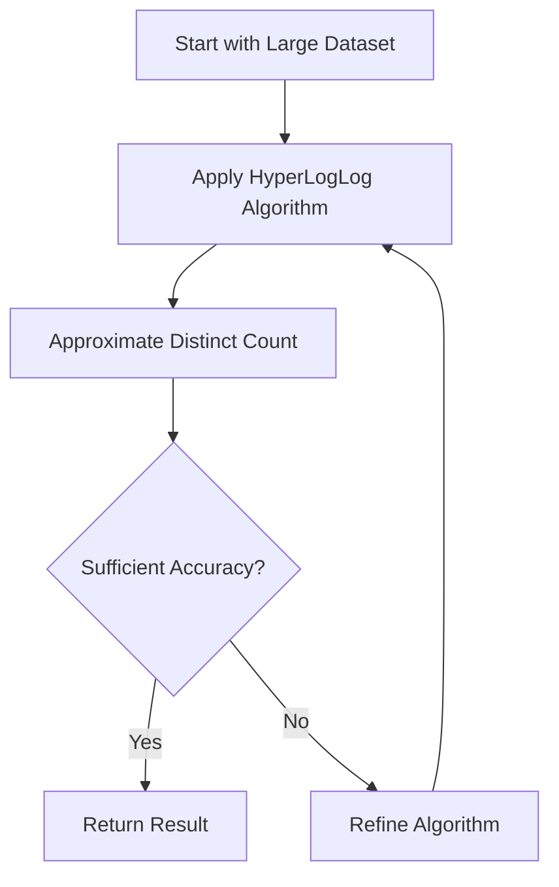

## Introduction

The Approximate Aggregation Design Pattern is a valuable strategy in handling large-scale data environments where achieving precise results might be computationally expensive or unnecessary. By leveraging algorithms that provide near-accurate results with a significant reduction in computational resources and time, systems can maintain responsiveness and efficiency, particularly in real-time analytics.

## Detailed Explanation

### Design Pattern Overview

- **Purpose**: 
  - To offer a practical means of performing aggregative operations on massive datasets without the heavy burden of attaining perfect accuracy.
  
- **Usage Scenario**: 
  - Useful when dealing with web-scale data, such as user activity logs, social media data, and sensor readings, where exact precision is not a critical requirement.

### Key Algorithms

- **HyperLogLog**:
  - A probabilistic data structure used to estimate the cardinality of a dataset (like the number of unique elements).
  - It is highly memory-efficient compared to exact counting methods.

- **Count-Min Sketch**:
  - Used for frequency estimation of events in data stream processing.
  - Helps in approximating the frequency of different events within a stream using sub-linear space.

### Architectural Considerations

- **Scalability**: 
  - Approximate methods allow systems to scale efficiently, managing larger datasets without proportionally increasing resource consumption.
  
- **Trade-offs**:
  - While these algorithms provide faster results and reduce resource demand, they introduce trade-offs in the form of potential inaccuracies.
  - Choice of algorithm and configuration (such as precision settings in HyperLogLog) need to balance resource optimization against acceptable error margins.

## Example Code

Here is an example of using HyperLogLog for approximate distinct counting in a Java-based system.

```java
import com.clearspring.analytics.stream.cardinality.HyperLogLog;
import java.util.Random;

public class ApproximateAggregationExample {
    public static void main(String[] args) {
        HyperLogLog hyperLogLog = new HyperLogLog(0.01);

        Random random = new Random();
        for (int i = 0; i < 10_000_000; i++) {
            hyperLogLog.offer(random.nextInt(1_000_000));
        }

        long estimate = hyperLogLog.cardinality();
        System.out.println("Estimated unique count: " + estimate);
    }
}
```

## Diagram



## Related Patterns

- **Batch Processing Pattern**:
  - Used for handling large volumes of data at intervals. Approximate aggregation can complement this in scenarios where quick insights are needed during the batch operations.

- **Stream Processing Pattern**:
  - Real-time data processing that can utilize approximate aggregation for instantaneous results.

## Additional Resources

- [HyperLogLog: The Analysis of a Near-Optimal Cardinality Estimation Algorithm](https://www.researchgate.net/publication/261456706_HyperLogLog_The_Analysis_of_a_Near-Optimal_Cardinality_Estimation_Algorithm)
- [Introduction to Count-Min Sketch](https://spectral.io/blog/2021/09/15/introduction-to-count-min-sketch/)

## Summary

The Approximate Aggregation Pattern plays a crucial role in modern data processing architectures, enabling applications to deliver insights rapidly and efficiently. By using techniques like HyperLogLog and Count-Min Sketch, systems not only achieve greater scalability but also optimize resource usage, essential in big data environments. This pattern is particularly beneficial when exact data precision is less important than speed and performance.
