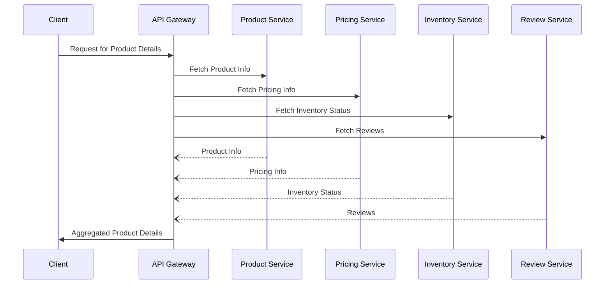

## Introduction

The "Aggregation in Microservices" pattern involves collating data from disparate microservices into a singular, cohesive response. This approach is pivotal in microservice architectures where information is often partitioned across several services. Effective aggregation reduces network latency and complexity for client applications, streamlines the management of distributed data, and enhances the user experience by delivering comprehensive responses promptly.

## Context

In distributed systems, microservices often encapsulate distinct business functionalities. A product web portal, for instance, might source details from several services such as inventory, pricing, and customer reviews. Each of these services provides a specific slice of data, often resulting in multiple remote calls from a client application to assemble a complete view of the product, which can be inefficient and cumbersome.

## Problem

Clients need to consolidate data from multiple microservices with minimal latency and overhead. Without a unified approach to data aggregation, a client must independently retrieve and stitch together data from various services, leading to excessive network requests, increased complexity, and slowed response times.

## Solution

Implement an aggregation layer that interfaces with the microservices and consolidates their data. This layer can exist at an API Gateway or as a dedicated aggregation service. It handles the complexities of communicating with the individual microservices, fetches the necessary data, and returns a unified result to the client.

### Example Implementation

Consider an e-commerce application where product information, pricing, inventory status, and user reviews are retrieved and consolidated for display on the product page. An API Gateway or an aggregation microservice can seamlessly handle these interactions.

```kotlin
// Pseudo-code to demonstrate aggregation
fun aggregateProductDetails(productId: String): ProductDetails {
    val productInfo = fetchProductInfo(productId) // From Product Service
    val pricingInfo = fetchPricingInfo(productId) // From Pricing Service
    val inventoryStatus = fetchInventoryStatus(productId) // From Inventory Service
    val reviews = fetchReviews(productId) // From Review Service

    return ProductDetails(
        info = productInfo,
        pricing = pricingInfo,
        inventory = inventoryStatus,
        reviews = reviews
    )
}
```

### Sequence Diagram

To visualize data aggregation, here's a sequence diagram depicting an API Gateway aggregating data from multiple services:



## Best Practices

- **Asynchronous Communication**: Leverage asynchronous calls when interfacing with microservices to reduce wait times and improve communication efficiency.
- **Caching**: Implement caching within the aggregation layer to minimize repeated calls to unchanged data.
- **Error Handling and Fault Tolerance**: Build robust error handling and implement fallback mechanisms to handle service failures gracefully.
- **Data Transformation**: Aggregate data should be transformed to fit the client's needs, ensuring that it serves its intended purpose.

## Related Patterns

- **API Gateway Pattern**: Often employed alongside aggregation to handle incoming requests and provide a single entry point into the system.
- **Backend for Frontend (BFF) Pattern**: Creates specific backend interfaces for client consumers; a specialized form of aggregation.
- **Composite Design Pattern**: Organizes component trees for structural patterns, enhancing the hierarchy and relationship management of data.

## Additional Resources

- *Microservices Architecture: Aligning Principles, Practices, and Culture*, by M. Richards
- *Designing Distributed Systems: Patterns and Paradigms for Scalable, Reliable Services*, by B. Burns
- "Building Microservices" by Sam Newman

## Summary

The "Aggregation in Microservices" design pattern plays a crucial role in synthesizing data from multiple microservices for efficient delivery and improved client interaction. This aggregation layer can dramatically streamline data access in microservice architectures, fostering a more responsive and cohesive system. By following best practices and leveraging complementary patterns, developers can optimize their distributed systems for enhanced scalability and performance.
