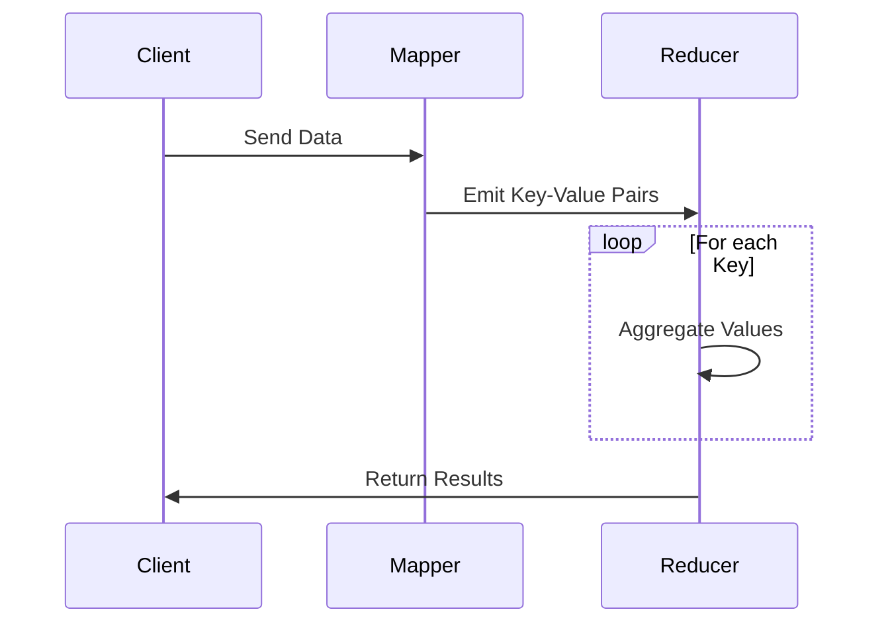
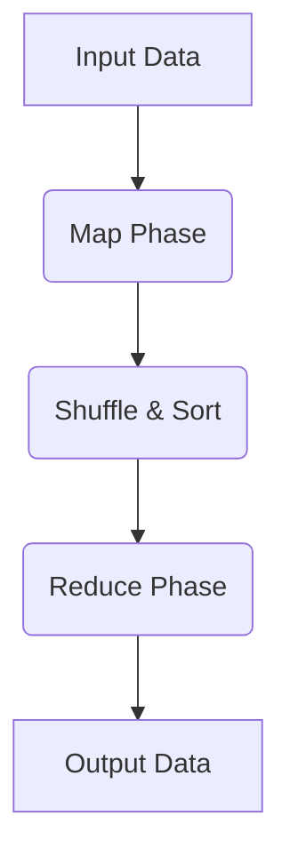

---

linkTitle: "Aggregation with Map-Reduce Functions"
title: "Aggregation with Map-Reduce Functions"
category: "9. Aggregation Patterns"
series: "Data Modeling Design Patterns"
description: "Defining map and reduce functions to process and aggregate data in distributed systems efficiently, enabling scalable computations and transformations within large datasets."
categories:
- Aggregation
- Data Modeling
- Distributed Systems
tags:
- Map-Reduce
- Distributed Computing
- Data Aggregation
- NoSQL
- CouchDB
date: 2024-07-07
type: docs

canonical: "https://softwarepatternslexicon.com/102/9/34"
license: "© 2024 Tokenizer Inc. CC BY-NC-SA 4.0"
---


Map-Reduce is a powerful programming model and associated implementation for processing and generating large data sets. It is primarily used in distributed systems to enable scalable, fault-tolerant aggregation and data processing tasks. This pattern can be leveraged across both NoSQL databases and big data platforms to facilitate the execution of data transformations and analyses.

## Description

The Aggregation with Map-Reduce Functions pattern involves defining distinct steps:

1. **Map Function** - Processes input data and produces key-value pairs. The goal here is data transformation and initial selection.
2. **Shuffle and Sort** - After map operations, key-value pairs are grouped by key, effectively redistributing data between processing nodes.
3. **Reduce Function** - Aggregates storied values associated with each key, summarizing data efficiently. This step combines results as needed, such as counting, ranking, or filtering operations.

This pattern is popularized by systems like Apache Hadoop and has been adapted within NoSQL databases like CouchDB. It enables handling extensive datasets by parallelizing tasks across a distributed environment.

## Example

Here's an example leveraging CouchDB, which uses JavaScript functions to perform map-reduce operations to build views:

```javascript
// Map Function
function(doc) {
  if (doc.type === 'purchase') {
    emit(doc.userId, doc.amount);
  }
}

// Reduce Function
function(keys, values, rereduce) {
  return sum(values);
}
```

In this example, the map function outputs a user's purchase amount per document that represents a purchase, while the reduce function sums the amounts, thus producing a total spending per user.

## Architectural Approaches

### Parallel Processing

Using the Map-Reduce pattern, workload can inherently be parallelized, leading to efficient use of resources across multiple nodes. It involves distributing the map tasks and then aggregating results through reduced operations.

### Fault Tolerance

The design naturally supports fault tolerance. Partial computation failures can be isolated and recovered without the entire dataset needing reprocessing.

### Scalability

By dividing tasks among data nodes, horizontal scaling can be achieved seamlessly. New nodes can be incorporated with minimal reconfiguration, balancing the load dynamically.

## Best Practices

- Optimize the size of map outputs - delegating too much work to reduce functions can create bottlenecks.
- Exploit in-memory caching where possible to further enhance processing speeds.
- Regularly monitor the performance and adjust map-reduce logic accordingly to accommodate growing data needs.

## Diagrams

### Map-Reduce Process



### Data Flow



## Related Patterns

- **Batch Processing**: Suitable for organizations performing extensive data transformations where real-time data access isn't necessary.
- **Stream Processing**: An alternative for scenarios requiring real-time processing over aggregation windows.

## Additional Resources

- **MapReduce: Simplified Data Processing on Large Clusters** by Jeffrey Dean and Sanjay Ghemawat - seminal paper that introduced the pattern.
- Apache Hadoop and CouchDB documentation for detailed implementation guides.

## Summary

The Aggregation with Map-Reduce Functions pattern is indispensable for large-scale data processing in distributed systems. It optimizes resource utilization by partitioning and paralleling tasks effectively across networks. Adapting this pattern can lead to significant improvements in performance, fault tolerance, and scalability for any enterprise-level data processing requirement, paving the way for real-time and batch processing capabilities across varied domains.

Whether applied in big data frameworks or NoSQL databases, this pattern continues to play a crucial role in modern data architecture solutions.

---
