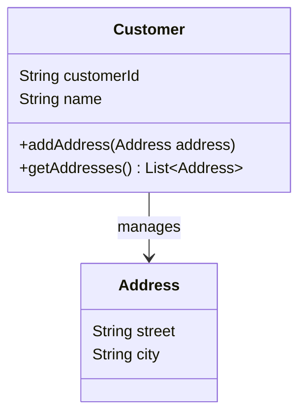

## Introduction

In Domain-Driven Design (DDD), an **Aggregate Root** is a fundamental design pattern employed to define a focal entity within an aggregate, responsible for maintaining the integrity and consistency of that aggregate. By encapsulating rules for accessing and modifying related entities, Aggregate Roots play a crucial role in domain modeling and data integrity.

## Detailed Explanation

Aggregates in DDD are clusters of domain objects that are treated as a single unit for data modification purposes. The Aggregate Root is the entity that acts as the gatekeeper for the entire aggregate, ensuring that no external entity can modify the aggregate's members without adhering to its rules. It champions encapsulation by controlling access to its components, thus safeguarding the aggregate's internal consistency.

### Characteristics of Aggregate Roots

1. **Encapsulation**:
    - Aggregate Roots encapsulate the entire state of their respective aggregates by managing all of its entities' interactions and modifications.
  
2. **Transactional Boundaries**:
    - Changes to an aggregate are processed as a transaction. The Aggregate Root ensures any state changes occur atomically to maintain consistency.

3. **Identifiers**:
    - Aggregate Roots are the only entities within the aggregate reachable by external means, and they are identified by unique IDs that aid in consistency control.

## Best Practices

- Keep your aggregates small and focused to ensure that any transactional data operations are lightweight and performant.
- Each aggregate should have one Aggregate Root.
- Avoid accessing or manipulating entities within aggregates directly from outside of the Aggregate Root.
- Design aggregates considering how they will collaborate with other aggregates but the focus should be on its autonomy.

## Example Code

Let's consider a simple example in Java, emphasizing a "Customer" aggregate where the customer entity acts as the Aggregate Root:

```java
class Customer {
    private String customerId;
    private String name;
    private List<Address> addresses;

    public Customer(String customerId, String name) {
        this.customerId = customerId;
        this.name = name;
        this.addresses = new ArrayList<>();
    }

    public void addAddress(Address address) {
        addresses.add(address);
    }

    public List<Address> getAddresses() {
        return Collections.unmodifiableList(addresses);
    }
}

class Address {
    private String street;
    private String city;

    public Address(String street, String city) {
        this.street = street;
        this.city = city;
    }
}
```

In this code, `Customer` is the Aggregate Root, with methods to manage addresses as part of its aggregate.

## Diagrams

Below is an illustration of the aggregate structure created using a class diagram in Mermaid:



## Related Patterns

- **Repositories**: Repositories offer a mechanism for accessing entities from external storage, serving entire aggregates.
- **Event Sourcing**: A design to store the state as a series of events, can be useful in reconstructing the state of aggregates.

## Additional Resources

- "Domain-Driven Design: Tackling Complexity in the Heart of Software" by Eric Evans.
- "Implementing Domain-Driven Design" by Vaughn Vernon.
  
## Summary

Aggregate Roots are pivotal in DDD for modeling data modifications within specified boundaries, ensuring integrity, and simplifying system design. By focusing on encapsulation and transactional coherency, they allow developers to build robust, maintainable systems that manage complex domain logic efficiently.
