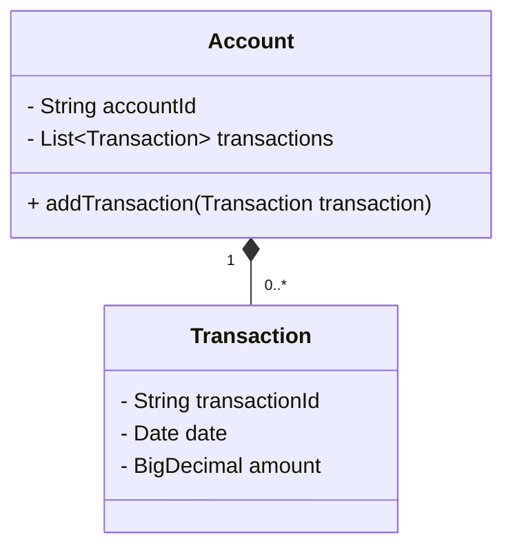

## Overview

In cloud-based systems and distributed architectures, maintaining consistency across databases and services is of paramount importance. The **Consistency Boundaries** pattern focuses on identifying aggregates that serve as boundaries for consistency. This ensures that within these boundaries, all operations appear atomic and consistent to the system users.

## What are Aggregates?

An aggregate is a cluster of domain objects that can be treated as a single unit regarding data changes. Each aggregate has a root and a boundary and preserves its consistency across operations. For example, in a banking domain, an "Account" entity may serve as an aggregate root encompassing other related entities like transactions, account holder details, etc.

## Architectural Approach

1. **Define Aggregate Roots**: Identify entities that will act as roots for aggregates.
2. **Establish Consistency Boundaries**: Ensure that all entities within an aggregate maintain consistency, triggered by changes at their root.
3. **Transaction Management**: Limit transactions to operate within an aggregate. Use eventual consistency for inter-aggregate operations if necessary.
4. **Use Domain-Driven Design (DDD)**: Leverage principles from DDD to model complex domain logic with consistency boundaries.

## Example Code

```java
@Entity
public class Account {
  
    @Id
    private String accountId;

    @ElementCollection
    private List<Transaction> transactions = new ArrayList<>();

    public void addTransaction(Transaction transaction) {
        transactions.add(transaction);
    }

    // Transaction management logic here
}

@Entity
public class Transaction {
    private String transactionId;
    private Date date;
    private BigDecimal amount;

    // getters and other methods
}
```

In this example, `Account` is the aggregate root, and `Transaction`s are part of its boundary. All operations are managed within a consistent boundary defined by `Account`.

## Diagram



## Related Patterns

- **Event Sourcing**: Log all changes to an application state as a sequence of events to maintain history and achieve eventual consistency if needed.
- **CQRS (Command Query Responsibility Segregation)**: Use different models for command (write) and query (read) operations, aiding in consistency across boundaries.
- **Saga Pattern**: Coordinate transactions that span multiple services or aggregates ensuring data consistency using compensating transactions.

## Best Practices

- **Limit Aggregate Scope**: Ensure aggregates are small enough to handle operations efficiently yet comprehensive enough to encapsulate consistency constraints.
- **Transactional Boundaries**: Opt for small transactions within aggregates and asynchronous processes for cross-aggregate operations.
- **Concurrency Control**: Use version control or timestamps to manage concurrent changes within an aggregate.

## Additional Resources

- _Domain-Driven Design: Tackling Complexity in the Heart of Software_ by Eric Evans
- _Implementing Domain-Driven Design_ by Vaughn Vernon
- Architectural Patterns: Unifying Consistency and Availability in Business Applications

## Summary

Consistency Boundaries play a critical role in maintaining the integrity and reliability of operations within distributed systems. By clearly defining aggregates and their boundaries, developers can ensure atomic updates and data consistency. Use the principles of Domain-Driven Design to collaboratively design systems that leverage these crucial boundaries effectively. Integrating this pattern into cloud architectures can significantly enhance system robustness and scalability.
