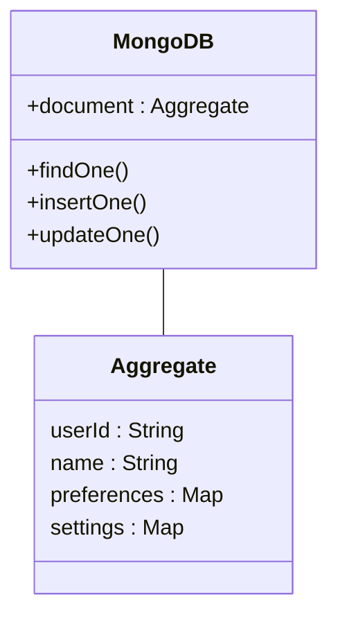

## Overview

The "Aggregating in NoSQL Databases" design pattern focuses on modeling data as aggregates that align closely with the non-relational structures of NoSQL systems. This approach is essential for optimizing operations and performance in systems that use schemaless databases like document stores, key-value pairs, and column-family stores.

## Description

NoSQL databases are optimized for specific kinds of operations, often involving aggregating related data into singular units, known as aggregates. Unlike traditional relational databases, NoSQL systems do not require a fixed schema, which provides flexibility in how data is stored and retrieved. By designing data models around aggregates, you can take full advantage of NoSQL capabilities, such as horizontal scalability, quick write/read operations, and data denormalization.

### Benefits
- **Performance**: By querying a single aggregate, applications minimize the need for complex joins and multiple retrievals, enhancing performance.
- **Scalability**: Aggregates allow for easy replication and sharding across distributed systems.
- **Flexibility**: Adjustments and iterations of data structures are easier in aggregate models due to their schemaless nature.

### Drawbacks
- **Data Duplication**: Maintaining aggregates often results in data redundancy.
- **Complex Transactions**: Handling complex operations involving multiple aggregates can complicate consistency and transaction management.

## Architectural Approaches

### Document-Oriented Databases

In document-oriented databases like MongoDB or CouchDB, an aggregate corresponds to a single document, typically in JSON or BSON format. For instance, storing an entire user profile, including preferences and settings, within a single document maximizes retrieval efficiency:

```json
{
  "userId": "12345",
  "name": "Jane Doe",
  "preferences": {
    "language": "English",
    "notifications": true
  },
  "settings": {
    "theme": "dark",
    "privacy": "high"
  }
}
```

### Key-Value Stores

With key-value stores, the value can represent a complex aggregate. For example, Redis could store session information as a serialized JSON string associated with a unique session ID (the key).

### Column-Family Stores

Column-family stores like Apache Cassandra model aggregates as rows with static or dynamic columns. Each row can represent an aggregate unit of related data fields accessible across distributed clusters.

## Best Practices

1. **Design Around Access Patterns**: Model aggregates according to the most frequent and critical data access patterns.
2. **Limit Aggregate Size**: While NoSQL databases are lenient about data volume per aggregate, keeping size manageable ensures better performance and operational resilience.
3. **Use Versioning**: Implement data versioning to handle schema evolution gracefully without service disruption.
4. **Leverage Denormalization**: Use denormalization strategically to store commonly accessed data together, reducing the need for complex queries or operations.

## Example Code

Consider using MongoDB's native driver in Node.js to access aggregated document data:

```javascript
const { MongoClient } = require('mongodb');

async function run() {
  const client = new MongoClient('mongodb://localhost:27017');
  try {
    await client.connect();
    const database = client.db('user_db');
    const users = database.collection('users');

    // Querying an aggregated user document
    const user = await users.findOne({ userId: '12345' });
    console.log(user);
  } finally {
    await client.close();
  }
}

run().catch(console.dir);
```

## Diagrams

### Aggregation Pattern in NoSQL Databases



## Related Patterns

- **CQRS (Command Query Responsibility Segregation)**: Separates read and write operations to optimize aggregate data handling.
- **Event Sourcing**: Stores sequence of changes (events) to reliably track state changes within aggregates.

## Additional Resources

- [Designing Data-Intensive Applications by Martin Kleppmann](https://dataintensive.net/)
- [MongoDB Aggregations and Data Modeling](https://www.mongodb.com/what-is-mongodb)
- [Apache Cassandra Data Modeling](https://cassandra.apache.org/doc/latest/cassandra/data_modeling/)

## Summary

Aggregating in NoSQL Databases is a fundamental design pattern that supports scalable, efficient data access in modern distributed applications. By modeling data as aggregates, developers can align their applications with the strengths of NoSQL databases, ensuring performance, flexibility, and scalability. While challenges such as data duplication and complex transaction handling exist, they can be managed with careful planning and best practices.
