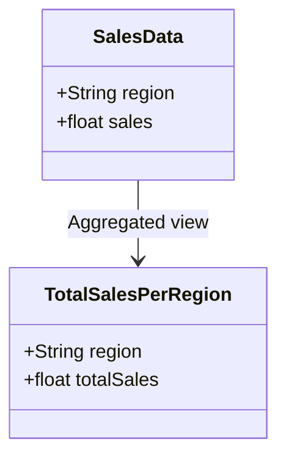

## Introduction

Materialized Views for Aggregation is a design pattern focused on improving query performance by storing the results of complex queries or aggregations in a dedicated storage structure known as a materialized view. This approach is particularly beneficial in data-intensive applications where real-time query speed and performance are critical, such as in business intelligence dashboards, reporting systems, and data warehousing solutions.

## Detailed Explanation

Materialized views act as cached tables that contain the results of a database query. Unlike regular views, which dynamically compute data upon access, materialized views store their results physically. The view is refreshed periodically or as needed, allowing read operations to benefit from precomputed and pre-aggregated results, thus reducing query load and response times.

### Architectural Approaches

1. **Direct Materialization**: This involves creating a dedicated view at the database level, where periodic refresh operations update the precomputed results based on new data input. Various cloud-based SQL solutions (e.g., AWS Redshift, Google BigQuery) offer built-in support for materialized views.

2. **Incremental Computation**: Instead of recomputing the entire view upon each refresh, only the changes that occurred since the last refresh are applied. This approach reduces computation costs and speeds up the refresh process.

3. **Hybrid Approaches**: Combinational models utilize real-time data streams with batch processing to maintain up-to-date materialized views without extensive lag. Frameworks such as Apache Flink and Kafka Streams are effective for implementing such models in distributed systems.

### Best Practices

- **Refresh Strategies**: Choose an appropriate refresh strategy (e.g., on-demand, scheduled, or event-driven) based on data volatility and application performance requirements.

- **Efficient Indexing**: Use indices on key columns in materialized views to further enhance read performance.

- **Automated Caching**: Leverage automatic materialization mechanisms provided by cloud dataware solutions to simplify the process.

- **Resource Management**: Regularly monitor and manage the storage requirements for materialized views to avoid unnecessary cost burdens.

## Example Code

Here's a simple example of defining a materialized view in SQL for aggregating sales data:

```sql
CREATE MATERIALIZED VIEW total_sales_per_region AS
SELECT region, SUM(sales) as total_sales
FROM sales_data
GROUP BY region
WITH REFRESH INTERVAL 1 HOUR;
```

This SQL statement instructs the database to maintain a materialized view of total sales per region, refreshing every hour.

## Mermaid UML Class Diagram



## Related Patterns

- **Cache Aside**: Materialized views complement cache aside patterns by serving a similar role in precomputing data but directly integrating with the database engine.

- **CQRS (Command Query Responsibility Segregation)**: Materialized views can serve the query side in the CQRS pattern by separating and optimizing read models.

## Additional Resources

- [Materialized Views in Amazon Redshift](https://docs.aws.amazon.com/redshift/latest/dg/materialized-view-create-sql-command.html)
- [Google BigQuery Materialized Views](https://cloud.google.com/bigquery/docs/materialized-views-intro)
- [Azure SQL Database Materialized View Documentation](https://learn.microsoft.com/en-us/azure/azure-sql/database/data-warehouse-materialized-views-overview)

## Summary

Materialized Views for Aggregation offer a compelling solution for increasing the performance of query operations by precomputing complex aggregations. By judiciously applying this pattern, system architects and engineers can significantly enhance data retrieval speed and efficiency in data-heavy applications, ultimately contributing to better user experiences and more effective data utilization.
