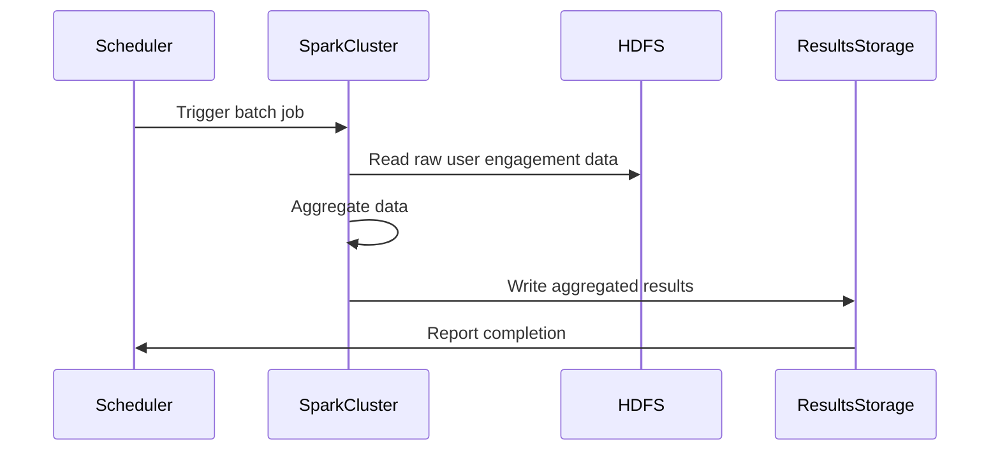

## Batch Aggregation

### Description

Batch Aggregation is a design pattern utilized in scenarios where there is a need to aggregate and process large volumes of data at scheduled intervals. Instead of processing data in real-time, data is collected over time and processed in bulk to generate insights such as reports and analytics. This approach is particularly useful in environments where data processing can be deferred, allowing for optimization of system resources and lowering costs.

### Architectural Approaches

- **Scheduled Batch Jobs**: Commonly implemented using tools like Apache Hadoop or Apache Spark that execute jobs at predefined intervals.
- **Data Warehousing**: Utilize data warehousing solutions like Amazon Redshift or Google BigQuery to store and query aggregated data efficiently.
- **ETL Processes**: Utilize Extract, Transform, Load (ETL) workflows designed to aggregate data as part of their pipeline.

### Best Practices

- **Time Window Selection**: Carefully select the time windows for aggregation to balance between data freshness and system efficiency.
- **Idempotency**: Design batch processes to be idempotent, allowing them to be rerun without causing inconsistent data states.
- **Scalability**: Use scalable cloud services that can handle varying workloads efficiently.

### Example Code

Here is an example using Apache Spark to batch aggregate user engagement metrics:

```scala
import org.apache.spark.sql.SparkSession
import org.apache.spark.sql.functions._

object BatchAggregationApp {
  def main(args: Array[String]): Unit = {
    val spark = SparkSession.builder
      .appName("BatchAggregationExample")
      .getOrCreate()

    val userEngagementData = spark.read.parquet("hdfs:///data/user_engagement/")

    val dailyEngagement = userEngagementData
      .groupBy(
        col("user_id"),
        window(col("timestamp"), "1 day")
      )
      .agg(
        sum("engagement_score").as("daily_engagement_score")
      )

    dailyEngagement.write.mode("overwrite").parquet("hdfs:///results/daily_user_engagement/")

    spark.stop()
  }
}
```

### Diagrams

#### Mermaid UML Sequence Diagram



### Related Patterns

- **Lambda Architecture**: Combining batch processing for latency-tolerant big data workloads with real-time processing of stream data.
- **Event Sourcing**: Capture changes as a sequence of events, applicable for both real-time and batch processing scenarios.
- **CQRS (Command Query Responsibility Segregation)**: Segregating read and write operations to optimize for each pattern.

### Additional Resources

- [Apache Spark Documentation](https://spark.apache.org/docs/latest/index.html)
- [Best Practices for Batch Processing](https://aws.amazon.com/big-data/batch-data-processing/)
- [Google Cloud Dataflow](https://cloud.google.com/dataflow/docs/)

### Summary

The Batch Aggregation pattern is essential for systems that require periodic data processing to generate analytical insights. By leveraging distributed processing frameworks like Apache Spark or cloud-based data warehousing solutions, organizations can efficiently process large datasets. Best practices such as ensuring idempotency and selecting optimal aggregation windows are vital to successfully implementing this pattern.
