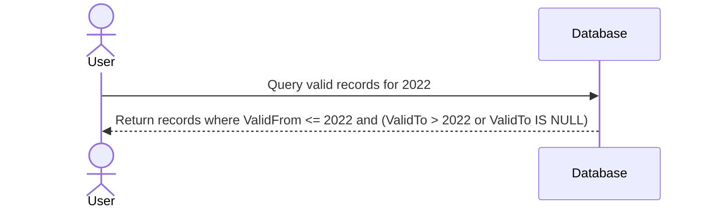

## Description

Valid Time Modeling is a data modeling approach used to represent the time period during which a piece of data is considered true in the real world. It is particularly useful in scenarios where entities have attributes that change over time. Unlike transaction time, which captures when data was stored or updated in the database, valid time reflects when data is accurate and applicable in the external world. This pattern uses two main attributes, `ValidFrom` and `ValidTo`, to explicitly define the timeframe of validity.

## Architectural Approach

Typically, valid time modeling is implemented in databases that support temporal data capabilities. The model can be applied to both SQL and NoSQL systems; however, the implementation mechanics might vary.

- **SQL Databases**: Tables are designed with `ValidFrom` and `ValidTo` columns. You can use SQL queries to filter data based on their validity period using these columns.
- **NoSQL Databases**: You may employ document-based designs to capture validity periods, relying on timestamps or datetime fields within the document structure.

## Paradigms and Best Practices

- **Temporal Overlap Checking**: When updating records, ensure new valid periods do not overlap with existing periods, unless intentional.
- **Current View**: Queries can be structured to easily extract the current view of the data, typically by filtering where `ValidTo` is Null or set to a special 'on-going' value (e.g., `9999-12-31`).
- **Audit and History**: Maintain a history of changes over time by storing all past records with their respective validity periods.
- **Indexing**: To enhance performance, particularly for large datasets, index the `ValidFrom` and `ValidTo` fields.

## Example Code

Here is a simple example showing how you might implement Valid Time Modeling using an SQL database for employee job titles:

```sql
CREATE TABLE EmployeeTitles (
    EmployeeID INT,
    JobTitle VARCHAR(255),
    ValidFrom DATE,
    ValidTo DATE,
    PRIMARY KEY (EmployeeID, ValidFrom)
);

-- Insert an example record
INSERT INTO EmployeeTitles (EmployeeID, JobTitle, ValidFrom, ValidTo)
VALUES (1, 'Junior Developer', '2020-01-01', '2021-06-30'),
       (1, 'Senior Developer', '2021-07-01', NULL);
       
-- Query for the current job title
SELECT JobTitle FROM EmployeeTitles
WHERE EmployeeID = 1 AND ValidTo IS NULL;
```

## Diagrams

Below is a simple Mermaid UML Sequence diagram illustrating the concept of Valid Time in data querying:



## Related Patterns

- **Transaction Time Modeling**: Another temporal data pattern capturing when database changes occur.
- **Bi-Temporal Modeling**: Combines both valid and transaction time, providing a comprehensive view on the timeline of data.

## Additional Resources

- [Temporal Database Design](https://en.wikipedia.org/wiki/Temporal_database)
- [SQL:2011 Bitemporal Features](https://www.orafaq.com/wiki/Temporal_Database)

## Summary

Valid Time Modeling is essential in domains requiring robust historical data tracking and retrieval aligned with real-world timelines. By integrating `ValidFrom` and `ValidTo` columns, systems gain the ability to precisely represent and query data reflective of its authentic state over time. This approach not only bolsters data integrity but also supports complex historical analyses.
