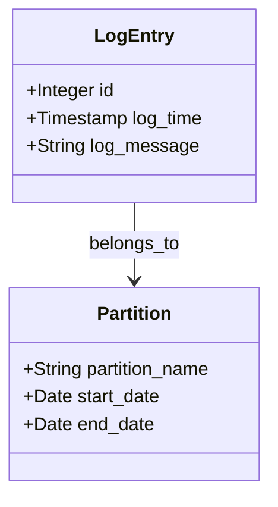

## Temporal Data Partitioning

Temporal Data Partitioning is a design pattern aimed at improving the performance and manageability of database systems that store large volumes of temporal (time-based) data. By dividing datasets into smaller, manageable partitions often based on time intervals, systems can benefit from reduced query times, optimized storage, and easier data management.

### Description

Temporal data partitioning involves logically dividing a database into parts that correspond to specific time intervals. These intervals often represent natural divisions of time such as days, weeks, or months, depending on the use case. The key advantages to implementing this pattern include enhanced query efficiency, faster data archiving, easier data deletion, and better load distribution across nodes in distributed systems.

### Architectural Approaches

1. **Range Partitioning**: Each partition corresponds to a range of time values. This approach is suitable for evenly distributed data across time intervals.
   
2. **List Partitioning**: Partitions are created based on a list of discrete values. Useful when partitioning by specific dates or short time ranges.

3. **Hybrid Partitioning**: Combines multiple partitioning strategies, sometimes integrating temporal data with dimensional attributes for more complex data slicing and dicing.

4. **Dynamic Partitioning**: Automatically adjusts the time intervals based on data access patterns and throughput requirements to optimize performance in real-time applications.

### Best Practices

- **Define Appropriate Intervals**: Consider the access patterns and data volume to choose the right intervals for partitioning. Monthly or weekly partitions are common, but daily partitions might suit high-throughput applications.
  
- **Indexing Strategies**: Implement indexing not only on partitioned columns but also on other frequent query predicates to improve lookup times.

- **Archive and Purge Policies**: Develop policies for data lifecycle management that determine when data moves to archival storage and when it can be purged, ensuring efficient space utilization.

- **Monitor Performance and Adjust**: Regularly monitor query performance and adjust partitioning strategies and policies as data and access patterns evolve.

### Example Code

Here’s a SQL example of creating a partitioned table for logs in a database system:

```sql
CREATE TABLE system_logs (
    id SERIAL PRIMARY KEY,
    log_time TIMESTAMP NOT NULL,
    log_message TEXT
) PARTITION BY RANGE (log_time);

CREATE TABLE system_logs_2024_01 PARTITION OF system_logs
FOR VALUES FROM ('2024-01-01') TO ('2024-02-01');

CREATE TABLE system_logs_2024_02 PARTITION OF system_logs
FOR VALUES FROM ('2024-02-01') TO ('2024-03-01');
```

### Diagrams

Here is a simple class diagram illustrating how a temporal partitioning structure might be implemented:



### Related Patterns

- **Data Sharding**: Similar to partitioning but involves distributing slices of data across multiple storage systems for horizontal scalability.
  
- **Indexing Strategy**: Indexes are often used with partitioning to provide fast query performance.
  
- **Data Aggregation Pattern**: Pre-aggregate partitioned data to provide efficient analytical querying capabilities.

### Additional Resources

- [Partitioning Guide by PostgreSQL](https://www.postgresql.org/docs/current/ddl-partitioning.html)
- [Oracle Partitioning Guide](https://docs.oracle.com/en/database/oracle/oracle-database/21/vldbg/partitioning.html)

### Summary

Temporal Data Partitioning is integral for systems dealing with extensive temporal datasets. By cleverly organizing data according to time ranges, it drastically reduces operational overhead, enhances start performance, and maintains data organization. Implementing effective archiving and purging strategies ensure that the system remains responsive and scalable over time.
