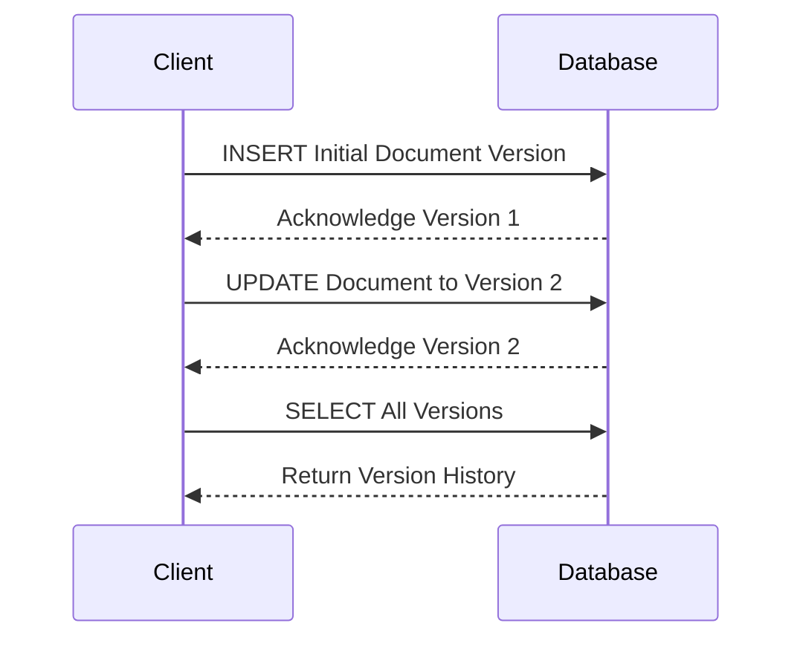

## Introduction

Temporal Data Versioning is a design pattern used to manage changes in data over time by assigning version numbers to records. This approach allows for chronological tracking of data modifications and provides a history of changes, making it easier to audit, roll back, or analyze the evolution of data.

## Architectural Approaches

### 1. Append-Only Strategy

In the Append-Only strategy, all versions of a record are retained by appending new versions instead of updating them in place. This strategy provides full auditability of historical data changes.

### 2. Version Column Strategy

The Version Column strategy involves the use of an additional column in the database table to store the version number of each record. This approach allows easy retrieval of specific versions of data.

## Paradigms and Best Practices

- **Maintain Consistency**: Ensure that each record remains consistent across versions by verifying dependencies and constraints.
- **Efficient Storage**: Optimize storage for versioned data using techniques like data compression.
- **Query Performance**: Use indexing strategies to improve query performance for retrieving specific versions.

## Example Code

### SQL Example

```sql
CREATE TABLE documents (
    document_id INT PRIMARY KEY,
    content TEXT,
    version INT,
    created_at TIMESTAMP DEFAULT CURRENT_TIMESTAMP
);

INSERT INTO documents (document_id, content, version) VALUES 
(1, 'Initial Version of Document', 1);

-- Update document
UPDATE documents SET content = 'Updated Content', version = version + 1 WHERE document_id = 1;

-- Retrieve all versions of a document
SELECT * FROM documents WHERE document_id = 1 ORDER BY version;
```

### NoSQL Example (MongoDB)

```json
{
  "_id": "1",
  "content": "Initial Version of Document",
  "version": 1,
  "created_at": "2024-07-07T00:00:00Z"
}

// Updating document
{
  "updateOne": {
    "filter": { "_id": "1" },
    "update": {
      "$set": { "content": "Updated Content", "version": 2 },
      "$currentDate": { "created_at": true }
    }
  }
}
```

## Diagrams

### Mermaid UML Sequence Diagram



## Related Patterns

- **Audit Logging**: Captures detailed logs of data changes for further analysis and compliance.
- **Snapshot Isolation**: Provides views of data at specific points in time without being affected by subsequent updates.

## Additional Resources

- [Temporal Database Design](https://link_to_temporal_db_article)
- [Versioned Database Systems](https://link_to_versioned_db_article)

## Summary

Temporal Data Versioning is an essential design pattern for applications that require maintaining historical records of changes in data. By assigning version numbers and maintaining a structured format for versioning data, this pattern facilitates effective data auditing, rollback capabilities, and historical data analysis. Leveraging both SQL and NoSQL techniques, it adapts to different database models while ensuring consistency and performance in managing temporal data.
