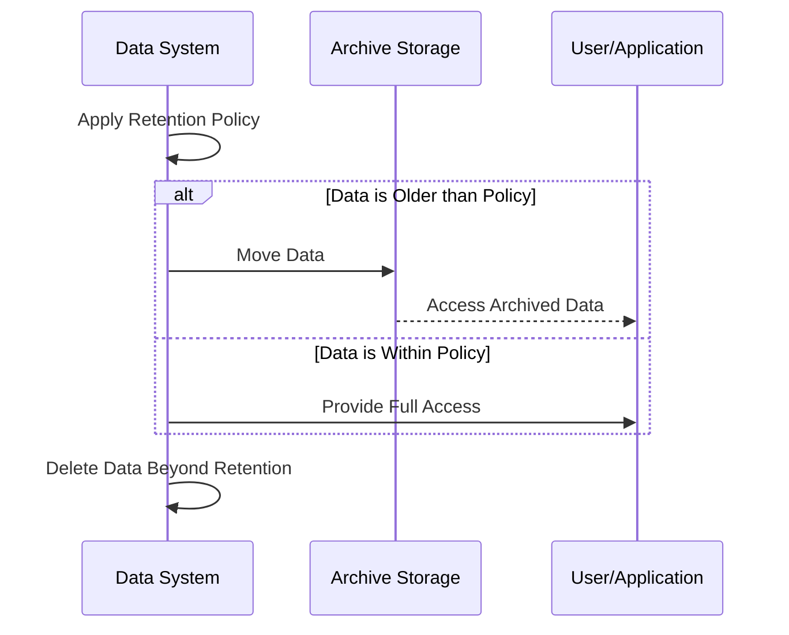

## Overview

Temporal data retention policies dictate the duration that specific data is stored within a system. These policies are crucial for organizations to meet regulatory compliance, manage storage costs effectively, and ensure data privacy and security. Retention policies are especially important in scenarios involving financial transactions, healthcare records, and personal data where legal and organizational mandates specify strict guidelines.

## Architectural Approaches

### 1. Automated Data Lifecycle Management
Automate data ingestion, storage, and expiration by setting policies within databases or cloud storage platforms. Leverage tools that provide built-in lifecycle management features to simplify implementation.

### 2. Time-Based Partitioning
In volume-heavy environments, organize data into time-based partitions (e.g., daily, monthly). This structure facilitates easy removal or archiving of data beyond a retention period.

### 3. Archive Before Delete
Consider moving outdated data to cheaper archival storage instead of deleting. This can help recover data if retention needs change and optimize operational costs while complying with policies.

### 4. Immutable Ledger with Historical View
For applications like blockchain, maintain immutable chains where historical data is accessible but managed with versioned snapshots to preserve state without affecting performance.

## Best Practices

- **Understand Regulatory Requirements**: Clearly understand local, state, and international regulations related to data retention. Align data policies to ensure compliance.
  
- **Regularize Policy Review**: Periodically review data retention policies to ensure they remain aligned with current regulations and organizational needs.
  
- **Implement Access Controls**: Restrict access to retention policies and sensitive data to authorized personnel only.
  
- **Automate Policy Enforcement**: Utilize cloud providers' tools, like AWS S3 lifecycle configurations, to automate policy enforcement and reduce the risk of human errors.

## Example Code

### SQL Example for Partition Management
```sql
-- Example SQL for removing partitions older than 7 years
ALTER TABLE transactions DROP PARTITION FOR (date_trunc('year', date) < date_trunc('year', (current_date - INTERVAL '7 years')) );
```

### Cloud Storage Lifecycle Configuration
```json
{
  "rules": [
    {
      "action": { "type": "Delete" },
      "condition": { "age": 2555 } // About 7 years
    }
  ]
}
```

## Diagrams

### Lifecycle Management Flow



## Related Patterns

- **Data Sharding**: Useful in partitioning data by time, ensuring scalability in storing and querying large datasets.
- **Event Sourcing**: Maintain sequential event logs with snapshots, supporting both retaining and querying historical states effectively.
  
## Additional Resources

- [AWS Data Lifecycle Manager](https://docs.aws.amazon.com/dlm/latest/userguide/what-is-dlm.html)
- [Azure Retention Policies](https://learn.microsoft.com/en-us/azure/storage/blobs/storage-lifecycle-management-concepts)
- [Google Cloud Storage Lifecycle Management](https://cloud.google.com/storage/docs/lifecycle)

## Summary

Implementing a robust temporal data retention policy is vital for efficient data management, regulatory compliance, and optimized storage costs. By leveraging automated tools and understanding legal requirements, organizations can design systems that manage data lifecycles effectively. This pattern will serve as a strategic framework for organizations looking to enhance their data management practices in a compliant and cost-effective way.
