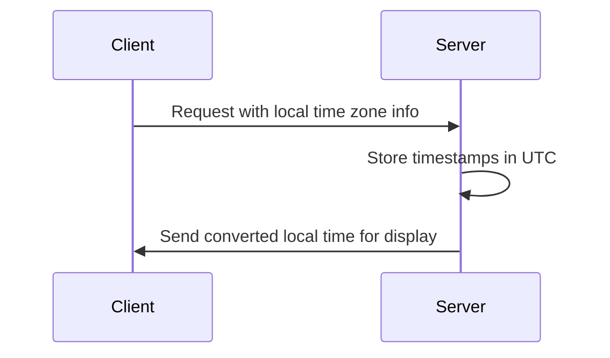

## Description

The Time Zone Management pattern is crucial for handling temporal data in applications that operate across multiple time zones. Ensuring that time is consistently and accurately processed is essential for applications ranging from scheduling systems to global transaction services. The primary approach is to store all timestamps in a universal format—usually Coordinated Universal Time (UTC)—and convert to local time zones only when needed for display or user interaction.

By centralizing the storage around a single time standard, you can avoid issues such as Daylight Saving Time (DST) changes, local time variations, and ensure that timestamps have a consistent meaning regardless of their origin or endpoint in a distributed system.

## Architectural Approaches

1. **Unified Time Storage**:
   - Store all timestamps as UTC in databases and internal applications.
   - Use timezone-aware data types provided by modern databases.

2. **Conversion Points**:
   - Perform conversions to local times at the application layer, specifically where the date/time is presented to the user or client.

3. **Synchronization Processes**:
   - Always ensure that all systems (client and server) sync their clocks using a network time protocol (NTP) server for accuracy and consistency.

## Best Practices

- **Use Libraries**: Leverage libraries and frameworks that offer robust time and date manipulation functions, such as Java's `java.time` package or Moment.js for JavaScript.
  
- **Configurations**: Store time zone configurations in environment variables or a central configuration service to allow flexibility and ease of updates.

- **Testing**: Implement comprehensive test cases that simulate time zone changes, DST transitions, and edge cases like leap years or seconds.

## Example Code

### Java Example

```java
import java.time.ZonedDateTime;
import java.time.format.DateTimeFormatter;
import java.time.ZoneId;

public class TimeZoneExample {
    public static void main(String[] args) {
        // Store date as UTC
        ZonedDateTime utcDateTime = ZonedDateTime.now(ZoneId.of("UTC"));
        System.out.println("UTC Time: " + utcDateTime.format(DateTimeFormatter.ISO_ZONED_DATE_TIME));
        
        // Convert to a specific time zone
        ZonedDateTime localDateTime = utcDateTime.withZoneSameInstant(ZoneId.of("America/New_York"));
        System.out.println("Local Time (New York): " + localDateTime.format(DateTimeFormatter.ISO_ZONED_DATE_TIME));
    }
}
```

### JavaScript Example

```javascript
const moment = require('moment-timezone');

// Store date as UTC
const utcTime = moment.utc();
console.log("UTC Time: " + utcTime.format());

// Convert to a specific time zone
const localTime = utcTime.tz('America/New_York');
console.log("Local Time (New York): " + localTime.format());
```

## Diagram



## Related Patterns

- **Data Localization**: Involves adapting other forms of data (not just time) based on the user’s locale.
- **Content Delivery Network (CDN) Cache Control**: Ensures that distributed content respects varied local regulations and time-specific content availability.

## Additional Resources

- [IANA Time Zone Database](https://www.iana.org/time-zones): A comprehensive source for timezone data.
- [Java's Date and Time APIs](https://docs.oracle.com/en/java/javase/17/docs/api/java.base/java/time/package-summary.html): Official documentation.

## Summary

The Time Zone Management pattern establishes guidelines for storing and processing times in a way that ensures accuracy and consistency across different local times. By adhering to this pattern, developers can significantly reduce the complexity and errors resulting from improper time handling, enhancing the robustness of global applications.
