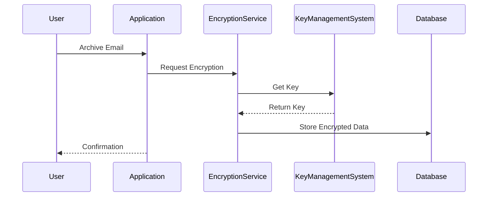

## Introduction

Temporal data encryption is a crucial design pattern that ensures the protection of sensitive historical information stored over time. As organizations deal with ever-increasing volumes of temporal data, including archived communications, transaction logs, and audit trails, securing this data becomes imperative to maintain privacy, compliance, and integrity.

## Design Pattern Overview

Temporal data encryption involves the application of cryptographic techniques to secure historical data, preventing unauthorized access and tampering. This design pattern is particularly relevant in environments where data needs to be retained for extended periods but must remain confidential and protected as it changes over time.

### Key Components

1. **Encryption Algorithms**: Using advanced encryption algorithms like AES (Advanced Encryption Standard) to secure data.
2. **Key Management**: Implementing robust key management practices to securely store and access cryptographic keys.
3. **Temporal Data Management**: Strategies to efficiently encrypt data that changes over time and may require different encryption approaches or keys.

### Architectural Approach

1. **Data Segregation**: Segregating temporal data based on sensitivity and access requirements. This might involve storing data in different tiers or partitions.
2. **Tiered Data Encryption**: Applying different levels of encryption based on data age and access needs, allowing for cost-effective and efficient processing.
3. **Automated Key Rotation**: Regularly rotating encryption keys to enhance security and comply with data protection regulations.
4. **Audit and Access Logs Encryption**: Ensuring that metadata, such as access logs related to temporal data, is also encrypted to prevent information leakage.

### Implementation Steps

1. **Assessment**: Identify and classify temporal data within the organization that requires encryption.
2. **Selection of Encryption Methods**: Choose suitable encryption algorithms and methodologies that fit the data's sensitivity and regulatory requirements.
3. **Encryption Policy Development**: Establish policies dictating how and when data is encrypted, accessed, and audited.
4. **Integration with existing Systems**: Ensure compatibility with existing data systems, databases, and storage solutions.
5. **Testing**: Conduct thorough tests to ensure data is encrypted correctly and can be decrypted when authorized. Validate regulatory compliance.
6. **Monitoring and Maintenance**: Implement a monitoring system to track the integrity and security of encrypted temporal data.

### Example Use Case

Consider an organization that archives email communications containing sensitive client information. Using temporal data encryption:
- Emails are encrypted as they are archived with unique keys.
- Archived emails older than a year undergo key rotation to comply with updated security policies.
- HTTPS is used to secure access to email archives, with decryption occurring only for authorized personnel.

### Diagram

## Related Patterns

- **Data Anonymization**: Hiding personal identifiers from datasets to protect user privacy while maintaining usability.
- **Immutable Data Store**: Storing unchangeable data versions to ensure data integrity, especially for audit logs.
- **Data Sharding**: Splitting large datasets into smaller parts to improve security and performance.

## Additional Resources

- [NIST Guide to Storage Encryption Technologies for End User Devices](https://nvlpubs.nist.gov/nistpubs/SpecialPublications/NIST.SP.800-111.pdf)
- [GDPR Guidelines on Data Encryption](https://gdpr.eu/encryption/)
- [OWASP Cryptographic Storage Cheat Sheet](https://cheatsheetseries.owasp.org/cheatsheets/Cryptographic_Storage_Cheat_Sheet.html)

## Summary

Temporal Data Encryption is an essential design pattern for securely handling historical data in today's digital environment. By implementing robust encryption methods, effective key management, and regular audits, organizations can protect sensitive temporal information from unauthorized access, thereby complying with data protection regulations and maintaining user trust.
