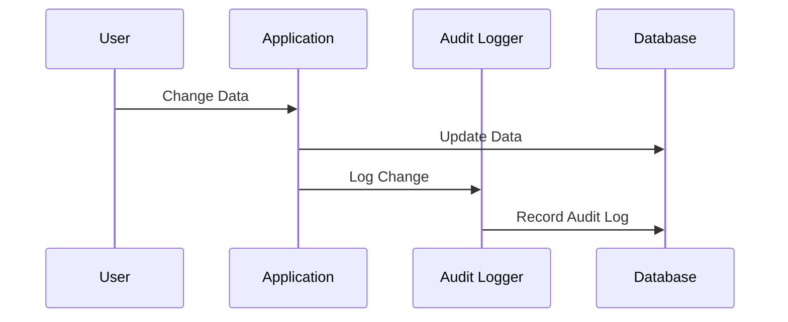

## Introduction

Temporal Data Auditing is a design pattern essential in systems that require a secure and transparent way to track changes to data. This pattern supports accountability, compliance, and traceability by maintaining detailed logs of modifications, including who altered the data and when the changes occurred.

## Problem Statement

In many domains, such as finance, healthcare, and legal systems, it is crucial to maintain an immutable history of data changes. Traditional CRUD (Create, Read, Update, Delete) operations often overwrite data, leading to a loss of historical context. The challenge is implementing a robust system where each change is tracked, stored, and easily retrievable.

## Solution

The Temporal Data Auditing pattern addresses this problem by introducing audit logs or tables dedicated to capturing change history. These logs store metadata details alongside the data, such as user identification, timestamps, and the nature of changes. Implementing this pattern typically involves:

- Designing audit tables to mirror primary data structures, capturing necessary fields for audit purposes.
- Implementing triggers or middleware components that automatically log data modifications.
- Providing interfaces for querying historical change logs to review past states and changes.

## Example Code

Here is an example implementation in Java, using JPA for entity management and Hibernate Envers for auditing:

```java
@Entity
@Audited
public class Account {
    @Id
    @GeneratedValue(strategy = GenerationType.IDENTITY)
    private Long id;

    private String ownerName;
    private BigDecimal balance;

    // Getters and Setters...
}
```

In this example, the `@Audited` annotation from Hibernate Envers enables automatic audit logging of the `Account` entity.

## Diagram

Here is a basic UML sequence diagram using Mermaid illustrating how the Temporal Data Auditing pattern works with a database system:



## Related Patterns

1. **Event Sourcing**: This pattern persists application state changes as a sequence of events. It's highly complementary, providing a broader context of application actions beyond just data changes.
   
2. **CQRS (Command Query Responsibility Segregation)**: Often used in conjunction with Event Sourcing, this pattern separates read and write operations, which might include the auditing logic in the command pipeline.

3. **Versioned Data**: Similar but distinct from audit logging, this pattern stores historical versions of data records, useful in contexts where rollback of data is necessary.

## Additional Resources

- [Hibernate Envers documentation](https://docs.jboss.org/hibernate/stable/envers/reference/en-US/html_single/)
- [Martin Fowler's Pattern Description: Audit Log](https://martinfowler.com/eaaDev/AuditLog.html)
- [Temporal Patterns in Microservices](https://microservices.io/patterns/data/temporal-patterns.html)

## Summary

The Temporal Data Auditing pattern provides a structured approach to tracking data changes in systems requiring high levels of accountability and compliance. By leveraging audit logs, it ensures complete visibility of data modifications over time, allowing organizations to reconstruct the past accurately for analysis, debugging, or legal purposes. Integrating with complementary patterns like Event Sourcing and CQRS can further enhance system robustness and functionality.
