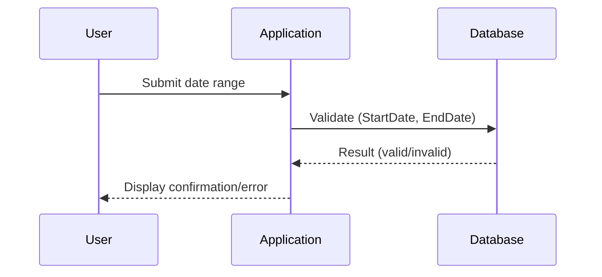

Temporal data validation is a design pattern used to enforce rules that maintain the integrity of temporal data within a system. It is crucial for applications that require the management of data that changes over time, such as bookings, project timelines, or any data involving historical tracking or forecasting.

## Problem

Managing temporal data can be challenging, as consistency and integrity are crucial to maintain. Without proper validation, data anomalies can arise, such as an `EndDate` occurring before a `StartDate`, overlapping events, or gaps in timelines. Handling temporal data requires strict adherence to logical rules to ensure that data reflects accurate timelines and sequences.

## Solution

Implement a validation mechanism in the application logic or database layer that checks temporal integrity rules when new data is entered or updated. This can involve:

1. Checking sequences for temporal attributes, ensuring end times are logically positioned after start times.
2. Preventing overlapping intervals in datasets where mutual exclusivity is mandated.
3. Ensuring ordered timelines, especially for audits and logs.
4. Validating against historical data baselines or expected future trends.

### Example Code

Here's a simple example in JavaScript that ensures `EndDate` follows `StartDate`:

```javascript
function isDateRangeValid(startDate, endDate) {
  return new Date(endDate) > new Date(startDate);
}

// Usage
const startDate = '2024-01-01';
const endDate = '2024-02-01';

if (isDateRangeValid(startDate, endDate)) {
  console.log('The date range is valid.');
} else {
  console.error('Invalid date range. Ensure the end date occurs after the start date.');
}
```

### Database Constraints Example

Using SQL constraints to enforce basic temporal rules at the database level:

```sql
ALTER TABLE Projects
ADD CONSTRAINT check_dates CHECK (EndDate > StartDate);
```

## Diagrams

### Temporal Validation Process



## Related Patterns

- **Event Sourcing**: A pattern that involves persistently storing event sequences to reconstruct state and validate transitions.
- **Domain-Driven Design (DDD)**: Incorporating temporal invariants in aggregate roots to naturally express time-constrained business rules.

## Additional Resources

- Martin Fowler’s article on [Temporal Patterns](https://martinfowler.com/articles/timeNarrative.html)
- Books like "Designing Data-Intensive Applications" by Martin Kleppmann for deeper insights into data and temporal consistency.

## Summary

Temporal Data Validation is essential for applications requiring accurate time-based data management, ensuring sequences are valid and consistent. By implementing validation checks and constraints, both in application logic and at the database level, temporal integrity can be maintained, aiding in the creation of robust and reliable systems. This pattern helps prevent logical inconsistencies and operational errors due to incorrect temporal data entry.
