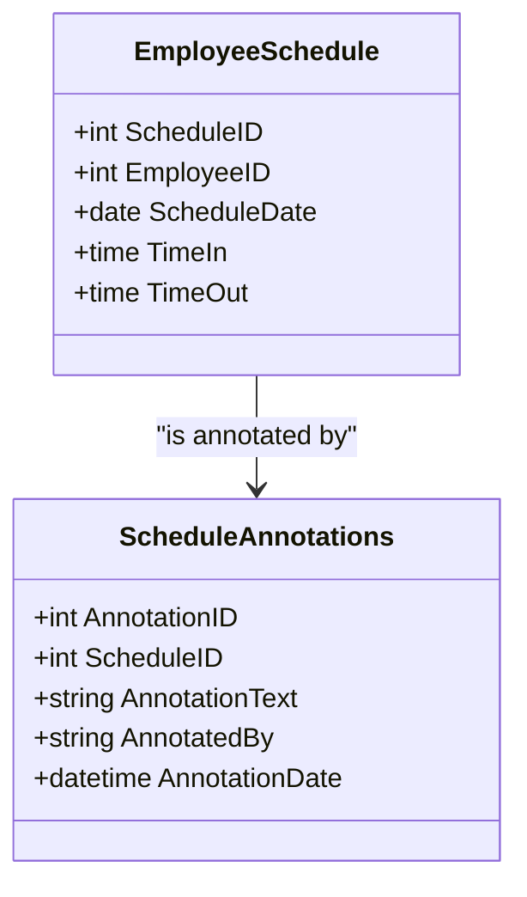

## Introduction

Temporal Data Annotation is a design pattern used in data modeling to attach additional information to temporal data points. This pattern helps in understanding the context or reasoning behind changes to specific data over a period of time.

### Problem Statement

In dynamic systems, data points are subject to change frequently. For instance, employee schedules, stock prices, or policy terms may change due to various reasons. Simply storing the change doesn’t provide sufficient context to understand why the change occurred, presenting a challenge in maintaining comprehensive historical records.

### Solution Approach

The Temporal Data Annotation involves attaching annotations or metadata to temporal data entries. These annotations can include information such as reasons for changes, conditions applicable at the time, or the identity of the person who made the change. 

This enables users to gain insights into the why and how of data evolution, rather than just the 'what'.

## Architectural Approach

The Temporal Data Annotation pattern can be implemented in different ways depending on the system requirements:

1. **Inline Annotations**: Annotations are stored alongside the temporal data in the same table, typically as additional columns dedicated to providing explanation or metadata about the change.
   
2. **Separate Annotation Tables**: A dedicated table is maintained for annotations, which is linked to the temporal data entries through a foreign key. This allows for flexible annotation structures and better normalization.

3. **Document-Based Storage**: For NoSQL databases, storing data and annotations as part of the same document is effective. This approach is more suitable for less rigid data structures.

### Example Code

Here’s a simple SQL example using a separate annotations table:

```sql
CREATE TABLE EmployeeSchedule (
    ScheduleID SERIAL PRIMARY KEY,
    EmployeeID INT,
    ScheduleDate DATE,
    TimeIn TIME,
    TimeOut TIME
);

CREATE TABLE ScheduleAnnotations (
    AnnotationID SERIAL PRIMARY KEY,
    ScheduleID INT REFERENCES EmployeeSchedule(ScheduleID),
    AnnotationText TEXT,
    AnnotatedBy VARCHAR(255),
    AnnotationDate TIMESTAMP DEFAULT CURRENT_TIMESTAMP
);
```

In this setup:
- Each schedule change can be annotated by inserting a corresponding entry into the `ScheduleAnnotations` table.
- The annotations provide a clear record of why certain scheduling decisions were made.

## Diagrams

Below is a UML Class Diagram using Mermaid to illustrate the relationship between temporal data and its annotations:



## Related Patterns

- **Temporal Table Pattern**: Focuses on maintaining historical states of data over time.
- **Audit Log Pattern**: Involves logging changes to data comprehensively for auditing purposes.
- **Versioned Storage Pattern**: Retains multiple versions of data to track its evolution.

## Additional Resources

- [Temporal Patterns in Data Modeling](https://example.com/temporal-patterns)
- [Best Practices for Using Temporal Data](https://example.com/best-practices-temporal-data)

## Summary

The Temporal Data Annotation pattern enhances the traceability and interpretability of changes in temporal data. By enriching temporal data with annotations, this pattern addresses the need for context and reasoning associated with data alterations. Implementing this pattern effectively can significantly improve transparency and decision-making processes in systems relying on dynamic data.

Whether integrated directly within the schema or managed in linked structures, Temporal Data Annotation provides a structured approach to managing changes over time, ultimately offering a richer and more insightful data experience.
