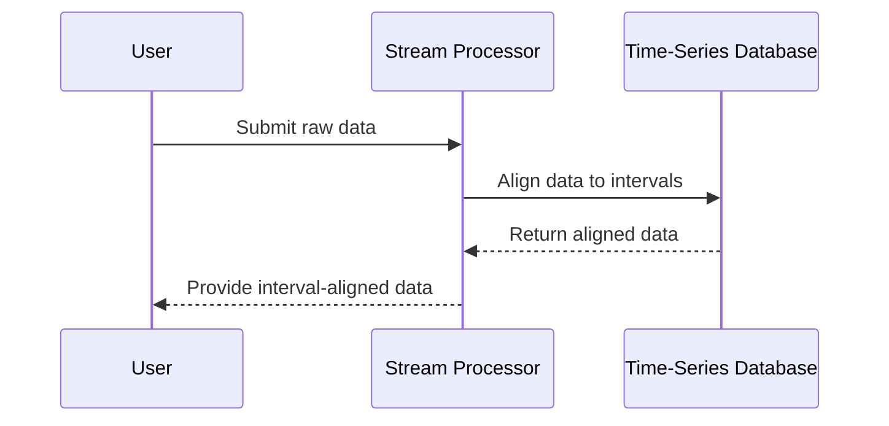

## Temporal Alignment

### Introduction

Temporal Alignment is a design pattern used to synchronize data with predefined time intervals for purposes such as consistency in reporting and ease of analysis. It involves adjustments to data periods, ensuring they fit standard intervals such as days, weeks, months, or quarters. This becomes critical in scenarios where data collection does not naturally conform to fixed time periods.

### Detailed Explanation

Temporal data often arrives in irregular intervals or durations. For instance, businesses may generate transactional data continuously or measure performance at arbitrary times. Such data needs to be restructured to fit standard reporting intervals for consistency and comparability.

#### Key Concepts:
- **Interval Standardization:** Define a consistent framework (e.g., ISO weeks, fiscal quarters) for aligning data.
- **Data Interpolation/Extrapolation:** Methods to estimate data at standard intervals, especially when data points are missing or occur sporadically.
- **Data Aggregation:** Combine smaller time intervals to form larger periodical summaries that align with standard intervals.

### Architectural Approaches

To implement Temporal Alignment, several architectural strategies can be employed:

1. **Batch Processing Systems:** Utilize tools like Apache Spark for periodic aggregation of data into standard intervals.
2. **Streaming Processing:** Employ technologies like Apache Kafka and Apache Flink to perform real-time temporal alignment.
3. **Time-Series Databases:** Use databases like TimescaleDB or InfluxDB that offer native support for time-related operations.

### Best Practices

- **Consistent Time Zones:** Ensure all data is timestamped using the same timezone.
- **Granular Data Storage:** Retain raw time-stamped data to allow reprocessing with different alignment configurations if needed.
- **Handling Edge Cases:** Develop robust methods to manage end-of-period records or those without clear intervals.

### Example Code

```scala
import org.apache.spark.sql.SparkSession
import org.apache.spark.sql.functions._

// Initialize Spark session
val spark = SparkSession.builder().appName("TemporalAlignment").getOrCreate()

// Example DataFrame of transactions
val transactions = Seq(
  ("2023-02-25", 100),
  ("2023-03-05", 150),
  ("2023-03-20", 200)
).toDF("date", "amount")

// Define time interval (e.g., monthly)
val aligned = transactions
  .withColumn("month", date_format(col("date"), "yyyy-MM"))
  .groupBy("month")
  .agg(sum("amount").alias("total_amount"))

// Display aligned data
aligned.show()
```

### Diagrams

#### Temporal Alignment Process



### Related Patterns

- **Time Window Processing:** Dividing a continuous stream of data into fixed-size time windows, processing each window independently.
- **Snapshot Pattern:** Capturing and storing the state of a system at regular intervals.

### Additional Resources

- [Temporal Data & Analytics](https://www.dataversity.net)
- [Time Series Data 101](https://www.timescale.com)

### Summary

Temporal Alignment is essential for standardizing data at specific time intervals, greatly facilitating analysis and reporting. It involves various processes, including aggregation and interpolation, to ensure time-related data is uniformly organized. By utilizing suitable technologies such as batch and stream processing, Temporal Alignment can be efficiently incorporated into data management practices, enhancing temporal analysis capabilities.
