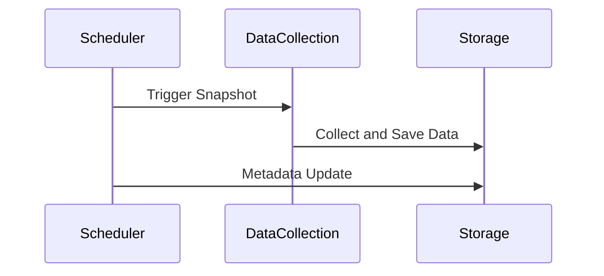

## Overview

Periodic Snapshot Modeling is a data modeling design pattern used to capture and store the state of data at specific, regular intervals. This allows organizations to track changes and analyze trends over time, making it ideal for historical reporting and temporal analysis.

## Detailed Explanation

### Objectives

The primary objectives of Periodic Snapshot Modeling are to:

1. **Capture Data at Intervals**: Store a complete dataset representing the state at the end of each period (e.g., daily, weekly, monthly).
2. **Enable Temporal Analysis**: Facilitate analysis across different time periods to identify trends, patterns, and anomalies.
3. **Simplify Historical Reporting**: Provide a straightforward mechanism to retrieve and analyze historical data without complex queries.

### Architectural Approaches

- **Interval Selection**: The interval depends on the business requirements and data volatility. Common intervals include daily, weekly, or monthly snapshots.
- **Data Storage**: Each snapshot is stored as a separate dataset, often as a table or partition in a data warehouse or data lake.
- **Schema Evolution**: Ensure that schema changes (e.g., adding new fields) are handled gracefully across snapshots.
- **Data Volume Management**: Utilize efficient storage mechanisms to handle potentially large data volumes, such as columnar storage formats.

### Best Practices

- **Consistency**: Ensure that snapshots are consistently taken at the exact time and interval to maintain data integrity.
- **Metadata Tracking**: Use metadata to keep track of snapshot timing, schema versions, and other relevant information.
- **Change Detection**: Consider integrating delta detection mechanisms to optimize the amount of data stored if only changes are needed between snapshots.

### Example Code

```sql
-- Storing a daily inventory snapshot in a data warehouse
CREATE TABLE Inventory_Snapshot (
    Snapshot_Date DATE,
    Item_ID INT,
    Item_Description STRING,
    Quantity INT
);

-- Inserting a snapshot for October 10, 2023
INSERT INTO Inventory_Snapshot (Snapshot_Date, Item_ID, Item_Description, Quantity)
SELECT CURRENT_DATE, Item_ID, Item_Description, Quantity
FROM Inventory
WHERE CURRENT_DATE = '2023-10-10';
```

### Diagrams

Here is a simple sequence diagram to illustrate how periodic snapshots work:



### Related Patterns

- **Event Sourcing**: Provides a full history of changes as sequences of events, useful for auditing and reconstructing states.
- **Slowly Changing Dimension (SCD)**: Deals with storing historical changes in dimension tables.
- **Aggregated Aggregate Pattern**: Handles aggregations and summaries over large datasets for reporting.

### Additional Resources

- ["Building a Scalable ETL Pipeline for Analytics"](https://docs.someurl.com/build-scalable-etl) - Resource for creating effective ETL pipelines.
- ["Temporal Table Patterns in SQL"](https://docs.someurl.com/temporal-tables) - Techniques and best practices for handling temporal data in SQL databases.
- ["Data Warehousing by Example"](https://docs.someurl.com/data-warehousing-tutorial) – Comprehensive guide on common data warehousing practices and patterns.

## Summary

Periodic Snapshot Modeling is an essential pattern for businesses that need reliable and consistent historical data analyses. By capturing data states at regular intervals, organizations can gain insights into temporal trends, enhance their reporting capabilities, and make more informed decisions. While the pattern may demand careful consideration of intervals, storage needs, and data schemas, it delivers significant benefits in terms of reporting simplicity and analytical power.
