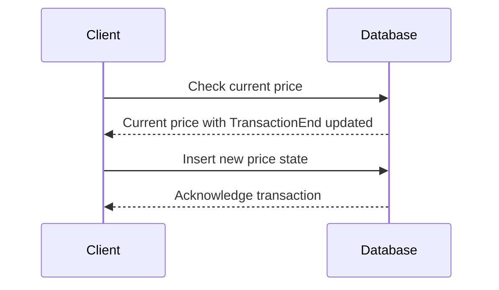

## Introduction

In the realm of database design, handling temporal data effectively is crucial for tracking historical states and past changes. The **Transaction Time Modeling** pattern is an instrumental approach for recording the exact times when data is stored or modified. This pattern uses fields such as `TransactionStart` and `TransactionEnd` timestamps to preserve a clear trace of how and when data transitions occur in the database.

## Design Pattern Overview

The Transaction Time Modeling pattern involves maintaining supplementary fields alongside your primary data points to capture the lifespan of data records with regard to when changes were applied in the system:

- **TransactionStart**: This timestamp field indicates when a particular data state entered the database system.
- **TransactionEnd**: This timestamp represents when the data state is considered expired in the database. If the data is current, it can be marked with a special value (e.g., high date or NULL).

### Architectural Context

In a cloud computing environment, particularly where data consistency and auditability are paramount, Transaction Time Modeling is vital. This pattern is commonly used in financial systems, supply chain applications, and any domain where historical data accuracy is necessary.

## Implementation

### Example Code: SQL Table Design

Here's an example of how you might structure a table using Transaction Time Modeling:

```sql
CREATE TABLE ProductPriceHistory (
    ProductID INT,
    Price DECIMAL(10, 2),
    TransactionStart TIMESTAMP DEFAULT CURRENT_TIMESTAMP,
    TransactionEnd TIMESTAMP DEFAULT '2999-12-31 23:59:59',
    PRIMARY KEY (ProductID, TransactionStart)
);
```

### Inserting Data

When inserting or updating data using this pattern:

```sql
-- Insert a new product price
INSERT INTO ProductPriceHistory(ProductID, Price) 
VALUES (1, 99.99);

-- Update product price
UPDATE ProductPriceHistory
SET TransactionEnd = CURRENT_TIMESTAMP
WHERE ProductID = 1 AND TransactionEnd = '2999-12-31 23:59:59';

-- Insert the updated price
INSERT INTO ProductPriceHistory(ProductID, Price) 
VALUES (1, 109.99);
```

## Diagram

Here is a sequence diagram illustrating the data update:



## Related Patterns

- **Bitemporal Data Modeling**: Another temporal data modeling pattern involving both transaction time and valid time.
- **Versioning**: Generally manages different versions of data but lacks temporal precision provided by timestamps.

## Best Practices

- **Use Indexed Time Columns**: Indexing `TransactionStart` and `TransactionEnd` can improve query performance.
- **Handle Overlapping Intervals**: Ensure application logic manages transaction intervals accurately to prevent overlaps.
- **Normalization**: Store changes in dedicated history tables to keep current data tables streamlined.

## Additional Resources

- [Temporal Data in Databases](https://example.com/temporal-data)
- [Comprehensive Guide on SQL Temporal Tables](https://example.com/sql-temporal-tables)
- [Effective Cloud Data Management Strategies](https://example.com/cloud-data-management)

## Summary

The Transaction Time Modeling pattern is indispensable for systems requiring robust data integrity and precise audit trails of historical states. The use of `TransactionStart` and `TransactionEnd` timestamps ensures every piece of data has a definable lifespan, enhancing system auditability and reliability. By leveraging this pattern, organizations can better adapt their data strategies within dynamic architectures like cloud computing environments.
