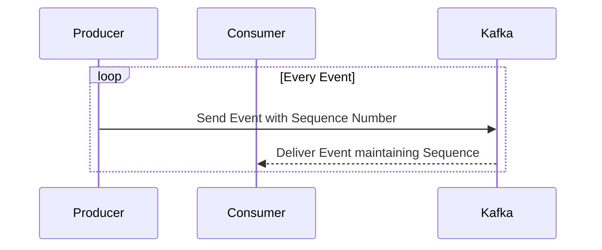

## Event Sequencing

### Description
Event sequencing is a design pattern focused on maintaining the order of events, particularly in situations where events occur in rapid succession and share identical timestamps. Organizations often require ordered data to guarantee business processes run smoothly, ensuring consistency and integrity in event-driven systems.

### Architectural Approaches

1. **Sequence Numbers**:
   Assign an incremental sequence number to each event. This is particularly useful when events are produced at a fast pace and timestamps are not granular enough to differentiate them.

2. **Logical Clocks**:
   Logical clocks, such as Lamport timestamps, can be used to reason about the order of events in distributed systems where physical time isn't reliable. Each event increments a counter, ensuring a total ordering.

3. **Vector Clocks**:
   Vector clocks provide a mechanism to partially order events across distributed systems. They are particularly useful for capturing causality and conflicts in distributed databases.

4. **Kafka Log Offset**:
   Apache Kafka automatically maintains event order using log offsets. Each event in a Kafka topic has a unique offset, ensuring reliable order preservation.

### Example Code

Here's an example demonstrating how sequence numbers can be implemented in an event streaming application using Apache Kafka:

```java
import org.apache.kafka.clients.producer.KafkaProducer;
import org.apache.kafka.clients.producer.ProducerRecord;

import java.util.Properties;
import java.util.concurrent.atomic.AtomicInteger;

public class EventProducer {
   
    private static final AtomicInteger sequenceNumber = new AtomicInteger(0);

    public static void main(String[] args) {
        Properties props = new Properties();
        props.put("bootstrap.servers", "localhost:9092");
        props.put("key.serializer", "org.apache.kafka.common.serialization.StringSerializer");
        props.put("value.serializer", "org.apache.kafka.common.serialization.StringSerializer");

        KafkaProducer<String, String> producer = new KafkaProducer<>(props);
        
        for (int i = 0; i < 10; i++) {
            String key = "eventKey";
            String value = "eventValue-" + sequenceNumber.incrementAndGet();
            ProducerRecord<String, String> record = new ProducerRecord<>("my-topic", key, value);
            producer.send(record);
        }
        
        producer.close();
    }
}
```

### Diagrams

#### Mermaid UML Sequence Diagram



### Related Patterns

- **Chronological Versioning**: Manage different versions of data entities by maintaining a chronological sequence.
- **Idempotent Receiver**: Ensure that processing the same event multiple times does not alter the outcome.

### Additional Resources

- [Learn about Kafka](https://kafka.apache.org/documentation/)
- [Logical Clocks Overview](https://en.wikipedia.org/wiki/Lamport_timestamp)
- [Vector Clocks Explanation](https://en.wikipedia.org/wiki/Vector_clock)

### Summary

Event sequencing is crucial in systems where event order impacts stability, reliability, and consistency. By using tools like sequence numbers, logical clocks, and distributed logging systems such as Apache Kafka, we can maintain a robust event order, even under rapid event production. This pattern integrates well with distributed and event-driven architectures, helping to solve complex problems related to data integrity and consistency.
