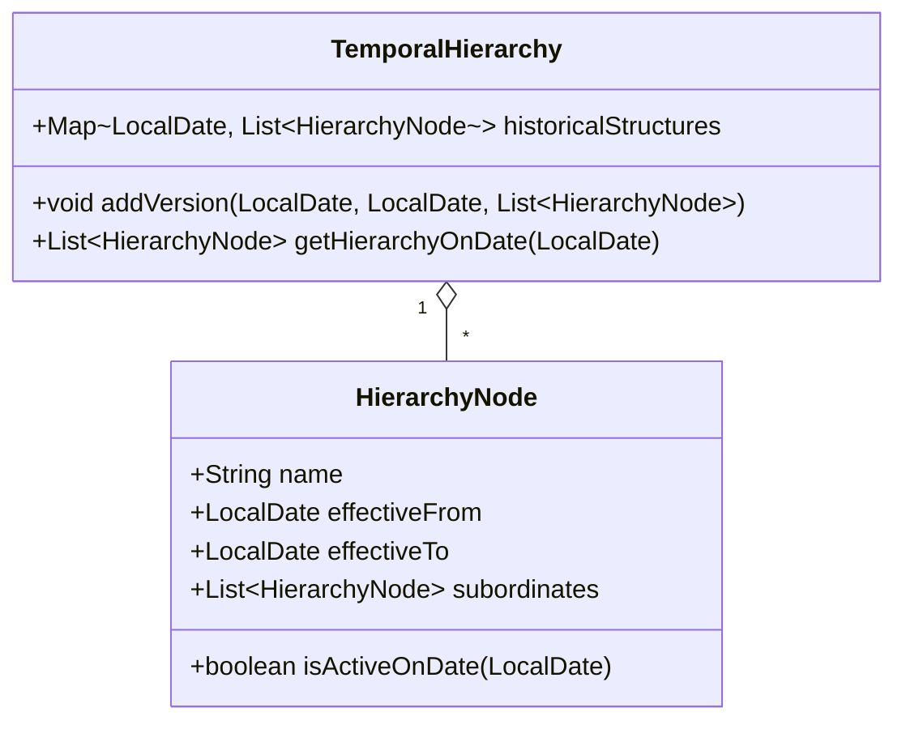

## Temporal Hierarchies

Temporal hierarchies are structures used to represent hierarchical relationships that evolve over time. This design pattern is invaluable in scenarios where the hierarchical order among entities is not static but is subject to change. One common use case is organizational charts that document the changes in management roles within a company over the years. But the applications extend well beyond this example, providing insights into any domain where temporal changes in hierarchies need to be monitored and analyzed.

### Key Concepts

- **Temporal Aspect**: Unlike static hierarchies, temporal hierarchies focus on recording how relationships change over time. This requires capturing not only the relationships but also the time period those relationships are valid.
- **Granularity**: The temporal resolution at which changes are recorded can vary greatly, from minutes and hours to days, months, or years, depending on how frequently hierarchical changes are expected.
  
### Architectural Approach

Temporal hierarchies require a systematic approach to capture and query relationships across different time periods. The following are foundational architectural strategies to manage these hierarchies:

1. **Timestamped Relationships**: Each relationship in the hierarchy is tagged with timestamps indicating its period of validity. This allows retrieval of the hierarchy at any point in time.

2. **Versioning**: Each change in the hierarchy is treated as a new version. The immutable storage of versions helps maintain an accurate change history that can be audited or analyzed at any time.

3. **Efficient Temporal Queries**: Implement efficient querying techniques that allow sporadic snapshot retrievals of the hierarchy at any given moment in historical time. Indexing strategies and temporal databases can be leveraged here.

### Best Practices

- **Consistent Timestamps**: Ensure that timestamps are captured consistently and accurately across all parts of the hierarchy. Maintain a unified time zone and format.
  
- **Optimize for Read**: Because temporal hierarchies are often queried, especially in analytics and reporting scenarios, optimize storage and queries for read-heavy operations.

- **Data Pruning**: Over time, archived data can grow significantly. Use a pruning strategy to archive or remove obsolete records based on business needs and compliance requirements.

### Example Code

Here is a simple implementation using a combination of class structures and data storage strategies in a language like Java:

```java
import java.time.LocalDate;
import java.util.List;
import java.util.Map;
import java.util.HashMap;

public class HierarchyNode {
    private String name;
    private LocalDate effectiveFrom;
    private LocalDate effectiveTo;
    private List<HierarchyNode> subordinates;

    public HierarchyNode(String name, LocalDate from, LocalDate to) {
        this.name = name;
        this.effectiveFrom = from;
        this.effectiveTo = to;
    }

    // getters and setters

    public boolean isActiveOnDate(LocalDate date) {
        return (date.isAfter(effectiveFrom) || date.isEqual(effectiveFrom)) &&
               (date.isBefore(effectiveTo) || date.isEqual(effectiveTo));
    }
}

public class TemporalHierarchy {
    private Map<LocalDate, List<HierarchyNode>> historicalStructures = new HashMap<>();

    public void addVersion(LocalDate from, LocalDate to, List<HierarchyNode> nodes) {
        historicalStructures.put(from, nodes);
        nodes.forEach(node -> node.effectiveTo = to);  // Setting the end of the interval
    }

    public List<HierarchyNode> getHierarchyOnDate(LocalDate date) {
        // logic to find appropriate list
    }
}
```

### Diagrams

#### Mermaid UML Class Diagram



### Related Patterns

- **Temporal Patterns**: General approaches for handling temporal data, including versioning and bitemporal data models.
- **Command-Query Responsibility Segregation (CQRS)**: Useful for separating the write model (tracking the hierarchy changes) from the read model (querying historical state).

### Additional Resources

- **Books**: "Temporal Data & the Relational Model" by C. J. Date and Hugh Darwen.
- **Articles**: Explore articles on implementing temporal tables in SQL databases to maintain a history of data state changes.

### Summary

Temporal hierarchies efficiently represent changing hierarchal relationships over time, providing a structured way to manage, observe, and analyze how transitions and structural changes occur. This design pattern is essential in scenarios requiring auditing, historical analysis, or simple time-based retrieval of relationship states. Understanding and implementing temporal hierarchies can provide significant advantages in both operational and analytical contexts.
