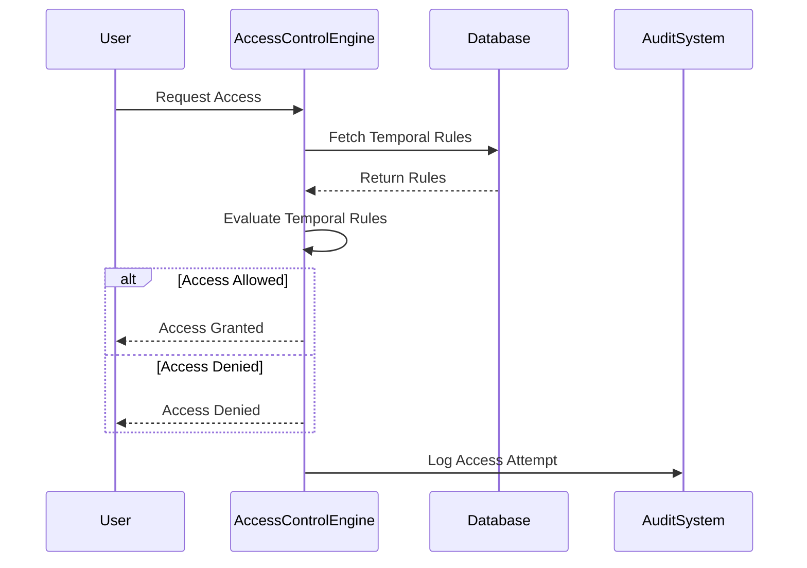

### Time-Sensitive Access Control

#### Description

Time-Sensitive Access Control is a security pattern that provides mechanisms to restrict data access based on specific temporal conditions. This pattern enhances data security by defining access rights that are time-bound, ensuring that users can only interact with resources within the permitted time frame. This is particularly useful in scenarios where data sensitivity fluctuates over time or regulatory compliance demands time-bound data availability.

#### Architectural Approach

The design of Time-Sensitive Access Control comprises the following components:

- **Temporal Constraints Module**: Manages the timing rules and conditions under which access to data is permitted.

- **Access Control Engine**: Evaluates the temporal conditions in conjunction with user roles and permissions. Enforces allow/deny decisions based on current time and defined rules.

- **Audit Trail System**: Logs access requests and decisions to provide a history of who accessed what data and when, aiding in compliance and monitoring.

- **Notification System**: Alerts users or administrators of impending changes to access permissions due to temporal constraints.

#### Example Code

Here's an example in Java using a simple access control library to demonstrate time-sensitive logic:

```java
import java.time.LocalTime;
import java.util.HashMap;
import java.util.Map;

public class TimeSensitiveAccessControl {
    private Map<String, AccessRule> accessRules;

    public TimeSensitiveAccessControl() {
        this.accessRules = new HashMap<>();
    }

    public void addAccessRule(String resource, LocalTime startTime, LocalTime endTime) {
        this.accessRules.put(resource, new AccessRule(startTime, endTime));
    }

    public boolean isAccessAllowed(String resource) {
        AccessRule rule = accessRules.get(resource);
        if (rule == null) return false;

        LocalTime currentTime = LocalTime.now();
        return currentTime.isAfter(rule.getStartTime()) && currentTime.isBefore(rule.getEndTime());
    }

    private static class AccessRule {
        private final LocalTime startTime;
        private final LocalTime endTime;

        public AccessRule(LocalTime startTime, LocalTime endTime) {
            this.startTime = startTime;
            this.endTime = endTime;
        }

        public LocalTime getStartTime() {
            return startTime;
        }

        public LocalTime getEndTime() {
            return endTime;
        }
    }

    public static void main(String[] args) {
        TimeSensitiveAccessControl accessControl = new TimeSensitiveAccessControl();
        accessControl.addAccessRule("documentA", LocalTime.of(9, 0), LocalTime.of(17, 0));

        System.out.println("Access allowed: " + accessControl.isAccessAllowed("documentA"));
    }
}
```

#### Diagrams

Below is a simple UML sequence diagram illustrating the procedure for time-sensitive access.



#### Related Patterns

- **Role-Based Access Control (RBAC)**: Offers generalized access management based on roles; can be combined with temporal aspects for enhanced security.

- **Lease Pattern**: Implements temporary access control where usage is granted for a limited period and then revoked.

- **Policy-Based Access Control (PBAC)**: Supports more complex rules incorporating other criteria beyond just time.

#### Additional Resources

- [NIST Access Control Guidelines](https://csrc.nist.gov/publications/detail/sp/800-162/final)
- [AWS Time-Based Policies](https://docs.aws.amazon.com/IAM/latest/UserGuide/access_policies.html#policies-permissions)
- [Google Cloud Temporal Conditions](https://cloud.google.com/iam/docs/conditions-overview)

#### Summary

The Time-Sensitive Access Control pattern is critical in modern cloud computing environments where dynamic and adaptive security models are needed. By implementing time-based access, organizations can ensure that information access is aligned with operational needs and compliance requirements, potentially reducing the attack surface and adhering to principles of least privilege. This pattern is highly relevant in sectors with stringent data regulations and helps in maintaining secure data ecosystems at scale.
