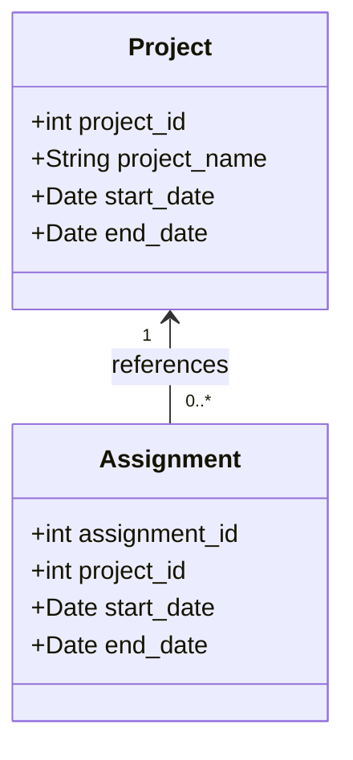

## Temporal Referential Integrity

### Description

Temporal Referential Integrity is a design pattern used in data modeling to ensure that foreign key relationships between entities are valid and logically consistent within defined time periods. This pattern is particularly important in systems that manage historical or time-varying data, such as project management systems, financial record-keeping, and temporal databases.

In systems where entities such as projects and assignments have temporal validity, it is crucial to ensure that an assignment only references projects that are active during the same time. This pattern helps maintain data accuracy and prevents logical inconsistencies arising from records being linked to inactive or non-existent temporal entities.

### Architectural Approach

Implementing temporal referential integrity involves:

1. **Temporal Fields**: Maintain temporal fields such as `start_date` and `end_date` in both the parent (e.g., Projects) and child (e.g., Assignments) tables to define the validity period of each record.

2. **Temporal Constraints**: Implement database constraints or application-level checks to enforce that the referenced parent record is active during the time range of the child record.

3. **Triggers/Stored Procedures**: Use database triggers or stored procedures to automatically enforce temporal referential integrity during data insertion or update operations.

4. **Versioning and History Tracking**: Implement versioning to manage changes over time and maintain a history of temporal states of the entities.

### Example Code

Below is a SQL example implementing temporal referential integrity:

```sql
CREATE TABLE Projects (
    project_id INT PRIMARY KEY,
    project_name VARCHAR(255),
    start_date DATE,
    end_date DATE
);

CREATE TABLE Assignments (
    assignment_id INT PRIMARY KEY,
    project_id INT,
    start_date DATE,
    end_date DATE,
    FOREIGN KEY (project_id) REFERENCES Projects(project_id),
    CHECK (start_date >= (SELECT start_date FROM Projects WHERE Projects.project_id = Assignments.project_id)
           AND (end_date IS NULL OR end_date <= (SELECT end_date FROM Projects WHERE Projects.project_id = Assignments.project_id)))
);
```

### Diagrams

Below is a simple UML class diagram representing the relationships:



### Related Patterns

- **Temporal Table Pattern**: Manages historical states of records by storing them in a temporal table.
- **Slowly Changing Dimensions (SCD)**: A data warehousing concept that manages historical and current data over time.

### Additional Resources

- "Temporal Data & the Relational Model" by C. J. Date, Hugh Darwen, and Nikos Lorentzos
- "SQL Design Patterns" by Vadim Tropashko
- [Temporal Tables in SQL Server](https://docs.microsoft.com/en-us/sql/relational-databases/tables/temporal-tables) - Microsoft Documentation

### Summary

Temporal Referential Integrity is essential for maintaining accurate and consistent foreign key relationships in databases that handle time-varying data. By enforcing temporal constraints, developers can ensure that references between entities make logical sense within their active periods. This pattern not only maintains data integrity but also provides valuable historical insights and accurate reporting in systems dealing with complex temporal data.
