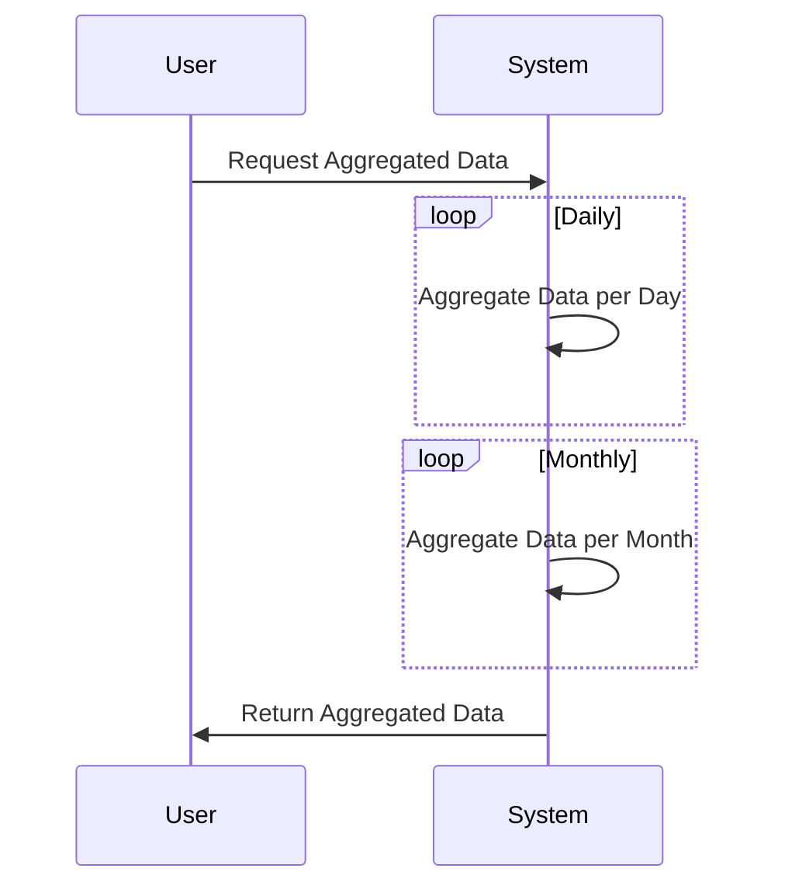

Temporal Aggregation is a design pattern focused on the process of summarizing and analyzing data across defined time periods. This is crucial for applications dealing with time-series data, seasonal trends, or periodic performance metrics. It helps organizations make informed decisions by providing insights derived from the pattern and behavior of data over time.

## Key Concepts

- **Time Periods**: Define the granularity of data aggregation, such as daily, weekly, monthly, or yearly.
- **Summarization Metrics**: Common metrics include sum, average, max, min, or count.
- **Statistical Analysis**: Enhancing aggregation with statistical methods to discover trends and anomalies.

## Architectural Approaches

- **ETL Pipelines**: Extract, Transform, Load processes that support data aggregation.
- **Lambda Architecture**: Combining batch processing with real-time streaming helps manage different paces of data flow and aggregation.
- **Data Warehousing**: Data warehouses designed to efficiently handle historical data and queries based on time periods.

## Best Practices

1. **Handle Time Zones**: Standardize time zones across your data to ensure consistency.
2. **Efficient Indexing**: Use time-based indexing for faster queries.
3. **Retention Policies**: Define data retention periods to manage data volume and relevance.
4. **Backfilling**: Ensure past periods are correctly aggregated, especially if source data updates.

## Example Code

Below is an example in SQL for calculating total sales per quarter:

```sql
SELECT 
  DATE_TRUNC('quarter', sale_date) AS sales_quarter,
  SUM(amount) AS total_sales
FROM 
  sales
GROUP BY 
  sales_quarter
ORDER BY 
  sales_quarter;
```

## Diagrams

Using **Mermaid** for sequence flow of data aggregation over time:



## Related Patterns

- **Data Lake Pattern**: Efficient storage of large raw data sets that are processed over various time horizons.
- **Batch Processing**: Standard big data method for processing large volumes on a schedule, fitting for periodic aggregation.
- **Real-time Monitoring**: Patterns focusing on capturing and analyzing data in real-time.

## Additional Resources

- [Temporal Data Management](https://www.timelydata.org)
- [Advanced SQL Aggregations](https://www.sql-tricks.com)
- [Lambda Architecture Explained](https://www.bigdatastories.com)

## Summary

Temporal Aggregation is essential for generating insights over defined time periods, uncovering patterns and trends vital for strategic decision-making. By leveraging architectural approaches like ETL pipelines, batch, and streaming processing, businesses can effectively implement temporal aggregation to handle diverse datasets and provide meaningful analytics. Always consider time zone standardization, efficient indexing, and appropriate retention policies to optimize aggregated data workflows.
