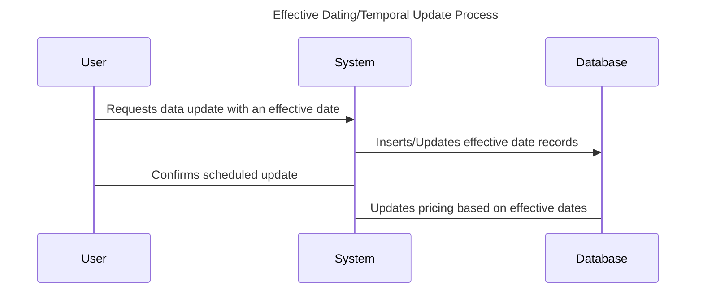

## Description

Effective Dating is a design pattern used in data modeling to schedule future data changes so they become effective on a specific date. This pattern is particularly useful in scenarios where you need to handle temporal data and implement changes that should only apply after a certain date without manually updating the database at that time. Effective Dating allows for the seamless transition of state changes in applications by using scheduled updates.

## Architectural Approaches

### 1. Effective Start Date and End Date

A common way to implement effective dating is to include `effective_start_date` and `effective_end_date` fields in the database schema. This allows the application to query which data is currently active or will become active based on the system’s current date.

```sql
CREATE TABLE product_pricing (
  product_id INT PRIMARY KEY,
  price DECIMAL(10, 2),
  effective_start_date DATE,
  effective_end_date DATE
);
```

### 2. Versioning Strategy

Another approach includes using version numbers or timestamps to track changes. This method can also keep historical data for auditing by adding a version column or using a composite key with a timestamp.

```sql
CREATE TABLE product_pricing (
  product_id INT,
  version INT,
  price DECIMAL(10, 2),
  effective_date DATE,
  PRIMARY KEY (product_id, version)
);
```

### 3. Utilizing Temporal Tables in SQL

Some RDBMS such as SQL Server provide native support for temporal tables, allowing automatic tracking of historical data changes with effective dating out-of-the-box.

```sql
CREATE TABLE product_pricing (
  product_id INT PRIMARY KEY,
  price DECIMAL(10, 2),
  sys_start_time TIMESTAMP GENERATED ALWAYS AS ROW START,
  sys_end_time TIMESTAMP GENERATED ALWAYS AS ROW END,
  PERIOD FOR SYSTEM_TIME (sys_start_time, sys_end_time)
) WITH SYSTEM VERSIONING;
```

## Best Practices

1. **Consistency in Dates**: Always use a standardized format for dates and times to avoid confusion and errors in data entries.
   
2. **Timezone Handling**: Incorporate timezone considerations to ensure the correct application of effective dates, especially in global systems.
   
3. **Data Integrity**: Use constraints and validation to ensure data integrity, such as ensuring no overlapping periods in start and end dates.

4. **Audit Trail**: Maintaining an audit trail of changes for future analysis and system debugging can add significant value.

## Example Code

Here's an example using Java and SQL to query an effective data set.

```java
import java.sql.Connection;
import java.sql.PreparedStatement;
import java.sql.ResultSet;
import java.sql.SQLException;

public class PricingService {
    
    private Connection connection;

    public PricingService(Connection connection) {
        this.connection = connection;
    }
    
    public double getCurrentPrice(int productId) throws SQLException {
        String query = "SELECT price FROM product_pricing WHERE product_id = ? AND effective_start_date <= CURRENT_DATE AND (effective_end_date IS NULL OR effective_end_date > CURRENT_DATE)";
        try (PreparedStatement preparedStatement = connection.prepareStatement(query)) {
            preparedStatement.setInt(1, productId);
            try (ResultSet resultSet = preparedStatement.executeQuery()) {
                if (resultSet.next()) {
                    return resultSet.getDouble("price");
                } else {
                    throw new RuntimeException("Price information not available");
                }
            }
        }
    }
}
```

## Diagrams

### Mermaid UML Sequence Diagram



## Related Patterns

- **Temporal Pattern**: A broader category related to effective dating that manages data with respect to time or temporal intervals.
  
- **SCD (Slowly Changing Dimension)**: Effective Dating is a specific case of temporal change in Slowly Changing Dimensions, which handles slowly changing aspects of data warehousing.

## Additional Resources

- Martin Fowler on [Temporal Patterns and Event Sourcing](https://martinfowler.com/eaaDev/TemporalProperty.html)
- The SQL documentation on [Temporal Tables](https://docs.microsoft.com/en-us/sql/relational-databases/tables/temporal-tables)

## Summary

Effective Dating is an essential design pattern for systems that need to manage data changes that occur at future dates. This pattern helps prevent data inconsistencies and facilitates temporal queries by using start and end dates, versioning, or database-supported temporal features. It is particularly valuable in scenarios encountering complex date-based business rules and future-scheduled updates. Embracing this pattern ensures robust management of temporal data and enhances the system's ability to evolve without disruption.
