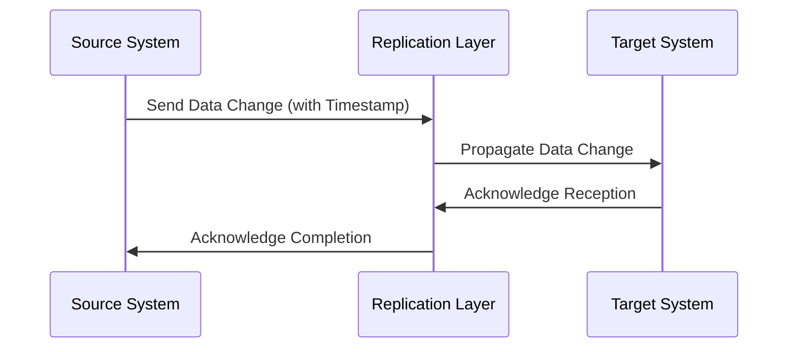

---

linkTitle: "Temporal Data Replication"
title: "Temporal Data Replication"
category: "Temporal Data Patterns"
series: "Data Modeling Design Patterns"
description: "Replicating data across systems while maintaining temporal integrity to ensure consistency, accuracy, and reliability in data-dependent operations."
categories:
- temporal data
- data replication
- data modeling
tags:
- temporal integrity
- data synchronization
- replication strategies
- consistency
- data accuracy
date: 2024-07-07
type: docs

canonical: "https://softwarepatternslexicon.com/103/1/28"
license: "© 2024 Tokenizer Inc. CC BY-NC-SA 4.0"
---

### Introduction

Temporal Data Replication is a critical design pattern in data modeling, focusing on the replication of data across multiple systems while maintaining temporal integrity. This approach ensures that the data is consistent and accurate over time, which is paramount for operations that depend heavily on precise data synchronization, such as in CRM (Customer Relationship Management) and billing systems.

### Intent

The primary aim of the Temporal Data Replication pattern is to ensure that data replicated across systems retains its temporal characteristics. This involves preserving the sequence of events, timestamps, and potentially the transactional ordering to prevent discrepancies and data anomalies which could lead to business logic errors.

### Motivation

In distributed systems, data often needs to be synchronized across different platforms and geographies. This synchronization can be challenging when data changes frequently and needs to reflect accurately in real-time across all systems. Maintaining the temporal integrity of this data is necessary to make sure that business decisions are based on up-to-date and accurate information.

### Applicability

Temporal Data Replication is particularly useful in scenarios where:

- Data consistency and accuracy are critical, such as in financial transactions and order processing.
- Systems require near real-time data updates, like customer service and support platforms that operate using real-time data feeds.
- Business logic requires sequence-sensitive data interactions.

### Structure

Here's a diagram illustrating Temporal Data Replication using the Mermaid syntax:



### Implementation

When implementing the Temporal Data Replication pattern, consider the following strategies:

1. **Time-stamping**: Ensure all data changes are marked with timestamps representing the exact moment of change, which helps in ordering events correctly across systems.

2. **Versioning**: Maintain version numbers for data changes to manage updates and prevent conflicts during replication.

3. **Event Sourcing**: Use an event log to record data changes. This ensures the chronological order of changes is maintained and can be replayed if needed.

4. **Conflict Resolution**: Design mechanisms to detect and resolve conflicts arising from concurrent modifications or network partitions.

#### Example Code

This example illustrates how you can implement a simple temporal data replication process using Java:

```java
import java.time.Instant;

class DataChange {
    private final String id;
    private final String data;
    private final Instant timestamp;

    public DataChange(String id, String data, Instant timestamp) {
        this.id = id;
        this.data = data;
        this.timestamp = timestamp;
    }

    // getters
}

class ReplicationService {
    public void replicateDataChange(DataChange change) {
        // Send data change to target system for replication
        // Include logic to ensure temporal integrity
        System.out.println("Replicating change: " + change.getId() + " at " + change.getTimestamp());
    }
}
```

### Related Patterns

- **Event Sourcing**: Often used in conjunction with temporal replication, Event Sourcing captures all changes to an application's state as a sequence of events.

- **CQRS (Command Query Responsibility Segregation)**: Helps separate read operations from write operations to optimize data replication across systems.

### Additional Resources

- [Temporal Database Systems](https://example-link-to-resource.com)
- [Designing Data-Intensive Applications by Martin Kleppmann](https://example-link-to-resource.com)

### Summary

Temporal Data Replication is an essential pattern to ensure data consistency and reliability across distributed systems. By maintaining temporal integrity, organizations can make better-informed decisions and streamline their data operations, ultimately enhancing the quality of service they offer to users.

This pattern, when applied correctly, addresses the challenges associated with synchronizing evolving datasets across heterogeneous environments, enabling robust and responsive data-driven applications.
