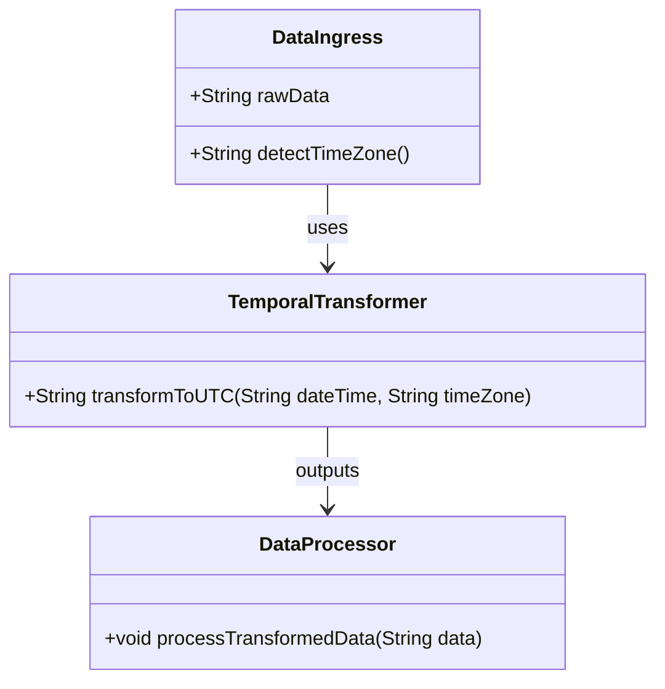

## Introduction

Temporal Data Transformation is a critical design pattern for harmonizing temporal data when integrating information from multiple heterogeneous data sources. It ensures that time-related data is consistent, accurate, and synchronized across different systems, which is essential for precise data analytics and reporting.

For example, converting event times from local time zones to a universal time format like UTC (Coordinated Universal Time) is a common necessity across systems to avoid discrepancies due to daylight saving time changes, differing local time zones, or central data processing requirements.

## The Need for Temporal Data Transformation

In today's interconnected systems, data is often gathered from multiple sources spread across various geographical locations worldwide. These locations might be operating under different time zones, and data might be captured in local times. Problems arise when integrating this data if the temporal aspect isn't addressed correctly. The primary goals of temporal data transformation include:

- **Unified Time References**: Ensure that data from distinct time zones can be compared and aggregated accurately.
- **Accuracy and Consistency**: Avoid errors introduced by daylight saving changes or ambiguous time zone data.
- **Interoperability**: Facilitate seamless data exchange and processing across distributed systems.

## Design Considerations

1. **Time Zone Awareness**: Data systems need to handle multiple time zones gracefully, recording source time zones where applicable.

2. **Date and Time Libraries**: Utilize robust libraries (e.g., Joda-Time, `java.time` in Java, moment.js in JavaScript) to parse, transform, and manipulate temporal data.

3. **Time Zone Databases**: Rely on up-to-date time zone databases (e.g., IANA Time Zone Database) for accurate conversions and daylight saving adjustments.

4. **Data Annotation**: Tag time-related fields in data models with their respective time zones and offsets to prevent ambiguity.

5. **Temporal Integrity Checks**: Implement checks to ensure data transformation does not result in illegal or impossible timestamps.

## Example Code

### Java Implementation using `java.time`

```java
import java.time.ZonedDateTime;
import java.time.ZoneId;
import java.time.format.DateTimeFormatter;

public class TemporalTransformer {

    public static String transformToUTC(String dateTime, String sourceTimeZone) {
        ZonedDateTime zonedDateTime = ZonedDateTime.parse(dateTime, DateTimeFormatter.ISO_ZONED_DATE_TIME);
        ZonedDateTime utcTime = zonedDateTime.withZoneSameInstant(ZoneId.of("UTC"));
        
        return utcTime.format(DateTimeFormatter.ISO_INSTANT);
    }

    public static void main(String[] args) {
        String localDateTime = "2024-07-07T15:23:01+02:00[Europe/Berlin]";
        String utcDateTime = transformToUTC(localDateTime, "Europe/Berlin");
        System.out.println("UTC time: " + utcDateTime);
    }
}
```

## Architectural Diagram

Here's an outline of a Mermaid class diagram to illustrate the conversion process in a system context:



## Related Patterns

- **Event Sourcing**: Often used in combination with temporal transformation to rebuild historical states from event logs consistently across different time zones.
- **Time Series Data Patters**: Leveraging data structures and databases optimized for recording, storing, and querying time-stamped information.
- **Data Normalization**: Involves making data uniform in systems beyond just temporal data, such as standardized formats and measurement units.

## Additional Resources

- [Time Zone Converter](https://www.timeanddate.com/worldclock/converter.html) for manual conversion
- Oracle's Java Time API: [Java 8 Date and Time](https://docs.oracle.com/javase/8/docs/api/java/time/package-summary.html)
- Moment.js documentation for JavaScript date manipulation

## Summary

Temporal Data Transformation plays a pivotal role in ensuring data integrity and accuracy in systems requiring integration of time-based information from disparate sources. This pattern focuses on converting, aligning, and standardizing temporal data to facilitate reliable data interpretation and analysis, preserving temporal relationships and sequences. Deploying robust strategies for handling temporal data, such as using standardized libraries and maintaining updated time zone tables, ensures that your systems remain consistent and accurate irrespective of their global operational span.
