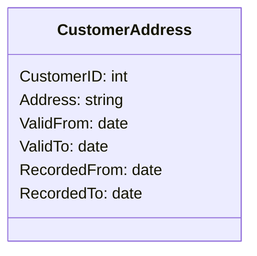

## Introduction

Bitemporal modeling is a data modeling design pattern that captures and manages two distinct timelines for data: the **valid time** and the **transaction time**. This approach allows for comprehensive tracking of data history, providing both the time period a record pertains to in real-world terms (valid time) and the period during which an entry exists in the database (transaction time).

## Detailed Explanation

### Valid Time

Valid time refers to the timeframe during which a fact is true in the real world. For instance, a customer's address might be valid from January 1, 2020, to January 1, 2021, representing the actual period they lived at that address.

### Transaction Time

Transaction time records when the data was stored in the database. This timeline accounts for when the data was inserted, modified, or deleted in the database. Unlike valid time, transaction time is immutable – once a record is created, its transaction time does not change.

### Combined Bitemporal Design

By using both valid and transaction times, bitemporal modeling captures a full historical view of data changes. This capability is essential for audit requirements, data forensics, and ensuring comprehensive historical analysis.

## Example

Consider a database table maintaining the history of customer addresses:

| CustomerID | Address       | ValidFrom    | ValidTo      | RecordedFrom | RecordedTo   |
|------------|---------------|--------------|--------------|--------------|--------------|
| 1          | 123 Maple St. | 2020-01-01   | 2021-01-01   | 2020-01-10   | 9999-12-31   |
| 1          | 456 Oak Ave.  | 2021-01-01   | 2022-01-01   | 2021-01-05   | 9999-12-31   |
| 1          | 789 Pine Rd.  | 2022-01-01   | 9999-12-31   | 2022-02-01   | 9999-12-31   |

In the example above:
- **ValidFrom** and **ValidTo** denote the period a customer actually lived at a specific address.
- **RecordedFrom** and **RecordedTo** indicate when these records were logged into the database.

## Architectural Approaches

1. **Schema Design**: Define tables or collections to manage separate attributes for both valid and transaction time. Ensure indexing to facilitate efficient querying.
   
2. **Temporal Queries**: Use SQL extensions or database features that support temporal queries to retrieve historical data effectively. The ANSI SQL:2011 standard includes capabilities specifically catered to temporal queries.

3. **Storage Considerations**: Consider columnar storage or compression algorithms to handle increased data volume due to additional temporal fields.

## Best Practices

- Clearly distinguish between valid and transaction time in your schema to avoid confusion.
- Regularly audit transaction times for compliance with data retention policies.
- Use database-native features for managing temporal data where available, such as SQL Server’s system-versioned temporal tables or equivalent features in other RDBMS.

## Example Code

Using a SQL database, the below example creates a bitemporal table:

```sql
CREATE TABLE CustomerAddress (
    CustomerID INT,
    Address VARCHAR(255),
    ValidFrom DATE,
    ValidTo DATE,
    RecordedFrom DATE,
    RecordedTo DATE,
    PRIMARY KEY (CustomerID, ValidFrom, RecordedFrom)
);
```

## Mermaid UML Class Diagram



## Related Patterns

- **Temporal Versioning**: Another temporal data pattern that notably tracks valid time without transaction time considerations, focusing on current view of the data.
- **Audit Logging**: While not inherently storing valid time, audit logging captures transactional changes and might integrate well with bitemporal models to satisfy compliance.

## Additional Resources

1. *Temporal Data & the Relational Model* by C.J. Date – A comprehensive book on managing temporal data in relational databases.
2. Articles and tutorials on implementing bitemporal models using modern database features.

## Summary

Bitemporal modeling is a powerful data modeling pattern for tracking how information changes over time in both the real world and within the database context. This dual timeline approach enables robust historical analysis, compliance with audit requirements, and provides insights into data life cycles, serving a wide variety of applications from finance to legal databases. It is a fundamental aspect of temporal data patterns, with potential to enhance data integrity significantly when implemented correctly.
