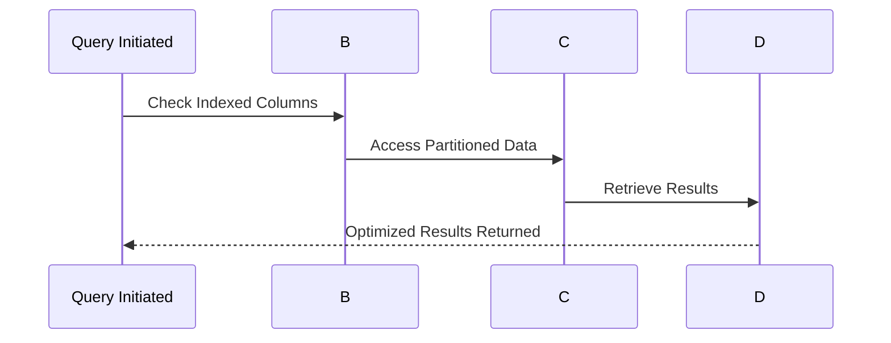

## Overview

Temporal query optimization is a critical aspect of data engineering, especially when dealing with large-scale databases that include temporal data—data associated with time information. The aim is to efficiently manage and retrieve time-based data by implementing effective indexing strategies and designing optimized queries.

In this article, we will explore various techniques for optimizing temporal queries, focusing on using partitioned tables and indexing on temporal columns. These methods help in reducing query time and improving data retrieval performance, making them essential for any application dealing with temporal data analytics.

## Design Pattern Explained

### 1. **Temporal Indexing**

Temporal indexing involves creating indexes on columns that hold time-based information. This enables quick access to specific time frames or changes over time, significantly reducing the query processing time.

- **B-tree Indexes**: Suitable for generic queries; however, not always optimal for range queries often required in temporal databases.
- **Bitmap Indexes**: Can be beneficial for low-cardinality columns, providing fast retrieval times for certain kinds of queries.
- **Time-Series Indexes**: Specially optimized for managing sequences of time-stamped data, they are highly effective in temporal data scenarios.

### 2. **Table Partitioning**

Partitioning large tables based on temporal columns can drastically improve query performance by enabling the database system to scan fewer partitions. Common strategies include:

- **Range Partitioning**: Divides data into range-based partitions, such as monthly or yearly. Ideal for time-series databases.
- **Interval Partitioning**: Automatically manages partitions by inserting new partitions as data is generated.
- **Hash Partitioning**: Distributes data evenly across partitions, reducing contention, especially in concurrent workloads.

### 3. **Optimized Query Design**

Query design is also crucial in performance optimization. Consider the following best practices:

- **Query Simplicity**: Simplifying temporal queries can reduce their complexity and execution time.
- **Predicate Filtering**: Use WHERE clauses effectively to filter data early in the query process.
- **Use CTEs and Subqueries Judiciously**: While beneficial for clarity, excessive use can slow down performance if not managed correctly.

## Example Code

Here’s a simple SQL example demonstrating partitioning and indexing for a temporal table:

```sql
-- Creating a partitioned table with a temporal index
CREATE TABLE Orders (
    OrderID INT,
    OrderDate DATE,
    CustomerID INT,
    Amount DECIMAL(10, 2)
)
PARTITION BY RANGE (OrderDate) (
    PARTITION p2023_01 VALUES LESS THAN ('2023-02-01'),
    PARTITION p2023_02 VALUES LESS THAN ('2023-03-01'),
    PARTITION p2023_03 VALUES LESS THAN ('2023-04-01')
);

-- Creating an index on OrderDate
CREATE INDEX idx_order_date ON Orders(OrderDate);
```

## Diagrams

Here is a Mermaid sequence diagram illustrating query optimization:



## Related Patterns

- **Time-Series Data Patterns**: Focused on storing and querying time-series data effectively.
- **Data Partitioning Strategies**: Covers broader aspects of partitioning beyond just temporal data.
- **Indexing Patterns**: Detailed exploration of different types of indexing for performance optimization.

## Additional Resources

- [Time-Series Indexing Techniques](https://example.com)
- [Efficient Partitioning Strategies](https://example.com)
- [Query Optimization Best Practices](https://example.com)

## Summary

Temporal query optimization is an essential design pattern in data modeling, promising improved performance and scalability. By implementing effective indexing strategies and partitioning tables, together with sound query design, developers can ensure that applications dealing with time-based data perform efficiently and reliably. This leads to faster data retrieval and better resource management, both critical for modern data-driven applications.
