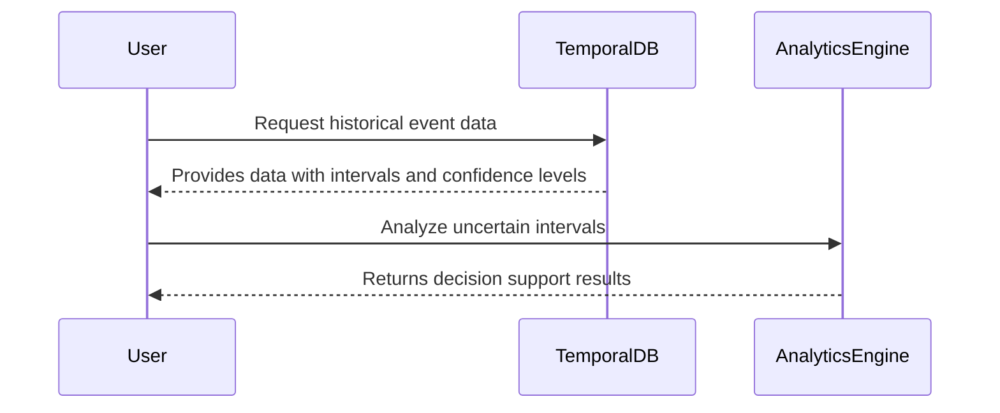

---

linkTitle: "Temporal Data Uncertainty Management"
title: "Temporal Data Uncertainty Management"
category: "Temporal Data Patterns"
series: "Data Modeling Design Patterns"
description: "A design pattern for managing data that includes uncertainty about the time intervals during which it is valid. This pattern is crucial for applications where events have approximate or probabilistic dates, such as forecasting models or historical databases."
categories:
- data-modeling
- temporal-patterns
- uncertainty-management
tags:
- temporal-data
- uncertainty
- data-modeling
- probabilistic-models
- forecasting
date: 2024-07-07
type: docs

canonical: "https://softwarepatternslexicon.com/103/1/32"
license: "© 2024 Tokenizer Inc. CC BY-NC-SA 4.0"
---

## Introduction

In many applications, managing temporal data with uncertain time intervals is essential. Whether dealing with historical data that lacks precise timestamps or forecasting future events with inherent unpredictability, temporal data uncertainty management provides a structured approach to capturing and handling these ambiguities effectively.

## Detailed Explanation

### Problem Context

Temporal data uncertainty arises when it is impossible to specify the exact period during which data is valid. Common scenarios include:

- **Incomplete Historical Records**: Historical data often lacks precise timestamps.
- **Forecasting and Predictions**: Projected dates carry inherent uncertainties.
- **Event Detection in Sensor Networks**: Events may register approximate times.

### Solution Approach

Implementing temporal uncertainty management involves leveraging data structures and algorithms that can store and process intervals with associated probabilities or degrees of confidence. Here are key aspects:

- **Modeling Uncertain Intervals**: Use data models like interval timestamps with fields for `start`, `end`, and `confidence`. For instance, a historical event might be recorded with a start and end date accompanied by a probability or confidence level.

- **Probabilistic Temporal Data**: Utilize probabilistic models to express uncertainty. Bayesian networks or Markov chains can manage dependencies and compute confidence levels associated with temporal predictions.

- **Fuzzy Temporal Logic**: Apply fuzzy logic to model and query temporal data with vague boundaries. This involves defining linguistic variables that can capture the uncertainty in natural terms like "around summer 2022."

### Implementation Strategy

1. **Schema Design**: Adapt schema definitions in SQL/NoSQL databases to incorporate fields for uncertainty metrics in temporal data tables.
2. **Algorithm Application**: Develop algorithms for calculating overlaps, confidences, and statistical measures to evaluate uncertain data dynamics.
3. **Visualization**: Design user interfaces that clearly represent temporal uncertainty, using overlapping timelines, shaded intervals, or confidence bands.

### Code Example

Here's an example illustrating a simple probabilistic temporal model in Python:

```python
from datetime import datetime, timedelta

class UncertainInterval:
    def __init__(self, start, end, confidence_level):
        self.start = start
        self.end = end
        self.confidence_level = confidence_level

    def __str__(self):
        return f"Interval({self.start}, {self.end}, Confidence: {self.confidence_level})"

event = UncertainInterval(datetime(2024, 6, 1), datetime(2024, 9, 1), 0.85)
print(event)
```

## Diagrams

Here is a **Mermaid UML Sequence Diagram** that represents interactions with a temporal data management system handling uncertainty:



## Related Patterns

- **Temporal Snapshot Pattern**: Keeps a view of data at various time points but with precise intervals.
- **Event Sourcing**: Although typically used to record concrete event sequences, it can support uncertain data by storing versions of events with confidence metrics.

## Additional Resources

- [Probabilistic Time Management in Databases](https://linktoresource1.com)
- [Improving Temporal Data Quality through Estimation Techniques](https://linktoresource2.com)
- [Temporal Databases: Concepts and Implementations](https://linktoresource3.com)

## Summary

Temporal Data Uncertainty Management is indispensable for applications needing to process and analyze data with ambiguous time intervals. By employing probabilistic and fuzzy logic models, businesses can gain insightful analyses and predictions, helping them navigate through incomplete historical records and uncertain future forecasts. This pattern enhances data robustness and decision-making within uncertain environments.
