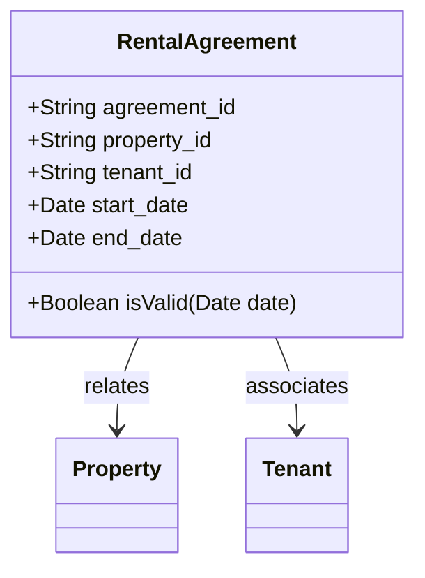

## Time Interval Representation

### Description

In data modeling, temporal aspects are crucial for representing periods of validity, availability, or activity. The **Time Interval Representation** pattern is utilized to define a range between two time points. This typically includes a `start date/time` and an `end date/time` to signify when an entities' status is valid, available, or active. This pattern is widely used in a multitude of domains such as financial transactions, bookings, subscription services, and more. 

### Example

Consider a rental application for a property management system. Each rental agreement includes a period during which the rental is effective, defined by a beginning date (`start_date`) and an ending date (`end_date`). This interval specifies the complete timeframe for which the agreement is valid:

```sql
CREATE TABLE RentalAgreements (
  agreement_id SERIAL PRIMARY KEY,
  property_id INT NOT NULL,
  tenant_id INT NOT NULL,
  start_date DATE NOT NULL,
  end_date DATE NOT NULL,
  CONSTRAINT chk_dates CHECK (start_date < end_date)
);
```

### Architectural Approaches and Paradigms

- **Event Sourcing**: Leveraging event sourcing can effectively track changes over time by capturing each state change as a distinct event. Instead of relying solely on current state, the full history of an entity can be reconstructed from the events.
  
- **Snapshot and Temporal Tables**: Use temporal tables in databases that support this feature to automatically retain historical records alongside current records. This approach aids in automatically managing historical intervals without manually creating copies of tables or rows.

- **Interval Trees**: Data structures such as interval trees can be used for efficient querying over time intervals, especially useful when overlapping intervals need to be queried frequently.

### Best Practices

- **Ensure Consistency**: Always enforce constraints to maintain consistent data between `start_date` and `end_date`, such as ensuring that the start date precedes the end date.

- **Indexing**: If you need to perform frequent interval queries, implement effective indexing strategies, such as composite indexes on `(start_date, end_date)`.

- **Handling Open Intervals**: Sometimes, data modelers need to represent open-ended time intervals, such as futureavailabilities. An `end_date` field can be null in these cases but ensure your application logic handles nulls appropriately.

### Related Patterns

**Versioned Data**: This pattern maintains multiple versions of an entity over time, each version marked as active for a different interval.

**Temporal Validity**: Focuses on tracking historical changes of data entities with precise timing.

**State Transition**: This pattern models permitted transitions between states along with their timing aspects.

### Diagrams

Below is a sample UML class diagram representing a `RentalAgreement` entity with time intervals:



### Additional Resources

- **Books**: "Implementing Domain-Driven Design" by Vaughn Vernon offers a comprehensive guide on handling complex temporal data scenarios within domain-driven design.
  
- **Articles**: Explore further insights and tutorials on [Temporal Tables in SQL Server](https://docs.microsoft.com/en-us/sql/relational-databases/tables/temporal-tables) from Microsoft documentation.

- **Tools**: Check out frameworks that support automatic handling of time intervals and temporal aspects like Joda-Time in Java or Temporal SQL features in PostgreSQL.

### Summary

The **Time Interval Representation** is a powerful design pattern essential for managing temporal aspects of data entities. Its effectiveness is demonstrated in applications requiring clear validity and availability definitions across any domain managing time-bound data. By representing time intervals accurately and efficiently, systems can ensure reliable temporal data consistency, easy querying, and historical tracking of changes.
