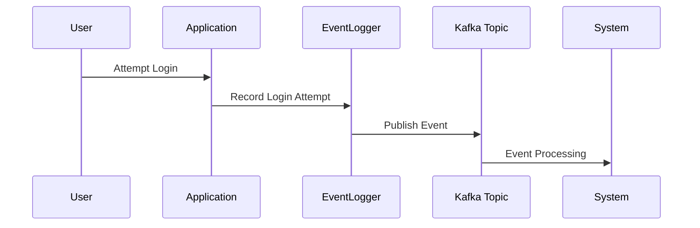

## Description
Point-in-Time Events is a pattern used for capturing and recording events that occur at precise moments. These events are characterized by a specific timestamp, which allows for accurate auditing, historical analysis, and tracing of the changes in systems over time. This pattern is essential in domains like finance, security, healthcare, and any other domain where accurate historical records are necessary.

## Architectural Approaches
To implement Point-in-Time Events effectively, you can utilize various architectures depending on the requirements:

1. **Event Sourcing**: Capture all changes to application state as a sequence of events. This method allows for not only reconstructing past states but also provides a full audit trail.

2. **Event Log Service**: A centralized service or component designed to capture and store event data. This is often backed by a database or a distributed logging system like Splunk, ELK Stack, or Kafka.

3. **Event-Driven Microservices**: Each service records events associated with its operations. Events are often published to a messaging system like Apache Kafka or RabbitMQ, from where they can be persisted or further processed.

## Example Code
Below is a sample implementation using Java and Apache Kafka for logging login attempts:

```java
import org.apache.kafka.clients.producer.KafkaProducer;
import org.apache.kafka.clients.producer.ProducerRecord;
import java.time.Instant;
import java.util.Properties;

public class LoginEventLogger {

    private KafkaProducer<String, String> producer;

    public LoginEventLogger() {
        Properties props = new Properties();
        props.put("bootstrap.servers", "localhost:9092");
        props.put("key.serializer", "org.apache.kafka.common.serialization.StringSerializer");
        props.put("value.serializer", "org.apache.kafka.common.serialization.StringSerializer");
        producer = new KafkaProducer<>(props);
    }

    public void logLoginAttempt(String username, boolean success) {
        String timestamp = Instant.now().toString();
        String message = String.format("User %s logged in at %s, success: %b", username, timestamp, success);
        producer.send(new ProducerRecord<>("login-events", username, message));
    }

    public static void main(String[] args) {
        LoginEventLogger logger = new LoginEventLogger();
        logger.logLoginAttempt("john_doe", true);
    }
}
```

## Diagram
Here is a sequence diagram illustrating the capture and processing of Point-in-Time Events:



## Related Patterns
- **Event Sourcing**: Useful for reconstructing system states based on a history of events.
- **Change Data Capture**: Often used in conjunction with Point-in-Time Events to detect changes in data and record them as events.

## Best Practices
- **Time Synchronization**: Ensure system time is synchronized across all components to prevent discrepancies in timestamps.
- **Idempotency**: Design your event logging system to handle duplicate events gracefully.
- **Data Retention**: Implement strategies for data archiving or purging to manage storage efficiently, while maintaining compliance with data retention policies.
- **Security**: Ensure event logs are properly encrypted and access-controlled to protect sensitive information.

## Additional Resources
- [Martin Fowler's Event Sourcing](https://martinfowler.com/eaaDev/EventSourcing.html)
- [Introduction to Apache Kafka](https://kafka.apache.org/intro)
- [Designing Event-Driven Systems](https://aws.amazon.com/blogs/compute/designing-event-driven-systems/)

## Summary
The Point-in-Time Events pattern is essential for any system that requires precise tracking of actions or state changes. By implementing this pattern, systems can ensure accurate historical records, enable auditing capabilities, and support real-time monitoring and analysis. Proper implementation involves selecting the appropriate architectural approach, adhering to best practices in synchronization and security, and integrating with related data patterns to create robust solutions.
