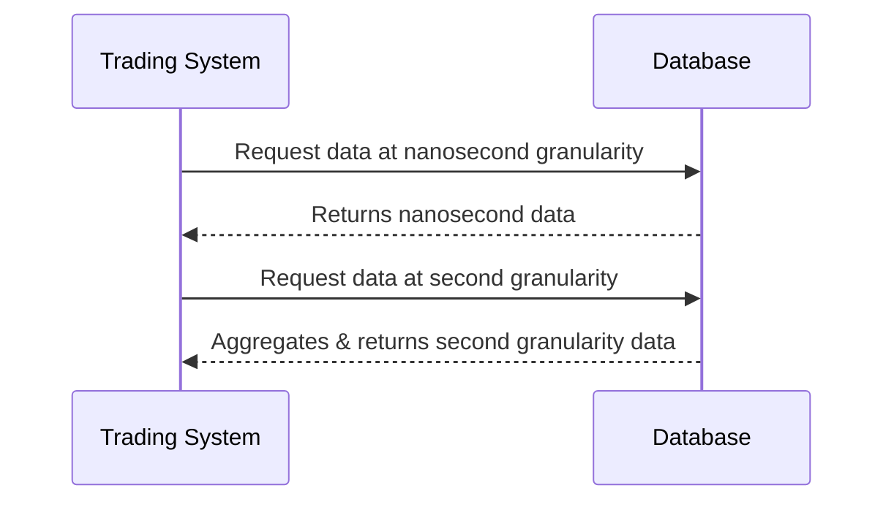

## Description

Temporal Granularity is a key design pattern in data modeling that defines the level of time precision necessary for storing and processing temporal data. Selecting the right temporal granularity is crucial for optimizing storage, processing, and querying of time-based data. It involves balancing trade-offs between data precision and system performance. Choosing an appropriate temporal granularity should align with your data's business context and intended use cases.

For instance, high-frequency trading systems require extremely granular data, often down to nanoseconds, to track minute changes in stock prices. Conversely, business reporting systems may only require data aggregated to the hour or day.

## Architectural Approaches

1. **Granular Indexing**: Implement indices based on the chosen granularity to speed up temporal queries without unnecessary overhead.
   
2. **Partitioning Strategy**: In distributed databases, use partitioning based on temporal granularity to ensure efficient read/write with temporal datasets.

3. **Granularity Configuration**: Design systems to allow configurable granularity to adjust as business requirements evolve without significant refactoring.

4. **Data Aggregation**: Use aggregation services to generate different views of data in various granularity levels to cater to diverse use cases.

5. **Event Streaming**: For real-time processing systems, choose an event processing approach that matches the required time precision.

## Best Practices

- **Align with Business Needs**: Always align the granularity of temporal data with business needs to ensure architectural choices support organizational objectives.

- **Performance vs Precision Trade-off**: Understand the trade-off between the computational cost of finer granularities versus the needs for precision.

- **Minimal Granularity Enforcement**: Avoid over-specifying time precision if it's not needed, to reduce storage costs and improve performance.

- **Configurable Granularity Support**: Systems should support configuration of granularity to allow easy future adjustments.

## Example Code

Here's a Java example to illustrate a simplistic approach to manage temporal granularity in a data handling system:

```java
import java.time.LocalDateTime;
import java.time.temporal.ChronoUnit;

public class TemporalDataProcessor {

    public enum Granularity {
        SECOND, MINUTE, HOUR, DAY, MONTH, YEAR
    }

    public LocalDateTime truncateToGranularity(LocalDateTime timestamp, Granularity granularity) {
        switch (granularity) {
            case SECOND:
                return timestamp.truncatedTo(ChronoUnit.SECONDS);
            case MINUTE:
                return timestamp.truncatedTo(ChronoUnit.MINUTES);
            case HOUR:
                return timestamp.truncatedTo(ChronoUnit.HOURS);
            case DAY:
                return timestamp.toLocalDate().atStartOfDay();
            case MONTH:
                return timestamp.withDayOfMonth(1).truncatedTo(ChronoUnit.DAYS);
            case YEAR:
                return timestamp.withDayOfYear(1).truncatedTo(ChronoUnit.DAYS);
            default:
                throw new IllegalArgumentException("Unsupported granularity: " + granularity);
        }
    }
}
```

## Diagrams

Below is an illustration using a Mermaid UML Sequence diagram showing granularity adjustments over multiple transactions in a trading system:



## Related Patterns

- **Time Series Data**: Involves representation of data over consistent timed intervals, heavily reliant on accurate temporal granularity to track and project patterns.

- **Event Sourcing**: Involves storing all changes to data as a sequence of events, necessitating precise temporal order.

- **Snapshot Pattern**: Reduces computation by recording system state at intervals appropriate to the chosen granularity.

## Additional Resources

- [Effective Time Management in Databases](https://www.example.com)
- [Temporal Databases: A Comprehensive Introduction](https://www.example.com)
- [Understanding High-frequency Trading Data](https://www.example.com)

## Summary

Temporal Granularity is fundamental in data modeling for temporal data patterns, as it dictates the precision and efficiency of data handling systems. By balancing the need for precision with system performance, and ensuring configurations match business needs, organizations can optimize their data strategy to suit diverse use cases.
