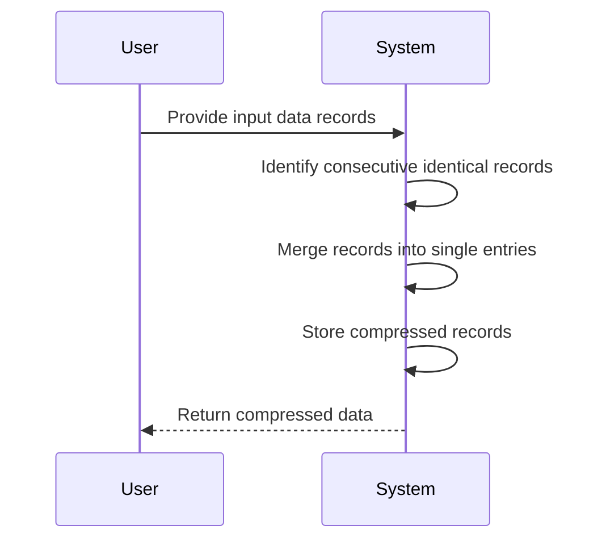

## Overview

Temporal Data Compression is an efficient design pattern that aims to reduce storage space required for temporal datasets by merging consecutive records with identical data into single entries with calculated durations. This pattern is particularly useful in applications where temporal data, such as stock prices, sensor readings, or log entries, frequently change over discrete time intervals but often remain constant across consecutive periods.

## Architectural Approach

### Core Concept

The fundamental idea behind Temporal Data Compression is to minimize data redundancy in temporal datasets. By identifying sequences of consecutive records sharing identical values, these records can be consolidated into single entries. Each resulting entry records the start time, the end time (or duration), and the data value itself, reducing overall storage needs.

### Implementation Steps

1. **Identify Consecutive Identical Records:** 
   Traverse the dataset sequentially, identifying when the value remains unchanged over subsequent periods.

2. **Merge Records:**
   When a sequence of identical records is found, merge them into a single record with three fields: start_time, end_time (or duration), and the value.

3. **Store Compressed Data:**
   Replace the identified sequence with the merged record in the database or data structure.

4. **Iterate Until Completion:**
   Repeat the process until you reach the end of the dataset.

### Example Code

Let's illustrate the Temporal Data Compression concept using Python:

```python
def compress_temporal_data(records):
    # Assume `records` is a list of tuples: (timestamp, value)
    compressed_data = []
    if not records:
        return compressed_data

    start_time, current_value = records[0]
    for i in range(1, len(records)):
        current_time, next_value = records[i]
        if current_value != next_value:
            compressed_data.append((start_time, current_time - 1, current_value))
            start_time = current_time
            current_value = next_value

    # Add the last accumulated sequence
    end_time = records[-1][0]
    compressed_data.append((start_time, end_time, current_value))
    
    return compressed_data

records = [(1, "A"), (2, "A"), (3, "B"), (4, "B"), (5, "B"), (6, "C")]
compressed = compress_temporal_data(records)
print(compressed)
```

### Diagrams

Here is a sequence diagram illustrating the data compression workflow:



## Best Practices

- **Data Integrity Checks:** Before compression, ensure data integrity to avoid loss of crucial information.
- **Performance Optimization:** If the dataset is large, consider iterative or batch-wise processing to optimize performance.
- **Set Retention Policies:** For applications like stock trading or IoT data, set appropriate retention policies for storing compressed vs raw data.

## Related Patterns

- **Delta Encoding:** Focuses on storing the difference between consecutive records rather than the absolute values.
- **Time Series Aggregation:** Involves summarizing or aggregating data at less granular time intervals, suited for long-term trend analysis.

## Additional Resources

- **Temporal Data Management:** Refer to literature on temporal databases for broader contexts and management strategies.
- **Data Compression Algorithms:** Explore other compression techniques that can be applied to non-temporal data for overall system optimization.

## Summary

In summary, Temporal Data Compression is a design pattern that streamlines the storage of time-series data by consolidating sequentially redundant entries. It is beneficial in reducing storage costs while maintaining data accuracy over predominately static periods. Implementing this pattern requires diligent data processing and integrity checks to ensure no valuable information is lost during compression.
