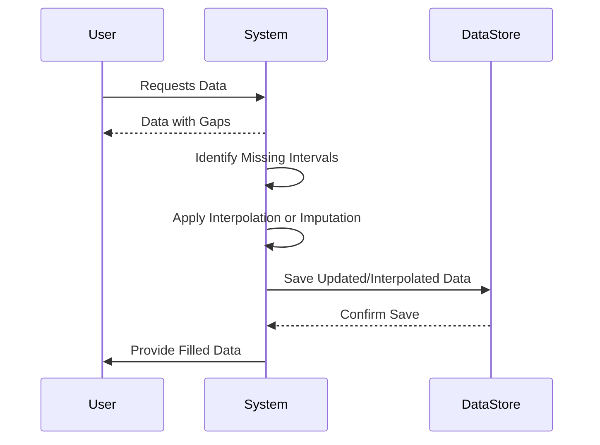

## Overview

Temporal gaps handling is a design pattern used in data modeling and processing architectures to manage and address periods where data is missing in time-series datasets. This pattern is crucial in applications like IoT sensor networks, financial data streams, and other domains reliant on continuous data ingestion where data integrity and accuracy are paramount.

Handling temporal gaps involves techniques such as interpolation, data imputation, and using predictive models to estimate or fill in missing data points. By effectively managing these gaps, systems can maintain a seamless data flow and ensure robust analytical outcomes.

## Architectural Approaches

1. **Interpolation**: This approach estimates missing data by leveraging known data points. Various interpolation methods include:
   - **Linear Interpolation**: Connecting known data points with straight lines and estimating values along these lines.
   - **Spline Interpolation**: Using polynomial functions to create smoother transitions between points.
   - **Nearest Neighbor**: Filling gaps with the nearest known values.

2. **Data Imputation**: Employing statistical or machine learning algorithms to estimate the missing values based on the properties of the dataset:
   - **Mean/Median Imputation**: Replacing missing values with the mean or median of observed values.
   - **K-Nearest Neighbors (KNN) Imputation**: Using a KNN model to infer values based on similar points.

3. **Predictive Modeling**: Using historical data to predict missing values with models like ARIMA (AutoRegressive Integrated Moving Average) or machine learning models (e.g., LSTM networks for sequential data).

## Best Practices

- **Data Profiling**: Understand the distribution and frequency of missing data in the dataset.
- **Contextual Analysis**: Examine contextual factors that might have caused data omission, such as hardware malfunctions or network outages.
- **Model Evaluation**: Periodically evaluate the predictive performance of the methods adopted to handle gaps, and iterate as necessary.
- **Scalability**: Ensure that the chosen solutions scale well with increasing data volumes, particularly in streaming environments.

## Example Code

Below is a JavaScript example using linear interpolation to fill temporal gaps in a dataset:

```javascript
function linearInterpolation(data) {
  const interpolatedData = [];
  for (let i = 0; i < data.length - 1; i++) {
    interpolatedData.push(data[i]);
    if (data[i + 1] === null) {
      const start = data[i];
      let endIdx = i + 1;
      while (endIdx < data.length && data[endIdx] === null) endIdx++;
      const end = data[endIdx];
      const gapSize = endIdx - i;
      for (let j = 1; j < gapSize; j++) {
        interpolatedData.push(start + ((end - start) * (j / gapSize)));
      }
    }
  }
  interpolatedData.push(data[data.length - 1]);
  return interpolatedData;
}

// Example data with gaps
const sensorData = [1, 2, null, null, 5, 6, null, 8];
console.log(linearInterpolation(sensorData));
```

## Diagrams

A simple UML Sequence Diagram showing the process of handling temporal gaps in data ingestion might look like this using Mermaid syntax:



## Related Patterns

- **Delta Upload Pattern**: Focuses on handling incremental data updates, which might lead to temporal gaps if not properly synchronized.
- **Change Data Capture (CDC)**: Can be used alongside to identify anomalies in data streams causing gaps.
- **Data Smoothing**: Techniques overlap with interpolation methods for handling noise as well as gaps in data.

## Additional Resources

- "Time Series Analysis with Applications in R" by Jonathan D. Cryer and Kung-Sik Chan.
- Research papers on time-series data imputation techniques.
- Tutorials on using ARIMA and machine learning methods for time-series analysis.

## Summary

Handling temporal gaps is a crucial aspect of managing temporal data in various real-world applications. By applying interpolation, imputation, and predictive modeling techniques, systems can effectively manage missing data, ensuring data integrity and continuous analytical operations. The choice of method should align with the data context and application requirements, ensuring scalability and adaptive accuracy.
